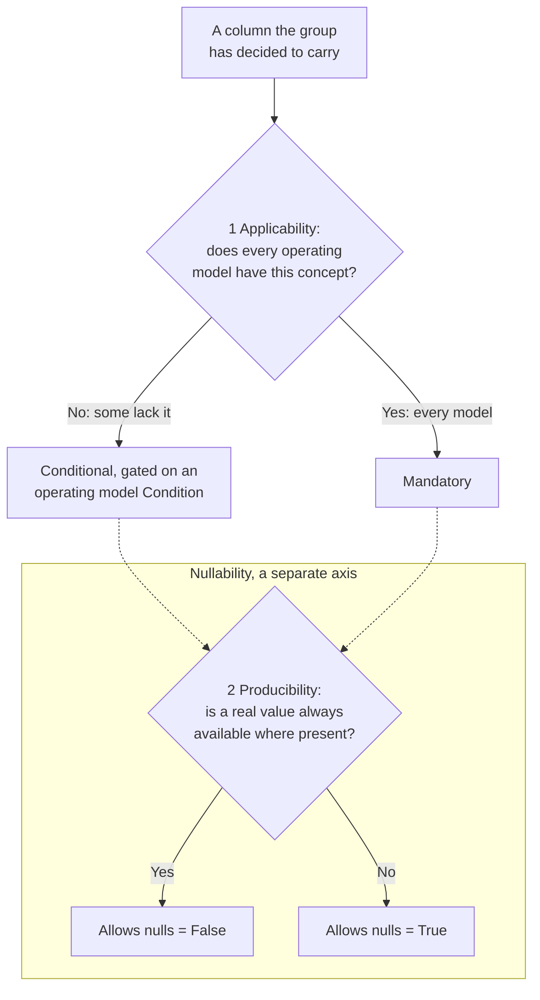

# Column Feature-Level Rubric: Mandatory and Conditional

## Overview

This guideline answers one question. When FOCUS adds a column, does every data generator have to publish it, or only the generators it applies to?

The first answer is Mandatory. The second is Conditional. This guideline decides which of the two a column takes, and whether its value is allowed to be null. It applies to columns already in the specification and to new ones the working group has decided to carry.

There are two decisions here, not one:

* **Level** decides whether the column is there.
* **Nullability** decides whether the value may be empty once the column is there.

"Make it Mandatory, and generators without the data can just leave it null" answers the first question with the second, and that is how columns end up mandated for generators that cannot fill them.

A column earns Mandatory by applying to every operating model.

This is the principles part. The mechanics (the step-by-step procedure, the data-driven tests, the machine-readable check) come in a companion guideline, and the criteria this revision defers come in a later revision of this one. The bar to meet: two people applying these principles to the same column reach the same level, without the author in the room.

**Contents:**

* [Scope of This Revision](#scope-of-this-revision)
* [Key Concepts](#key-concepts)
* [Core Principles](#core-principles)
* [The Interim Boundary Rule](#the-interim-boundary-rule)
* [The Two Decision Inputs](#the-two-decision-inputs)
* [Normative Content Defined by the Rubric](#normative-content-defined-by-the-rubric)
* [Applying the Principles: A Worked Example](#applying-the-principles-a-worked-example)
* [Relationship to the Companion Guideline](#relationship-to-the-companion-guideline)

## Scope of This Revision

FOCUS has four feature levels: Mandatory, Conditional, Recommended, and Optional. This revision covers two of them.

Start here once the working group has already decided a column is worth carrying in a dataset. This guideline then picks which of Mandatory or Conditional that column takes, and whether its value may be null.

Two questions sit outside this revision and wait for a later one:

* **What the criteria for Recommended and Optional should be.** How a column reaches either level, and what happens to the columns holding them today, is not settled here. This revision takes no position either way. It does not change what those levels mean, and it does not change the level of any column that currently holds one.
* **Whether a proposed column belongs in the schema.** Two tests would answer that: whether the data is genuinely needed rather than merely useful, and whether a column that can already be calculated from other columns earns a place of its own. Neither is part of this revision. Nor is the related question of where to draw the line between a column whose absence breaks a use case and one that only sharpens a result another column already delivers.

One further question sits alongside these rather than inside them. Principle 7 requires a Conditional column's dependent Supported Features to account for its absence, but what they should do about it, whether a substitute, a narrower stated population, or a per-feature requirement, is not settled here. That choice belongs with the Supported Features work and is recorded in the design notes.

Two things drove the narrowing.

The problem that blocks adoption lives entirely in these two levels. A generator whose operating model cannot produce a column is hurt by a Mandatory obligation, not by a Recommended one. Getting the Mandatory-versus-Conditional line right is what opens FOCUS to generators that do not look like cloud providers.

These are also the two criteria that currently meet this guideline's own bar, which is that two reviewers reach the same answer without the author present. A test that would do the same for Recommended has not been written yet, and writing one under time pressure would produce a rule the working group could not apply consistently.

## Key Concepts

* **Operating model.** How a provider's business works, described through the billing concepts it uses. Does it have regions? Commitment discounts? Virtual currency? For leveling, this is what decides whether a FOCUS concept applies to a generator, and it is not the same thing as what kind of company the generator is.
* **Operating model Condition.** A named entry in the specification's Conditions section (specification/conditions/). Each entry reads "the operating model includes X": includes regions, includes commitment discounts. That section is the single list. Every Conditional column points at one or more of its entries, and one column's presence may be gated by more than one Condition.
* **Leveling unit.** A column within a dataset, not a Column ID in the abstract. The same Column ID may take a different level, a different nullability, or a different set of Conditions in each dataset that carries it. Judge it per dataset.
* **The two axes.**

| Axis | Values | Decides |
|---|---|---|
| Feature level | Mandatory, Conditional, Recommended, Optional | Whether the column is present, and when |
| Nullability | Allows nulls = True / False | Whether the value may be null when present |

The four levels, and the `MUST`, `SHOULD`, and `MAY` obligations attached to them, are already defined in the [FOCUS Feature Level](../../specification/overview.md#focus-feature-level) section. This guideline changes how a level gets chosen, not what a level means. Recommended and Optional appear in the table because the specification defines them and columns still carry them. They stay as they are: writing criteria for them is deferred work, not work this revision has done.

## Core Principles

1. **Level by operating model, not by what kind of generator it is.** Cloud, SaaS, PaaS, data center, AI: these labels describe the generator, not the schema, and they get no say in the level. When a column applies to some generators and not others, name an operating model Condition instead. *(A SaaS provider whose operating model includes regions takes on the region obligation. Being SaaS does not exempt it.)*
2. **Generators assert their own Conditions, and category defaults are not ceilings.** Any generator may meet any operating model Condition, whatever kind of company it is, and asserting one takes on the matching obligation. Conformance then checks that assertion like any other requirement. Category defaults only describe what is common today. They never cap a generator, and exceeding one is never non-conformant. How a generator records what it has asserted is mechanics for the companion. *(A data center generator whose model includes commitment discounts asserts that Condition and carries the commitment columns, even though its category default would not.)*
3. **Keep the two axes apart.** Decide them one at a time. *(ChargeClass is Mandatory on the level axis and still Allows nulls = True on the nullability axis.)*
4. **Mandatory has to be earned.** A column is Mandatory only when two things hold: its concept exists for every operating model, and a value can be produced naturally. Together those mean no reasonable generator would carry the column null on every single row. A column that a reasonable operating model would leave null throughout is Conditional instead, gated on the operating model Condition where the concept lives. The default between them is Conditional. A column can move up to Mandatory later, once adoption shows the concept is universal. *(BilledCost clears the bar. RegionId does not: a flat-rate SaaS has no region, so it is Conditional.)*
5. **Nulls are honest; invented values are not. No level may rest on one.** When a value is not meaningful, or is not available, it is null. FOCUS never asks a generator to invent a placeholder, and any level that forces one has to change. Fabrication means inventing a value for a concept the operating model does not have. Producing a value for a concept the model does have is not fabrication. Judge availability against the operating model, not against whatever the generator's billing export happens to contain today. A model that uses unit pricing has SKUs, so producing SkuId is identifying them rather than inventing them. A value that would be genuinely null for a whole class of models makes the column Conditional, not Mandatory with those models inventing a value. A value a generator can report truthfully still counts as truthful, even when it is a single value that holds across its entire dataset. And where the model leaves only one correct answer (BillingAccountType), populating it is a matter of conformance.
6. **Derivation runs one way.** When a column is calculated from other columns, that calculation has a direction: sources go in, the derived column comes out. A derived column can never be more present than its sources, so when a source is absent the derived column is absent too. The reverse never holds. A derived column that is absent, or that applies more narrowly, does not drag its sources down, and each source is leveled on its own. That is why a source can be Mandatory while a column derived from it is Conditional, when the derived concept applies to fewer models. *(A cost restated in a second currency is derived from the billing-currency cost. It is absent whenever that cost is absent. But a generator that does not restate omits it, and the source cost stands on its own.)*
7. **A Conditional level is not complete until the features that depend on the column account for its absence.** Making a column Conditional means it can be missing from a dataset instance, so every Supported Feature that lists it as a directly dependent column has to still hold when it is not there. Absent is not null: what such a feature needs is a rule for combining dataset instances, not per-row null handling. What that rule should be, whether a substitute, a narrower stated population, or naming the column as required for that feature, is the feature's decision and not this guideline's. Until the companion says where the record belongs, it lives with the leveling decision itself, in the pull request or issue. *(Cost Comparison lists ContractedCost among its directly dependent columns. Leveling ContractedCost Conditional obliges that feature to say what it does for a generator whose model has no contracted pricing.)*

## The Interim Boundary Rule

Two outcomes look similar and are not:

* **Mandatory, Allows nulls = True.** The concept exists for every operating model, so the column is always there. A truthful value is not on every row. (An ordinary charge carries a null ChargeClass.) The nulls are row by row, and no operating model is null throughout, though an individual generator may not yet have produced a value. Because the column is always present, consumers and joins can count on it.
* **Conditional.** The column is there only when it applies, and is fully mandatory when it does. Which columns appear varies from one dataset to the next. Conditional does not mean optional. And a column that is absent tells a consumer more than one that is null for an entire generator.

The rule:

* Input 1 decides, following principle 4. A single unusual operating model that lacks the column may be an exception that keeps the column Mandatory. A pattern of models leaving it null makes it Conditional.
* Until the companion guideline calibrates that line against real generator data, anything sitting at the boundary is Conditional.
* Calling a model an exception only holds when the working group writes down which operating model is being judged exceptional, and why. Until the companion says where that record belongs, it lives with the leveling decision itself, in the pull request or issue.
* A value that is present and truthful for every model never reaches this boundary, even when it is always the same value, and stays Mandatory. ServiceProviderName may repeat on every row of a single-provider dataset and is still Mandatory.

## The Two Decision Inputs

Every leveling decision answers two questions, one per axis. Applicability sets the level. Producibility sets nullability.

1. **Applicability: does this concept exist for everyone?** Ask whether the column applies to some operating models but not others. Test the exact concept that the column's Description and glossary term fix, not a broader or narrower one. When a reasonable model would have the column null on every row because the concept does not exist for it, the column is Conditional, gated on the operating model Condition that marks where the concept does exist. When the concept exists for every model, the column is Mandatory, and input 2 sets its nullability. Four things sharpen this test:
   * **Having to substitute is a sign the concept is not universal.** When the only way to fill the column for the models that lack the concept is to substitute or derive some other value, the concept is not universal, and the column is Conditional.
   * **A rule for everyone, or a patch for the models missing the concept?** Some columns are defined in terms of another column, and which of these two it is decides the level. When the definition applies in every operating model, the concept stays universal and the column is Mandatory. That holds even where the two values differ from row to row. EffectiveCost works this way: it is defined against BilledCost for every generator, equal to it for ordinary charges, and computed from it where commitments amortize, never standing in for a concept the generator lacks. When the value is supplied only for the models that lack the concept, it is a patch, the concept is not universal, and the column is Conditional. Having a fallback settles nothing by itself. Which of the two kinds it is settles it.
   * **Missing concept, or just never happened yet?** When the concept is absent for a whole class of models, Conditional. A flat-rate SaaS has no region concept to populate. When the concept exists for every model but a generator has never produced an instance of it, Mandatory, with input 2 setting nullability. Every generator marks a correction to a closed billing period with ChargeClass, so a generator that has never issued such a correction still carries the column, null on its rows. The test is whether the concept exists, not whether a value has been produced yet.
   * **Only presence gates belong here.** An operating model Condition that gates nullability leaves the level Mandatory and feeds input 2 instead. Tell the two apart by scope. A presence gate means a model can lack the characteristic outright, so no row ever carries a value and the whole column is absent (a model with no regions). A gate that still leaves values on some rows for every model is row-level nullability, however it is worded. No operating model lacks the concept of a correction to a closed billing period, so ChargeClass's null rule is nullability, not an operating model Condition. Whether something is one odd exception or a real pattern is settled by the Interim Boundary Rule.
2. **Producibility: can a real value be produced?** Where the column applies, can the operating model produce a meaningful value, or is null the honest answer? Judge against the operating model, not against today's export (principle 5). Set Allows nulls = False only when a meaningful value is available on every row where the column is present. Otherwise set Allows nulls = True. This sets nullability only, row by row. Whether a model can produce the value at all is the dataset-wide question in principle 4, and it belongs to input 1. Input 2 never sets the level, and it never licenses inventing a value.

When applicability is borderline, with the concept present for most models and absent for a few, the companion guideline's test settles it. Until that test exists, such a column takes the Conditional default from the Interim Boundary Rule.

## Normative Content Defined by the Rubric

The rubric provides guidance for defining the normative content related to feature leveling and column nullability.

The rubric helps identify:

* applicable operating model Conditions,
* Feature Levels for FOCUS columns,
* Nullability for FOCUS columns.

Feature Levels are defined independently of category. Conditional columns are expressed through operating model Conditions rather than category-specific rules such as "Mandatory for cloud" or "Optional for SaaS".

> **Note:** Category-based expectations are informative only and are out of scope for this rubric. They should be addressed separately, potentially in the companion guideline or other guidance material.

## Applying the Principles: A Worked Example

This section is informative. Here are the two inputs worked through on two columns.

**RegionId**, in the Cost and Usage dataset:

* **Applicability.** Some operating models have no customer-visible region. A flat-rate SaaS would have RegionId null on every row. So applicability varies, which makes the column Conditional, gated on the operating model Condition that the model includes regions.
* **Producibility.** Where the model does include regions, a region is available, though not on every single row. So Allows nulls = True.

Result: RegionId is Conditional, gated on the model includes regions, Allows nulls = True.

**ContractCommitmentId**, in the Contract Commitment dataset:

* **Applicability.** Every Contract Commitment dataset has commitments in it to identify, so the concept exists for every model that has this dataset. Mandatory.
* **Producibility.** An identifier is always available wherever the dataset exists. So Allows nulls = False.

Result: ContractCommitmentId is Mandatory, Allows nulls = False. The same Column ID is leveled on its own terms in each dataset that carries it.

## Relationship to the Companion Guideline

This guideline defines the principles for assigning feature levels and nullability. The companion guideline is intended to define the mechanics needed to apply these principles consistently and support conformance validation.

The following topics should be considered for the companion guideline:

* The step-by-step leveling procedure.
* How a generator's asserted operating model Conditions are recorded.
* The applicability test, including the matrix and the threshold at which a column moves between Mandatory and Conditional.
* The disposition of variance that does not map to an operating model Condition.
* Where the Supported Features write-back required by principle 7 is recorded.
* The back-test against current columns.
* Where informative category-based expectations are recorded.
* The machine-readable check, including:
  * Reading all relevant requirement surfaces.
  * Consuming a machine-readable derivation source.
  * Linking Conditional columns to the Conditions section.

The principles stand on their own, and a team can adopt them without waiting for the mechanics.
