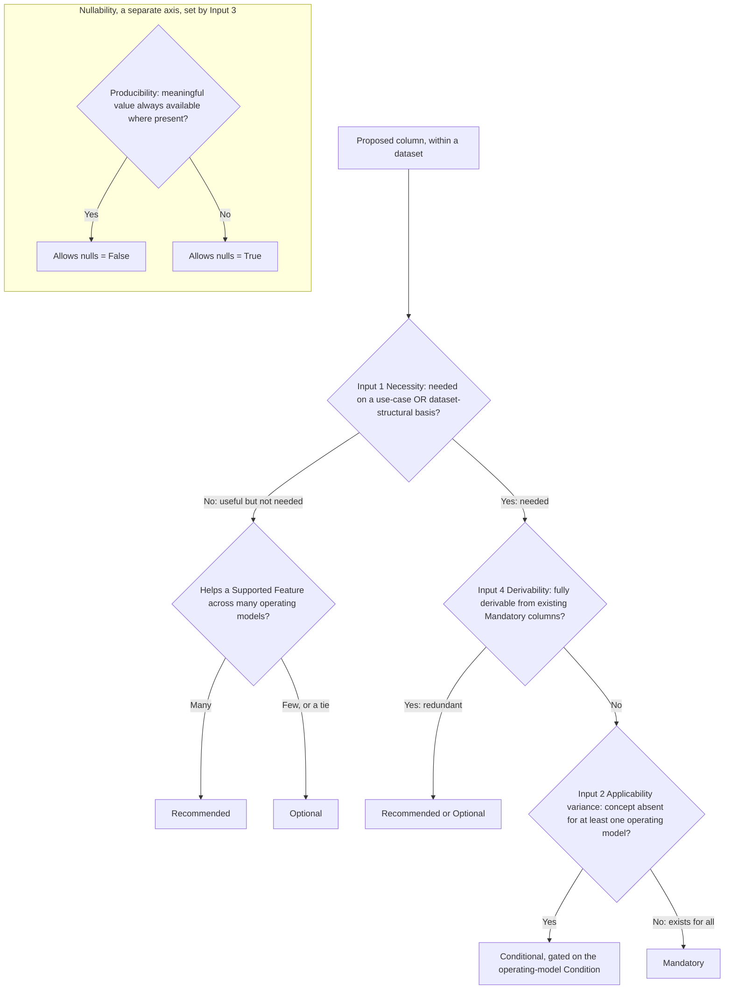

# Column Feature-Level Rubric: Principles

## Overview

This guideline gives the principles for setting a FOCUS column's feature level and nullability. Apply them when a column is proposed, so the level is decided up front instead of argued out after the column ships.

It is the first of two parts: this part covers the principles, and a companion guideline covers the mechanics. Scope of This Guidance, at the end, lists what falls in each part.

The bar is simple. Two people applying these principles to the same new column should reach the same level, without the author in the room. They apply to existing and net-new columns alike.

The unit of leveling is a column within a dataset, not a Column ID in the abstract. The same Column ID may appear in more than one dataset and carry a different level, nullability, or set of Conditions in each, because its necessity and applicability are judged per dataset.

## The Problem This Addresses

Today a column's feature level is an output, not a choice. The level falls out of how the presence requirement happens to be written: an unconditional `MUST` gives Mandatory, a conditional `MUST` gives Conditional, a `SHOULD` gives Recommended, and a `MAY` gives Optional. Nothing decides what the requirement should be in the first place, so each column is leveled on its own.

Two problems followed. First, two separate questions got treated as one: whether a column is present (the level), and whether its value may be null (nullability). "Always present, value may be null" is not the same as "present only when it applies." Second, similar columns drifted to different levels with no rule to settle it, such as the split between cost and price columns and the different handling of Account and Provider columns.

These principles set the level on purpose, and keep the two questions apart.

## Core Principles

These principles turn on the operating model. An operating model is the set of characteristics that decide which FOCUS concepts apply to a data generator (whether it includes regions, commitment discounts, virtual currency, and so on), independent of its category.

1. **Level by operating model, not by technology category.** A category (cloud, SaaS, PaaS, data center, AI) describes the data generator. It does not constrain the schema and has no say in the level. When applicability varies, name a Condition from the operating-model Conditions registry instead. Each Condition reads "the operating model includes X" (for example, includes regions, or includes commitment discounts). The registry is the shared vocabulary for this; it lives in the requirements model.

2. **Conditions are asserted by the generator, and defaults are not ceilings.** A data generator may meet any Condition, whatever its category. A SaaS provider whose operating model includes regions asserts that Condition and takes on the matching obligation. Category defaults describe what is common today. They never cap a generator down, and meeting more of them never makes a generator non-conformant.

3. **Two axes, kept apart.** Level and nullability are decided separately. Level says whether the column is present, and when. Nullability says whether the value may be null when the column is present.

4. **Honest nulls, never fabrication.** When a value is not meaningful or not available, it is null. FOCUS never asks a data generator to invent a placeholder value. A column that must always carry a value stays honest when a truthful value is always available, including one supplied by a defined fallback or derivation (for example, a cost that falls back to another cost when its unit price is null). That is not fabrication; fabrication is inventing a value where the truthful answer is null.

5. **Derived-pair symmetry.** When a column and the column it derives from are both carried, they take the same level. A cost and the unit price it derives from are leveled together. This settles the cost-versus-price split by principle, not column by column.

> **Note:** "Condition" here means an operating-model gate in the requirements model, where its schema key is `ApplicabilityCriteria`. This is a different thing from the per-rule `Condition` validation field that also appears in the model. One Condition may gate a column's presence (feeding input 2, and making the column Conditional) or its nullability (feeding input 3, leaving the level unchanged). These are two roles for the same registry entry; only the presence role bears on the level.

## The Two Axes

Level and nullability are separate questions with separate answers.

| Axis | Values | Decides |
|---|---|---|
| Feature level | Mandatory, Conditional, Recommended, Optional | Whether the column is present, and when |
| Nullability | Allows nulls = True / False | Whether the value may be null when the column is present |

The four levels are unchanged. Nullability stays the per-column attribute it is today, decided alongside the level, not folded into it.

The split that matters most is between two outcomes that are easy to confuse:

* **Mandatory, Allows nulls = True.** The column is in every dataset, for every operating model. The value is filled in when meaningful and null otherwise. Presence is guaranteed, so consumers and joins can count on the column being there.
* **Conditional ("mandatory when [condition]").** The column is present only when it applies, and is fully mandatory whenever it does. The set of columns varies between datasets. Conditional never means optional.

Input 2 below decides which of these applies. The companion guideline gives the exact test for borderline cases.

## The Four Decision Inputs

Every leveling decision answers four questions.

1. **Necessity.** Is the data needed, so that without it something breaks rather than just degrades? A column is needed on either of two bases:
    * **Use-case necessity.** The column is needed for a FinOps use case in the FOCUS Supported Features. Operationally, this shows up as the column appearing in a Supported Feature's Directly Dependent Columns list. Appearing only in a feature's Supporting Columns list is the useful-but-not-needed signal, not a necessity signal.
    * **Dataset-structural necessity.** The column is needed for the dataset's own integrity rather than a downstream use case, such as a primary or foreign identifier, a period boundary, or record provenance. Supplemental and metadata datasets carry these, and the metadata Supported Features intentionally list their applicable metadata rather than dependent columns. A column needed on this basis takes the `MUST` family even though no feature depends on it.

    Needed on either basis goes to the `MUST` family (Mandatory or Conditional). Useful but not needed goes to `SHOULD` or `MAY` (Recommended or Optional). In that second branch, choose Recommended when the column helps a Supported Feature across many operating models, and Optional when it helps only a few. When the call is genuinely even, default to Optional. A Mandatory or Conditional column that satisfies neither necessity basis is a signal to re-level, not to reverse-engineer a use case for it.
2. **Applicability variance.** Does the column apply to some operating models but not others? When at least one real operating model would have the column null on every row because the concept does not exist for it, the column is Conditional, gated on the Condition that marks the models where the concept exists. When the concept exists for every operating model and only some values are missing, the column is Mandatory, and input 3 sets its nullability. Cases in between, where the concept exists for most models and not for a few, are settled by the test in the companion guideline rather than by debate. Read only the Conditions that gate the column's presence for this test. A Condition that instead gates nullability (whether the value may be null when the column is present) leaves the level Mandatory and feeds input 3, not this one; do not read a nullability gate as an applicability gate.
3. **Producibility.** When the column applies, can the operating model produce a meaningful value, or is the honest answer null? Set Allows nulls = False only when a meaningful value is always available on every row where the column is present. Otherwise set Allows nulls = True, and use null wherever the value is not meaningful or not available. This sets nullability, never the level, and never allows fabrication.
4. **Derivability.** Can the column already be computed from existing Mandatory columns? A fully derivable column is not made a Mandatory obligation, since that is redundant work for the producer; when it is carried at all, it is Recommended or Optional. This holds even when the data is needed (input 1): the need is already met by the Mandatory columns the value derives from, so the derived column is not itself Mandatory. This does not clash with derived-pair symmetry (principle 5): derivability keeps a redundant column below Mandatory, while symmetry levels two columns that are both kept. Derivability covers more than arithmetic: a value produced by lookup from another column (a display name from its identifier) or by conversion (a cost expressed in another currency) is derivable too. The companion guideline supplies the machine-readable derivation source that records, per column, what it derives from and by what kind of relation.

The one judgment call left is in input 1: Recommended versus Optional. Every other input has an answerable test.

The four inputs place a proposed column at a level, while producibility sets its nullability on a separate axis:

Borderline applicability, where the concept exists for most operating models and not for a few, is settled by the test in the companion mechanics guideline rather than by the binary shown here.

## Recording Why a Column is Conditional

When a column is Conditional, record which kind of gate makes it so. This is rationale, not a new label.

* **Intrinsic gate.** Presence or value depends on the row itself, such as its charge category. ResourceId is null on tax rows; SkuId depends on the charge category. Write this as a row-level rule.
* **Operating-model gate.** Presence depends on what the operating model includes, such as regions or virtual currency. Write this as a named Condition from the registry. Category variation is always this kind, and only this kind.

A column may have both: an operating-model gate for whether the concept exists, and an intrinsic gate for which rows it covers.

When a column needs a Condition that is not in the registry yet, propose the new Condition, worded as "the operating model includes X", as part of the leveling decision. Do not encode the category in its place.

The phrasing rule keeps this honest: never write a level or default as a category rule. Not *SaaS does not populate RegionId*, but rather that SaaS operating models usually do not include regions, and those that do populate RegionId. The first version hides a category inside a rule. The second names the Condition and treats the category as a default.

## Two-Layer Output

The rubric produces two layers. Only one is normative.

1. **Normative layer (no categories).** Per column: a level, a nullability, and zero or more Conditions. Always *Conditional, gated on the Condition that the operating model includes regions*, never *Mandatory for cloud, Optional for SaaS*. This layer names no category.
2. **Informative layer (categories, non-binding).** Per category: the Conditions a typical operating model in that category tends to include today. These are defaults, not ceilings. A generator may go past its category default, per principle 2.

Keeping the normative layer free of categories is what lets a level be tested for conformance and stay valid as operating models change. The informative layer records today's expectations without binding tomorrow's generators.

## Applying the Principles: A Worked Example

This example is informative. It runs the four inputs for one column, RegionId.

* **Necessity.** Region is needed for the Location supported feature (for example, allocating cost by region), so without it that use case breaks rather than just degrades. That places it in the `MUST` family.
* **Applicability variance.** Some operating models have no customer-visible region (a flat-rate business SaaS, say) and would have RegionId null on every row. Applicability varies, so the column is Conditional, gated on the Condition that the model includes regions.
* **Producibility.** When the model includes regions, a region is available, though not always on every row, so Allows nulls = True.
* **Derivability.** Region cannot be computed from another Mandatory column, so derivability does not apply.

Result: RegionId is Conditional, gated on the regions Condition, Allows nulls = True. The companion guideline confirms the borderline cases with that test.

A second example, for a dataset-structural column, ContractCommitmentId.

* **Necessity.** No Supported Feature lists ContractCommitmentId as a dependent column, but the Contract Commitment dataset cannot function without its primary identifier, since rows cannot be joined or de-duplicated without it. It is needed on the dataset-structural basis, so it is in the `MUST` family even though no feature depends on it.
* **Applicability variance.** Every Contract Commitment dataset has commitments to identify, so the concept exists for every operating model that produces the dataset. The column is Mandatory, not Conditional.
* **Producibility.** An identifier is always available where the dataset exists, so Allows nulls = False.
* **Derivability.** It cannot be computed from another column, so derivability does not apply.

Result: ContractCommitmentId is Mandatory, Allows nulls = False, on the dataset-structural necessity basis, with no Supported Feature dependency required.

## Scope of This Guidance

In scope here: the principles, the two axes, the four decision inputs, the two kinds of gate, and the two-layer output.

In the companion mechanics guideline: the step-by-step procedure, the test for applicability variance (the applicability matrix, and the threshold at which a column flips between Mandatory and Conditional), the back-test against current columns, and the machine-readable check. The machine-readable check in particular must:

* **Check every place a gate can appear.** A column's presence requirement can live in the dataset requirements ("MUST include X when the operating model includes Y"), in the applicability Conditions on the composite and dataset-level model rules, or in the column's own nullability rule. A check that reads only the column file will miss the others.
* **Consume a machine-readable derivation source.** Input 4 needs a per-column record of what each column derives from and by what relation (arithmetic, lookup, or conversion), rather than prose equalities scattered across column files.
* **Point every Conditional column at one Conditions registry.** Once the registry is a standalone list, the check names it as the single source, requires each Conditional column to link to a Condition in it, and maps any older criteria keys onto it.
* **Plan the back-test's re-leveling output.** The back-test will flag existing Mandatory columns that satisfy neither necessity basis (administrative and audit columns are the common case). The guidance says how to handle them: re-level, or record the dataset-structural basis that keeps them Mandatory.

Before the back-test can run, the Supported Features must actually name the columns each use case depends on. A column needed on the use-case basis but absent from every Directly Dependent Columns list has nothing for input 1 to point at, so completing that coverage, especially for the supplemental datasets, is a prerequisite the mechanics guideline calls out rather than assumes.

The principles stand on their own. A team can adopt them without waiting for the mechanics.
