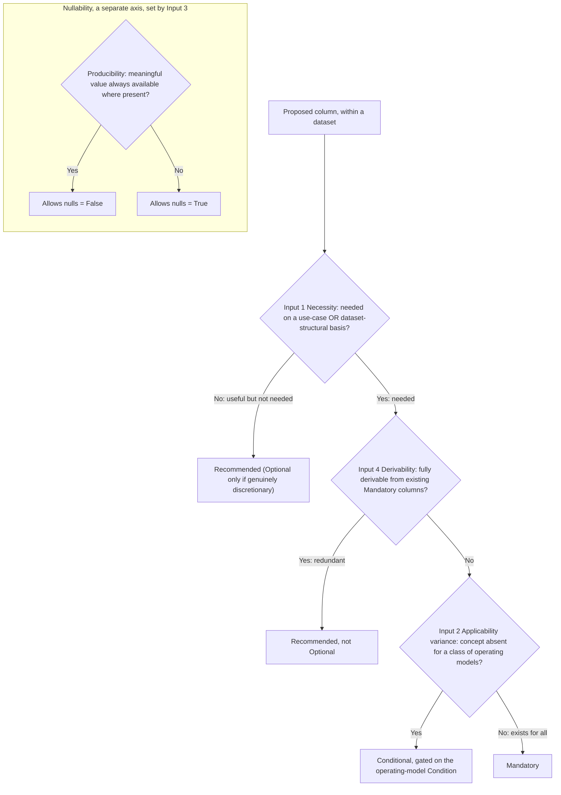

# Column Feature-Level Rubric: Principles

## Overview

This guideline gives the principles for setting a FOCUS column's feature level and nullability. Apply them when a column is proposed, so the level is decided up front instead of argued out after the column ships.

It is the first of two parts: this part covers the principles, and a companion guideline covers the mechanics. [Scope of This Guidance](#scope-of-this-guidance), at the end, lists what falls in each part.

The bar is simple. Two people applying these principles to the same column should reach the same level, without the author in the room. The principles apply to existing and net-new columns alike.

The unit of leveling is a column within a dataset, not a Column ID in the abstract. The same Column ID may appear in more than one dataset and carry a different level, nullability, or set of Conditions in each, because its necessity and applicability are judged per dataset.

## The Problem This Addresses

Today a column's feature level is an output, not a choice. The level falls out of how the presence requirement happens to be written: an unconditional `MUST` gives Mandatory, a conditional `MUST` gives Conditional, a `SHOULD` gives Recommended, and a `MAY` gives Optional. Nothing decides what the requirement should be in the first place, so each column is leveled on its own.

Two problems followed. First, leveling decisions treated two separate questions as one: whether a column is present (the level), and whether its value may be null (nullability). The specification carries the two as separate fields; the conflation is in how leveling arguments run, keeping a column Mandatory for operating models that lack its concept because those generators can carry it null or fill it from another column (ContractedCost is Mandatory and defaults to the list cost for generators with no negotiated pricing, so the presence question is never asked). "Always present, value may be null" is not the same as "present only when it applies." Second, columns bound to the same concept or linked by derivation drifted to different levels with no rule to settle it, such as the split between cost and price columns (ListCost is Mandatory while ListUnitPrice is Conditional).

Underneath both, Mandatory had become the default rather than a high bar, so columns that only some operating models can produce were mandated anyway. Forcing those generators to emit an empty or padded column is the adoption barrier this guideline most wants to remove.

These principles set the level on purpose, keep the two questions apart, and make Mandatory something a column earns rather than something it is assumed to be.

## Core Principles

These principles turn on the operating model. Operating model is a defined term in the specification glossary; for leveling purposes, read it as the set of characteristics that decide which FOCUS concepts apply to a data generator (whether it includes regions, commitment discounts, virtual currency, and so on), independent of its category.

1. **Level by operating model, not by technology category.** A category (cloud, SaaS, PaaS, data center, AI) describes the data generator. It does not constrain the schema and has no say in the level. When applicability varies, name an operating-model Condition from the specification's Conditions section instead. Each Condition reads "the operating model includes X" (for example, includes regions, or includes commitment discounts). The Conditions section (specification/conditions/) is a single list of operating-model Conditions that the specification maintains and that each Conditional column links to.

2. **Conditions are asserted by the generator, and defaults are not ceilings.** A data generator may meet any Condition, whatever its category. A SaaS provider whose operating model includes regions asserts that Condition and takes on the matching obligation. Category defaults describe what is common today. They never cap a generator down, and meeting Conditions beyond the category default never makes a generator non-conformant. Asserting a Condition sets the matching obligation; it does not exempt the generator from it. An asserted Condition, and the presence and values it implies, is checked by conformance like any other requirement.

3. **Two axes, kept apart.** Level and nullability are decided separately. Level says whether the column is present, and when. Nullability says whether the value may be null when the column is present.

4. **Honest nulls, never fabrication.** When a value is not meaningful or not available, it is null; FOCUS never asks a data generator to invent a placeholder. Two things follow, and they set the high bar for Mandatory. A value that would be null for a whole class of operating models makes the column Conditional (input 2 under The Four Decision Inputs, below), not Mandatory carried null throughout for those models. A level that would force a generator to fabricate or pad a value is never correct and must change. A column is never kept Mandatory by leaning on a manufactured or default value to fill it; whether a column can borrow a related value where its own is absent is a detail of that column's definition, not a reason to level it Mandatory. Fabrication means inventing a value for a concept the operating model lacks; producing the representation of a concept the model does have is not fabrication. Availability is judged against the operating model, not against what a generator's current billing export surfaces: a model that includes unit pricing has SKUs to identify, so producing the SkuId the specification defines is identification, not fabrication, and a column whose value has only one correct answer given the model and the column's definition (BillingAccountType, say) is populated as a matter of conformance.

5. **Derivation symmetry.** When a dataset carries a derived column together with the source columns it is computed from, they are leveled together (a cost and its unit price, say). Derivation runs from one or more source columns to a derived column; it is a directional relation, not a pair of equals, and may involve more than two columns. This settles the cost-versus-price split by principle, not column by column. Which level they share comes from the four decision inputs, run per column as usual: when the inputs place all of the related columns at the same level, that is the shared level, and when they would fall on opposite sides of the Mandatory-versus-Conditional line, the group is a boundary case and takes the interim level from The Two Axes, Conditional, unless the working group records why a specific operating model is exceptional.

> **Note:** "Condition" here means an operating-model gate: a named entry in the specification's Conditions section that marks the operating models where a concept exists. Asserting a Condition (principle 2) is not a separate registration step in the current specification: each Condition is a verifiable state that holds when the operating model includes the named characteristic. How a generator's asserted Conditions are recorded is mechanics for the companion guideline. This is a different thing from the per-rule `Condition` field that also appears in the requirements model (inside each rule's `ValidationCriteria`) and gates an individual validation rule; the spelling is the same, so context, not capitalization, tells the two apart. One Condition may gate a column's presence (feeding input 2, and making the column Conditional) or its nullability (feeding input 3, leaving the level unchanged). These are two roles for the same entry; only the presence role bears on the level.

## The Two Axes

Level and nullability are separate questions with separate answers.

| Axis | Values | Decides |
|---|---|---|
| Feature level | Mandatory, Conditional, Recommended, Optional | Whether the column is present, and when |
| Nullability | Allows nulls = True / False | Whether the value may be null when the column is present |

The four levels, and the `MUST`/`SHOULD`/`MAY` presence obligations behind them, are the ones the specification already defines (see the [FOCUS Feature Level](../../specification/overview.md#focus-feature-level) section of the specification overview); this rubric changes how a level is chosen, not what a level means. Nullability stays the per-column attribute it is today, decided alongside the level, not folded into it.

Mandatory is a high bar a column earns, not the default it starts from. A column is Mandatory only when its concept exists for every operating model and a value is naturally producible, so that no reasonable data generator would carry it null down every row. Any column a reasonable operating model would leave entirely null is Conditional, gated on the Condition that marks where the concept lives. Between the two, the default is Conditional. A column can harden from Conditional to Mandatory later, as adoption shows every operating model carries it; it is not presumed universal up front.

The split that matters most is between two outcomes that are easy to confuse:

* **Mandatory, Allows nulls = True.** The concept exists for every operating model, so the column is in every dataset, but a truthful value is not on every row (an ordinary, non-correction charge carries a null ChargeClass, say). The nulls are row-level, never a whole operating model carrying the column null throughout. Presence is guaranteed, so consumers and joins can count on the column being there.
* **Conditional ("mandatory when [condition]").** The column is present only when it applies, and is fully mandatory whenever it does. The set of columns varies between dataset instances. Conditional never means optional, and an absent column is clearer than one carried null for a whole operating model.

Input 2 decides which of these applies, holding to the high bar: a single unusual operating model that lacks the column may be an exception that keeps it Mandatory, but a pattern of operating models leaving it null makes it Conditional. The companion guideline calibrates from generator data where that line sits. Until it does, a column at that boundary is leveled Conditional, and the exception that keeps it Mandatory holds only when the working group records the specific operating model judged exceptional and why. Until the companion guideline names a durable home for these records, the record lives with the column's leveling decision (the pull request or issue that proposes the level), so the exception can be checked later. A value that is present and truthful for every operating model does not reach this boundary at all, even when it is a constant one, and keeps the column Mandatory. (ServiceProviderName may hold the same value on every row of a single-provider dataset; it is still truthful and present for every operating model, so it stays Mandatory.)

## The Four Decision Inputs

Every leveling decision answers four questions.

1. **Necessity.** Is the data needed, so that without it something breaks rather than just degrades? A column is needed on either of two bases:
    * **Use-case necessity.** The column is needed for a FinOps use case in the FOCUS Supported Features. Operationally, this shows up as the column appearing in a Supported Feature's Directly Dependent Columns list. That membership is a signal, not proof: the governing test is still whether the use case breaks or merely degrades without the column. A column that only refines a result another Mandatory column already delivers (for example, a secondary classification beneath a mandatory primary one) degrades rather than breaks, so it is useful-but-not-needed even when a feature lists it as directly dependent. This carve-out applies only when the primary it refines is itself Mandatory. A column that refines a result delivered by a Conditional primary is not demoted by the carve-out; it is leveled by inputs 2 and 4 like any other needed column, typically inheriting the primary's Condition. The companion guideline gives the test for that boundary. Appearing only in a feature's Supporting Columns list is the useful-but-not-needed signal, not a necessity signal.
    * **Dataset-structural necessity.** The column is needed for the dataset's own integrity rather than a downstream use case, such as a primary or foreign identifier, a period boundary, or record provenance. The datasets beyond Cost and Usage (Billing Period, Contract Commitment, Invoice Detail) and the metadata sections carry these, and the metadata Supported Features intentionally list their applicable metadata rather than dependent columns. A column needed on this basis takes the `MUST` family even though no feature depends on it.

    Needed on either basis goes to the `MUST` family (Mandatory or Conditional). Useful but not needed goes to `SHOULD` (Recommended). Optional is reserved for a column that is genuinely discretionary rather than useful, which is rare; a useful-but-not-needed column defaults to Recommended, not Optional, so that the schema leans toward `MUST` and `SHOULD` and does not drift toward a pile of `MAY`s. A Mandatory or Conditional column that satisfies neither necessity basis is a signal to re-level, not to reverse-engineer a use case for it.

    **Net-new columns.** A net-new column is a special case: no Supported Feature can list it yet, so its necessity is judged from the use case it is proposed to serve, not read off current Directly Dependent Columns lists, and its absence from those lists is not the useful-but-not-needed signal. When the use case it serves is not yet a Supported Feature, that missing coverage is the gap to close, not evidence the column is unneeded. A net-new column judged needed is then leveled by inputs 2 and 4 like any other, so a needed net-new column whose concept is absent for some operating models is Conditional, not Optional.
2. **Applicability variance.** Does the column apply to some operating models but not others? The concept being tested is the one fixed by the column's Description and its linked glossary term, not a broader or narrower notion the reader supplies. When a reasonable operating model would have the column null on every row because that concept does not exist for it, the column is Conditional, gated on the Condition that marks the models where the concept exists. When the concept exists for every operating model, so that no reasonable model would carry it null throughout, the column is Mandatory, and input 3 sets its nullability.
    * **Defaults and derivations signal non-universality.** Needing a default or a derivation to fill the column for the models that lack it is a signal that the concept is not universal, so the column is Conditional, not Mandatory rescued by that default.
    * **Definitional equality versus gap-filling default.** Distinguish two cases that look alike. A rule that defines the column's value in terms of another column for the rows its definition specifies, in every operating model, is a definitional equality, not a gap-filling default, and leaves the concept universal (EffectiveCost is defined in terms of BilledCost for every generator, so it stays Mandatory). A rule that substitutes another column's value only for the operating models that lack the concept is a gap-filling default, and marks the concept as not universal (ContractedCost defaults to the list cost for generators with no negotiated pricing, so its contracted-pricing concept is not universal and it is Conditional). A fallback does not by itself settle the level; which of these two it is does.
    * **Concept absent versus never produced.** Two null patterns also look alike but level differently. When the concept is absent for a class of operating models, the column is Conditional (a flat-rate SaaS with no regions has no region concept to populate). When the concept exists for every operating model but a generator has simply never produced an instance of it, the column stays Mandatory and its nulls are set by input 3 (ChargeClass is how any generator marks a correction to a previously closed billing period, so one that has never issued such a correction still carries the column, present and null on its rows, rather than dropping it and leaving consumers unable to tell such a correction from an ordinary charge). The test is whether the concept exists for the model, not whether the model has yet produced a value for it.
    * **The boundary and the interim rule.** A single unusual operating model that lacks the column may be an exception that keeps it Mandatory; a pattern of models that lack it makes it Conditional, and the companion guideline calibrates that threshold from generator data rather than settling it by debate. Until it does, level such a boundary column Conditional unless the working group records why a specific operating model is exceptional, as [The Two Axes](#the-two-axes) describes.
    * **Read only presence gates for this test.** Read only the Conditions that gate the column's presence for this test. A Condition that instead gates nullability (whether the value may be null when the column is present) leaves the level Mandatory and feeds input 3, not this one; do not read a nullability gate as an applicability gate.
3. **Producibility.** When the column applies, can the operating model produce a meaningful value, or is the honest answer null? Availability is judged against the operating model, not the generator's current export (principle 4). Set Allows nulls = False only when a meaningful value is genuinely available on every row where the column is present, not manufactured to look present. Otherwise set Allows nulls = True, and use null wherever the value is not meaningful or not available. This sets nullability, never the level, and never allows fabrication.
4. **Derivability.** Can the column already be computed from existing Mandatory columns? A fully derivable column is not made a Mandatory obligation, since that is redundant work for the producer; when it is carried at all, it defaults to Recommended, not Optional. This holds even when the data is needed (input 1): the need is already met by the Mandatory columns the value derives from, so the derived column is not itself Mandatory. This does not clash with derivation symmetry (principle 5): derivability keeps a redundant column out of the `MUST` family, while symmetry levels columns that are all kept. When the dataset carries a derived column together with its source columns (a cost and its unit price), principle 5 governs and they take one level together; input 4's Recommended default applies to a derivable column outside such a set (for example, a cost restated in another currency alongside its source). Derivable here means a data consumer can compute the value from other Mandatory columns in the same dataset instance, using only values the dataset carries. Derivability covers more than arithmetic: a value produced by conversion from another column (a cost expressed in another currency), or by a lookup whose mapping the dataset carries as a distinct artifact, is derivable too. A value that needs a provider-held mapping the dataset does not include is not derivable in this sense, and neither is one whose only in-dataset link to its source is the two values appearing side by side on the same rows (a display name resolved from an identifier through a provider-only table). Row co-occurrence alone is not an in-dataset derivation. Such a column is leveled by inputs 1 through 3 as if the derivation were absent. The companion guideline supplies the machine-readable derivation source that records, per column, what it derives from and by what kind of relation.

Every input has an answerable test. There is no separate Recommended-versus-Optional judgment call to make: useful-but-not-needed is Recommended, and Optional is kept only for the rare genuinely discretionary column.

Three of the four inputs place a proposed column at a level, while producibility (input 3) sets its nullability on a separate axis:

Borderline applicability, where the concept exists for most operating models and not for a few, is settled by the test in the companion mechanics guideline rather than by the binary shown here. Until that test exists, such a column takes the interim rule from The Two Axes: Conditional, unless the working group records why a specific operating model is exceptional.

## Recording Why a Column Is Conditional

When a column is Conditional, record every gate that applies: the operating-model gate that sets the level, and any intrinsic gate that determines which rows within an applicable model carry a value. This is rationale, not a new label.

* **Intrinsic gate.** Value depends on the row itself, such as its charge category or what the charge relates to. SkuId is null on tax rows; ResourceId is null when the charge is not related to a resource. Write this as a row-level rule.
* **Operating-model gate.** Presence depends on what the operating model includes, such as regions or virtual currency. Write this as a named Condition from the Conditions section. Category variation is always this kind, and only this kind.

A column may have both, and this pairing is common for identifiers: an operating-model gate for whether the concept exists at all (a commitment discount, a resource), plus an intrinsic gate for which rows within an applicable model carry a value. Record both. Recording only the operating-model gate loses the row-level rule, and recording only the intrinsic gate hides the operating-model variation that sets the level.

When a column needs a Condition that is not in the Conditions section yet, propose the new Condition, worded as "the operating model includes X", as part of the leveling decision. Do not encode the category in its place. A proposed Condition must name an operating-model characteristic that can be identified without reference to the column it gates. A Condition that only restates that the generator produces the column is circular and not admissible: it must name an independent structural property of the operating model (for example, that the operating model includes commitment discounts), not the presence of the gated column itself. Existing Conditions are listed in the specification's Conditions section (specification/conditions/); check it before proposing a new one.

Some variance does not fit an operating-model Condition at all. A column whose applicability turns on a billing relationship or a marketplace topology (which entity issues the invoice, whether a host provider is exposed to the customer) varies by something that is not cleanly "the operating model includes X". When a column's variance does not fit an operating-model Condition, do not force it into an ill-fitting one; record it as a boundary case for the companion guideline, in the same place as the leveling decision's other records, which decides whether the Conditions vocabulary should be extended or the variance handled another way. Recording a column this way concerns which Condition expresses its variance, not its level: at the Mandatory-versus-Conditional boundary it still takes the interim level from [The Two Axes](#the-two-axes) now, and the companion settles only how the variance is expressed.

The phrasing rule keeps this honest: never write a level or default as a category rule. Not *SaaS does not populate RegionId*, but rather that SaaS operating models usually do not include regions, and those that do populate RegionId. The first version hides a category inside a rule. The second names the Condition and treats the category as a default.

## Two-Layer Output

The rubric produces two layers. Only one is normative.

1. **Normative layer (no categories).** Per column: a level, a nullability, and zero or more Conditions. Always *Conditional, gated on the Condition that the operating model includes regions*, never *Mandatory for cloud, Optional for SaaS*. This layer names no category.
2. **Informative layer (categories, non-binding).** Per category: the Conditions a typical operating model in that category tends to include today. These are defaults, not ceilings. A generator may go past its category default, per principle 2. This layer is expected to live outside the specification, in educational materials; where it is recorded, and how it is kept current, is settled by the companion mechanics guideline.

Keeping the normative layer free of categories is what lets a level be tested for conformance and stay valid as operating models change. The informative layer records today's expectations without binding tomorrow's generators. This is the normative-versus-informative split other specification bodies rely on (for example, W3C): the informative layer guides without binding conformance, and is expected to be revised as practice moves.

## Applying the Principles: A Worked Example

This example is informative. It runs the four inputs for one column, RegionId.

* **Necessity.** Region is needed for the Location Supported Feature (for example, analyzing cost by region), so without it that use case breaks rather than just degrades. RegionId appears in Location's Directly Dependent Columns list, which is the signal; the governing test also holds, because allocating cost by region is impossible without a region identifier, and no Mandatory column already delivers that result, so the carve-out for a column that only refines a Mandatory primary does not demote it. That places it in the `MUST` family.
* **Applicability variance.** Some operating models have no customer-visible region (a flat-rate business SaaS, say) and would have RegionId null on every row. Applicability varies, pointing to Conditional, gated on the Condition that the model includes regions.
* **Producibility.** When the model includes regions, a region is available, though not always on every row, so Allows nulls = True.
* **Derivability.** Region cannot be computed from existing Mandatory columns, so derivability does not pre-empt the level.

Result: RegionId is Conditional, gated on the regions Condition, Allows nulls = True. RegionId is a clear case, not a boundary one; a column at the Mandatory-versus-Conditional boundary would instead take the interim Conditional default from The Two Axes until the companion guideline's applicability test calibrates the threshold.

A second example, for a dataset-structural column, ContractCommitmentId.

* **Necessity.** No Supported Feature lists ContractCommitmentId among its Directly Dependent Columns; it appears only in the Contract Commitments feature's Supporting Columns list, which signals useful-but-not-needed on the use-case basis. It is needed on the dataset-structural basis instead: the Contract Commitment dataset cannot function without its primary identifier, since rows cannot be joined or de-duplicated without it. That places it in the `MUST` family even though no feature depends on it.
* **Applicability variance.** Every Contract Commitment dataset has commitments to identify, so the concept exists for every operating model that produces the dataset. The concept is universal, pointing to Mandatory rather than Conditional.
* **Producibility.** An identifier is always available where the dataset exists, so Allows nulls = False.
* **Derivability.** It cannot be computed from other Mandatory columns, so derivability does not pre-empt the level.

Result: ContractCommitmentId is Mandatory, Allows nulls = False, on the dataset-structural necessity basis, with no Supported Feature dependency required.

## Scope of This Guidance

In scope here: the principles, the two axes, the four decision inputs, the two kinds of gate, and the two-layer output.

In the companion mechanics guideline: the step-by-step procedure, how a generator's asserted Conditions are recorded, the test for the necessity boundary between refining and breaking, the test for applicability variance (the applicability matrix, and the threshold at which a column flips between Mandatory and Conditional), the disposition of variance that does not fit an operating-model Condition, the back-test against current columns, where the informative layer of category defaults is recorded and kept current, and the machine-readable check. The machine-readable check in particular must:

* **Check every place a gate can appear.** A column's presence requirement can live in the dataset requirements ("MUST include X when the operating model includes Y"), in the applicability criteria on the composite and dataset-level model rules (the model's `ApplicabilityCriteria` field, whose values are the older criteria keys), or in the column's own nullability rule. A check that reads only the column file will miss the others.
* **Consume a machine-readable derivation source.** Input 4 needs a per-column record of what each column derives from and by what relation (arithmetic, lookup, or conversion), rather than prose equalities scattered across column files.
* **Point every Conditional column at one Conditions list.** The specification's Conditions section is already that standalone list; the check names it as the single source, requires each Conditional column to link to a Condition in it, and maps the requirements model's older `ApplicabilityCriteria` keys (for example, `REGION_SUPPORTED`) onto the matching Condition IDs (for example, `IncludesRegions`).
* **Plan the back-test's re-leveling output.** The back-test will flag existing Mandatory columns that satisfy neither necessity basis (administrative and audit columns are the common case). The guidance says how to handle them: re-level, or record the dataset-structural basis that keeps them Mandatory.

Before the back-test can run, the Supported Features must actually name the columns each use case depends on. A column needed on the use-case basis but absent from every Directly Dependent Columns list has nothing for input 1 to point at, so completing that coverage, especially for the datasets beyond Cost and Usage, is a prerequisite the mechanics guideline calls out rather than assumes.

The principles stand on their own. A team can adopt them without waiting for the mechanics.
