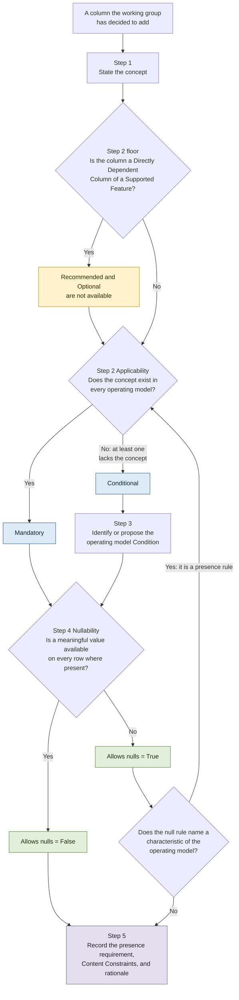

# Column Feature Level Rubric: Mandatory and Conditional

## Purpose

When FOCUS adds a column to a dataset, its **feature level** decides whether every *data generator* has to publish the column, or only the ones it applies to. This guideline decides that, for the levels `Mandatory` and `Conditional`. It applies to columns the working group has decided to add, and to columns already defined in the specification when their level is revisited.

A column earns `Mandatory` by applying to every *operating model*.

**Why nullability appears in a guideline about feature level.** Nullability decides whether the value may be null once the column is present. It is a separate axis, and it is here for two reasons:

* **It is how the feature level gets bypassed.** "Make it `Mandatory`, and *data generators* without the data can leave it null" answers the presence question with the nullability question, and mandates a column for *data generators* whose *operating model* cannot produce it. This is the failure the guideline exists to prevent.
* **It is where a missing Condition shows itself.** A null rule written in terms of what an *operating model* includes or supports is not a null rule. It is a presence rule in the wrong place, and it names the Condition the column should have been gated on.

Nullability is therefore decided here, but as the second axis and as a diagnostic, not as the subject.

**Output of the decision.** A leveling decision is not an annotation. It produces:

1. a column presence requirement in the dataset's normative requirements,
2. the `Feature level` and `Allows nulls` values in the column's Content Constraints table,
3. where the level is `Conditional`, an *operating model* Condition that the presence requirement references.

[Decision Procedure](#decision-procedure) produces all three.

The goal of this guideline is that two reviewers applying these principles independently reach the same feature level without requiring the author of the column definition to explain the decision.

**Contents:**

* [Purpose](#purpose)
* [Scope](#scope)
* [Terms Used](#terms-used)
* [Principles](#principles)
* [Decision Procedure](#decision-procedure)
* [Applicability Signals](#applicability-signals)
* [Tie-Breakers and Defaults](#tie-breakers-and-defaults)
* [Worked Example](#worked-example)
* [Deferred Topics](#deferred-topics)

## Scope

This revision covers the `Mandatory` and `Conditional` feature levels, and the nullability of columns holding them. It starts once the working group has decided that a column belongs in a dataset.

Two constraints follow:

* **It does not change the meaning of any feature level.** Each level, and the `MUST`, `SHOULD`, or `MAY` wording that expresses it, is defined in [FOCUS Feature Level](../../specification/overview.md#focus-feature-level). This guideline changes how a level is chosen, not what it means.
* **It applies to decisions made under it, and records the backlog it leaves.** Adopting it does not change the level of any published column. A published column's level is reopened when the working group schedules the backlog, or when the column is revisited for another reason. Columns that predate this guideline and do not meet its criteria are recorded rather than grandfathered.

Topics left to a later revision or to the companion guideline are listed in [Deferred Topics](#deferred-topics).

## Terms Used

| Term | Meaning |
| :--- | :--- |
| *Operating model* | How a *data generator*'s business works, described through the billing concepts it uses: regions, commitment discounts, unit pricing, and so on. It determines whether a FOCUS concept applies to a *data generator*, and it is not the same thing as the category of company the *data generator* is. |
| *Operating model* Condition | A verifiable state of an *operating model*, defined in the [Conditions](../../specification/conditions/conditions_overview.md) section. Every `Conditional` column references one or more of them through its presence requirement. |
| Leveling unit | A column within a dataset, not a Column ID in the abstract. The same Column ID may take a different feature level, a different nullability, or a different set of Conditions in each dataset that defines it. Decide per dataset. |
| Feature level | `Mandatory`, `Conditional`, `Recommended`, or `Optional`. Decides whether the column is present, and when. This revision assigns only the first two. |
| Nullability | `Allows nulls` = `True` or `False`. Decides whether the value may be null where the column is present. |

## Principles

These hold for every column and do not depend on which column is being decided.

1. **Level by *operating model*, not by category of *data generator*.** Cloud, SaaS, PaaS, data center, and AI describe the *data generator*, not the schema, and they have no bearing on the level. Where a column applies to some *data generators* and not others, name an *operating model* Condition.

   **Example:** A SaaS provider whose *operating model* includes regions takes on the region obligation. Being SaaS does not exempt it.

2. **A *data generator* asserts its own Conditions, and category expectations are not ceilings.** Any *data generator* may meet any *operating model* Condition, and asserting one takes on the matching obligation. Conformance then evaluates that assertion like any other requirement. Expectations about what a category of *data generator* commonly asserts are informative, never limiting, and exceeding one is never non-conformant.

   **Example:** A data center *data generator* whose *operating model* includes commitment discounts asserts that Condition and publishes the commitment columns.

3. **Decide the two axes separately.** Feature level and nullability are independent. Settle one, then the other.

   **Example:** `ChargeClass` is `Mandatory` on the level axis and `Allows nulls` = `True` on the nullability axis.

4. **Null is the correct value for an absent value; a placeholder is not.** Where a value is not meaningful or not available, it is null. FOCUS never requires a *data generator* to invent a value, and no feature level may depend on one.

   Fabrication means producing a value for a concept the *operating model* does not have. Producing a value for a concept the *operating model* does have is not fabrication.

   The distinction is:

   * **Absent concept:** the *operating model* does not have the concept. This affects feature level.
   * **Absent value:** the concept exists, but a specific row does not have a value. This affects nullability.

   Judge against the *operating model*, not against whatever a *data generator*'s current billing export happens to contain.

   A truthful constant value is not fabricated. A value that is always the same remains a valid value when the *operating model* defines that value.

   Where the *operating model* permits only one correct value, publishing that value is conformance, not fabrication.

   A value that does not vary is still information. Where it cannot be reconstructed from another column, omitting the column removes that information from the *FOCUS dataset* entirely, and no Condition makes that omission recoverable.

   **Example:** An *operating model* that uses unit pricing has SKUs, so producing `SkuId` identifies them rather than inventing them.

   **Example:** A single-provider dataset may contain the same `ServiceProviderName` value on every row. The repeated value remains truthful and does not make the column inapplicable.

5. **Derivation runs one way.** Where a column is calculated from other columns, the derived column can never be more present than its sources: when a source is absent, the derived column is absent. The reverse does not hold. The absence of a derived column, or a narrower applicability of the derived concept, does not lower the feature level of its source columns, and each source column is leveled on its own terms.

   **Example:** A cost restated in a second currency is derived from the billing currency cost and is absent whenever that cost is absent. A *data generator* that does not restate omits the derived column, and the source cost keeps its own level.

## Decision Procedure

Five steps. Step 3 applies only where Step 2 returns `Conditional`.



### Step 1: State the concept

Write down the exact concept the column carries, as its Description and its glossary term define it. Every later step tests that concept, not a broader or narrower one.

### Step 2: Applicability Test — sets the feature level

**Before the test: the Supported Feature floor.** Where the column appears among the Directly Dependent Columns of a Supported Feature, that feature cannot be exercised without it. Such a column is `Mandatory` or `Conditional`, and the test below decides which. `Recommended` and `Optional` are not available to it.

Where a directly dependent column would nonetheless land at `Recommended` or `Optional`, one of the two is wrong: either the level, or the feature's dependency list. Resolve that before the column ships, and record which of the two was changed.

**Question:** does this concept exist in every *operating model*?

* **Yes** → `Mandatory`. Proceed to Step 4.
* **No: at least one *operating model* lacks the concept entirely, so no row in its dataset could ever carry a value** → `Conditional`. Proceed to Step 3.

Two properties must both hold for `Mandatory`:

* the concept exists in every *operating model*, and
* a value can be produced without substituting or deriving something else in its place.

Together, these mean that no reasonable operating model would have a dataset instance where the column carries no value on any row.

A fallback value does not make a concept universal. The question is whether the column carries the concept itself, or whether it fills a gap for an *operating model* that does not have that concept.

Where the only way to populate the column for an *operating model* that lacks the concept is to substitute, approximate, or derive another concept in its place, the column is `Conditional`.

Where the concept exists across operating models but a value has not yet occurred for a particular *data generator*, the column is not `Conditional`. Nullability handles that case.

Where either the concept test or the value test fails, the column is `Conditional`. The default between the two levels is `Conditional`; a column may move to `Mandatory` in a later version once adoption shows the concept is universal.

[Applicability Signals](#applicability-signals) decides the cases where this is not obvious. [Tie-Breakers and Defaults](#tie-breakers-and-defaults) settles the rest.

### Step 3: Identify or propose the *operating model* Condition

A `Conditional` level is expressed through one or more *operating model* Conditions. Never through a category of *data generator*, and never through prose in the column description alone.

An *operating model* Condition MUST describe a characteristic of the *operating model*, not a category of *data generator*. Categories such as Cloud, SaaS, PaaS, or data center are not valid Conditions because they describe who the generator is rather than what concepts its operating model includes.

1. **Look for an existing Condition** that marks exactly where the concept exists. Reusing one is preferred over adding a near-duplicate.
2. **Where none exists, propose one** in the same pull request as the column: Condition ID, Display Name, Description, requirements stating when it evaluates to true and when to false, Version Introduced, and a row in the Condition List with its category.
3. **Where more than one applies**, decide which shape fits:
   * **Conjunction** — the column requires two independent characteristics. State both in the presence requirement.

     **Example:** `CostAndUsage MUST include [ResourceType](#datamodel.costandusage.resourcetype) when the *operating model* [includes provisioned resources](#conditions.includesprovisionedresources) and [includes resource type assignment](#conditions.includesresourcetypeassignment).`
   * **Nesting** — one Condition presupposes another. Express the dependency in the narrower Condition's own requirements rather than repeating it on every column.

     **Example:** `IncludesListUnitPrices` evaluates to true only when `IncludesUnitPricing` is true.

A Condition must remain a verifiable state of the *operating model*. A Condition that can only be evaluated by inspecting the dataset contents is not admissible.

### Step 4: Nullability Test — sets `Allows nulls`

**Question:** where the column is present, is a meaningful value available on every row?

This question starts only after applicability has been decided. It does not revisit whether the concept exists.

Two sub-questions, either of which is enough to set `Allows nulls` = `True`:

1. **Row-level applicability.** Does the concept apply to every row, or only to some? Where it applies only to some, the remaining rows are null.

   **Example:** `CommitmentDiscountStatus` is null on rows that carry no commitment discount.
2. **Availability.** On the rows where the concept applies, can the *operating model* always produce the value?

Set `Allows nulls` = `False` only when a meaningful value is available on every row where the column is present. Otherwise set `Allows nulls` = `True`.

This step never changes the feature level, and it never licenses inventing a value (Principle 4).

Whether an *operating model* can produce the concept at all is the dataset-wide question and belongs to Step 2. Whether a particular row has a value is the row-level question and belongs to this step.

**Diagnostic: a null rule that names the *operating model*.** A nullability requirement whose condition names a characteristic of the *operating model*, rather than a state of another column in the same row, is not a null rule. Return to Step 2: the characteristic it names is the Condition the column should be gated on, and the level is `Conditional` rather than `Mandatory`.

**Example:** `MUST be null when the operating model does not include regions` is a presence rule written as a null rule. `MUST be null when CommitmentDiscountId is null` is a null rule.

### Step 5: Record the outcome

**Column presence requirement**, in the dataset's normative requirements:

* `Mandatory`:

  ```markdown
  {DatasetId} MUST include [{ColumnId}](#datamodel.{datasetid}.{columnid}).
  ```

  **Example:** `CostAndUsage MUST include [BilledCost](#datamodel.costandusage.billedcost).`

* `Conditional`:

  ```markdown
  {DatasetId} MUST include [{ColumnId}](#datamodel.{datasetid}.{columnid}) when the *operating model* [{condition display name}](#conditions.{conditionid}).
  ```

  **Example:** `CostAndUsage MUST include [RegionId](#datamodel.costandusage.regionid) when the *operating model* [includes regions](#conditions.includesregions).`

**Content Constraints**, in the column definition: `Feature level` set to the Step 2 result, linked to the Condition where the level is `Conditional`; `Allows nulls` set to the Step 4 result.

**Nullability requirements**, in the column definition, where Step 4 returned `True` for the row-level applicability reason: state when the column is null and when it is not, rather than leaving the null rule implicit.

**Rationale**, where the decision was not obvious: which *operating model* was judged to lack or hold the concept, and why. Until the companion guideline says where this record belongs, it lives with the leveling decision itself, in the pull request or issue.

## Applicability Signals

Five distinctions decide Step 2 where it is not obvious. Each is a question about the concept, not about any one *data generator*.

| Signal | Question | Verdict | Example |
| :--- | :--- | :--- | :--- |
| **Substitution** | Is the only way to fill the column for the *operating models* that lack the concept to substitute or derive some other value? | Substitution needed → `Conditional`. The concept is not universal. | — |
| **Rule or patch** | Where the column is defined in terms of another column, does that definition apply in every *operating model*, or only in those lacking the concept? | Applies to all → `Mandatory`. Supplied only for those lacking the concept → `Conditional`. Having a fallback settles nothing by itself; which of the two kinds it is settles it. | EffectiveCost is defined against BilledCost for every *operating model*, equal to it for ordinary charges and computed from it where commitments amortize. It never stands in for a concept the *operating model* lacks, so it is a rule, not a patch. |
| **Absent or not yet occurred** | Is the concept missing from the *operating model*, or present but not yet instantiated by a given *data generator*? | Concept missing → `Conditional`. Concept present, instance not yet produced → `Mandatory`, with Step 4 setting nullability. | Every *operating model* has the concept of a correction to a closed billing period, so a *data generator* that has never issued one still publishes ChargeClass, null on its rows. |
| **Presence gate or nullability gate** | Does the gate remove the column from the dataset entirely, or only leave some rows without a value? | Whole column absent for some *operating model* → presence gate, so `Conditional`. Values on some rows in every *operating model* → nullability, so `Mandatory` with Step 4 setting `Allows nulls` = `True`, however the gate is worded. | An *operating model* with no regions has no row that could carry RegionId. Every *operating model* has rows that carry a ChargeClass value. |
| **Variance gate** | Does the Condition gate on two values differing, or on more than one value occurring, rather than on whether the concept exists? | The concept is universal, so applicability alone returns `Mandatory`. The gate is admissible, making the column `Conditional`, only where the column's value is fully determined by another column in the same dataset wherever the Condition is false. Where the value is not recoverable that way, a constant is still a truthful value and the column stays `Mandatory`. | An *operating model* that prices and bills in one currency has a pricing currency equal to its billing currency, so gating on the difference is admissible: the value is recoverable from the billing currency column. **Counter-example:** Where a *FOCUS dataset* carries no other column from which the value could be reconstructed, gating on variance removes information the dataset cannot otherwise convey, and the column stays `Mandatory`. |

## Tie-Breakers and Defaults

* **The default is `Conditional`.** Where Step 2 does not clearly return `Mandatory`, the column is `Conditional`.

* **Anything at the boundary is `Conditional`** until the companion guideline calibrates the boundary against real *data generator* data.

* **Calling a model an exception requires an explicit decision.** A single unusual *operating model* that lacks the concept may be treated as an exception, keeping the column `Mandatory`, only when the working group records:
  * which *operating model* is being treated as exceptional,
  * why the concept is still considered universal,
  * why the exception does not represent a broader pattern.

  A recorded exception takes precedence over the boundary default above. Until the companion guideline defines where this record belongs, it lives with the leveling decision itself, in the pull request or issue.

* **A constant value is a truthful value.** A column whose value is present and correct for every *operating model* stays `Mandatory` even where it repeats on every row.

  **Example:** `ServiceProviderName` repeats on every row of a single-provider dataset and is `Mandatory`.

* **`Conditional` does not mean optional.** Where the Condition holds, the column is fully mandatory. What varies is which columns a dataset contains, not how strongly they are required.

## Worked Example

> **Note:** This section is informative.

**RegionId, in the Cost and Usage dataset:**

* **Step 1, Concept.** The isolated geographic area a *resource* or *service* is deployed in.
* **Step 2, Applicability.** An *operating model* without customer-visible regions has no row that could carry a value. Presence gate, so `Conditional`.
* **Step 3, Condition.** [Includes Regions](#conditions.includesregions) exists and marks exactly where the concept exists. No new Condition needed.
* **Step 4, Nullability.** Where the *operating model* includes regions, a region is available on many rows but not all, so `Allows nulls` = `True`.
* **Step 5, Record.** `CostAndUsage MUST include [RegionId](#datamodel.costandusage.regionid) when the *operating model* [includes regions](#conditions.includesregions).` Content Constraints: `Feature level` = `Conditional`, linked to Includes Regions; `Allows nulls` = `True`.

The same Column ID is leveled on its own terms in each dataset that defines it.

## Deferred Topics

| Topic | Position of this revision |
| :--- | :--- |
| Criteria for `Recommended` and `Optional` | Not settled here. This revision takes no position, does not change what those levels mean, and does not change the level of any column that currently holds one. |
| Whether a proposed column belongs in the schema | Not part of this revision. Two tests would answer it: whether the data is needed rather than merely useful, and whether a column calculable from other columns earns a place of its own. |
| What a Supported Feature does about a column that can be absent | Belongs to the Supported Features work. The obligation is prospective: adopting this guideline does not reopen levels of existing columns. What a feature does once a column it depends on is `Conditional`, and therefore absent from some *FOCUS datasets*, is not decided here. Existing Conditional columns that are already dependencies of Supported Features are handled through the Supported Features work. |
| Applying these criteria to published columns | Scheduled, not settled here. A published column enters the backlog when it is a Directly Dependent Column of a Supported Feature and its presence requirement is a `SHOULD` or a `MAY`. Conditions that gate on variance rather than on absence are re-tested against the recoverability rule in the same pass, since such a gate is admissible only where the value is recoverable from another column in the same dataset. The working group sets the release that takes the backlog. |
| The threshold at which a column moves between `Mandatory` and `Conditional` | Companion guideline. Until then, [Tie-Breakers and Defaults](#tie-breakers-and-defaults) applies. |
| Where the leveling rationale is recorded | Companion guideline. Until then, the pull request or issue. |
| Informative category-based expectations | Out of scope here, and never expressed as a feature level. |

The principles and the procedure stand on their own, and can be adopted without waiting for the companion guideline.
