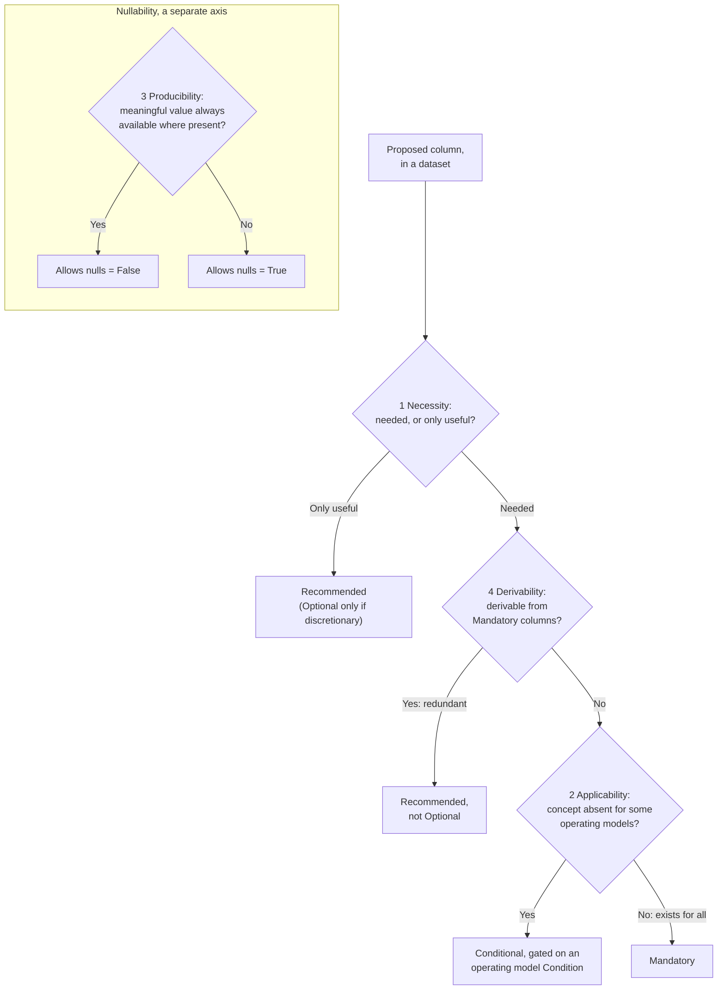

# Column Feature-Level Rubric: Principles

## Overview

These principles set a FOCUS column's feature level and nullability when the column is proposed, so the level is decided up front instead of argued after the column ships. They apply to existing and net-new columns alike.

Level and nullability are two axes, decided separately. Level says whether the column is present, and when. Nullability says whether the value may be null when the column is present. Mandatory is a bar a column earns by applying to every operating model, not the default it starts from.

Applied as intended, the rubric keeps three outcomes true:

* A column whose concept exists only for some operating models is never universally required; it takes Conditional, not Mandatory.
* Nullability never substitutes for the applicability decision; a column is not held Mandatory on the reasoning that generators lacking its concept can leave it null or fill it from another column.
* Derivation relationships never set a feature level by themselves; a derived column and its source columns are each leveled on their own inputs.

This is the first of two parts: the principles here, the mechanics (procedure, data-driven tests, machine-readable check) in a companion guideline. The bar to meet: two people applying these principles to the same column reach the same level, without the author in the room.

**Contents:**

* [Key Concepts](#key-concepts)
* [Core Principles](#core-principles)
* [The Interim Boundary Rule](#the-interim-boundary-rule)
* [The Four Decision Inputs](#the-four-decision-inputs)
* [Two-Layer Output](#two-layer-output)
* [Applying the Principles: A Worked Example](#applying-the-principles-a-worked-example)
* [Scope of This Guidance](#scope-of-this-guidance)

## Key Concepts

* **Operating model.** The collective set of business concepts underlying a FOCUS-compliant dataset. For leveling, read it as the characteristics that decide which FOCUS concepts apply to a generator (regions, commitment discounts, virtual currency, and so on), independent of category.
* **Operating model Condition.** A named entry in the specification's Conditions section (specification/conditions/), each reading "the operating model includes X" (includes regions, includes commitment discounts). The Conditions section is the single list, and every Conditional column links to one.
* **Leveling unit.** A column within a dataset, not a Column ID in the abstract. The same Column ID may take a different level, nullability, or set of Conditions in each dataset, judged per dataset.
* **The two axes.**

| Axis | Values | Decides |
|---|---|---|
| Feature level | Mandatory, Conditional, Recommended, Optional | Whether the column is present, and when |
| Nullability | Allows nulls = True / False | Whether the value may be null when present |

The four levels and their `MUST`/`SHOULD`/`MAY` obligations are already defined in the [FOCUS Feature Level](../../specification/overview.md#focus-feature-level) section; this rubric changes how a level is chosen, not what it means.

## Core Principles

1. **Level by operating model, not technology category.** A category (cloud, SaaS, PaaS, data center, AI) describes the generator, not the schema, and has no say in the level. When applicability varies, name an operating model Condition. *(A SaaS provider whose operating model includes regions takes the region obligation; being in the SaaS category does not exempt it.)*
2. **Operating model Conditions are self-asserted; defaults are not ceilings.** A generator may meet any operating model Condition, whatever its category, and asserting one takes on the matching obligation. Category defaults describe what is common today; they never cap a generator down, and exceeding them is never non-conformant. An asserted Condition is checked by conformance like any other requirement. How assertions are recorded is mechanics for the companion. *(A data-center generator whose model includes commitment discounts asserts that Condition and carries the commitment columns, though its category default would not.)*
3. **Two axes, kept apart.** Level and nullability are decided separately: level is whether the column is present and when, nullability is whether its value may be null when present. *(ChargeClass is Mandatory on the level axis yet Allows nulls = True on the nullability axis.)*
4. **Mandatory is earned, not assumed.** A column is Mandatory only when its concept exists for every operating model and a value is naturally producible, so no reasonable generator carries it null on every row. A column a reasonable model would leave entirely null is Conditional, gated on the operating model Condition where the concept lives. The default between them is Conditional. A column can harden to Mandatory later as adoption proves it universal; it is not presumed so up front. *(BilledCost clears the bar. RegionId does not: a flat-rate SaaS has no region, so it is Conditional.)*
5. **Honest nulls, never fabrication.** When a value is not meaningful or not available, it is null; FOCUS never asks a generator to invent a placeholder, and a level that forces one must change. Fabrication is inventing a value for a concept the model lacks; producing the representation of a concept the model has is not fabrication. Availability is judged against the operating model, not the current billing export: a model with unit pricing has SKUs to identify, so producing SkuId is identification, and a value with one correct answer given the model (BillingAccountType) is populated as a matter of conformance.
6. **No level rests on a manufactured value.** A column is never kept Mandatory by manufacturing a value to fill it, producing one only to satisfy the requirement when the model has nothing to report. A value that would be genuinely null for a whole class of models makes the column Conditional, not Mandatory and manufactured for those models. A value a generator can report truthfully, even a single value that holds for its whole dataset, is not manufactured.
7. **Derivation is directional.** A derivation runs one way, from source columns to a derived column; the two are not equals. A derived column cannot be more present than its sources: when a source is absent, so is the derived column. The reverse never holds. A derived column that is absent or narrower does not pull its sources down, and each source is leveled by its own inputs. So a source and a column derived from it may sit at different levels, the source Mandatory and the derived Conditional, when the derived concept applies to fewer models. (A cost restated in a second currency derives from the billing-currency cost: absent when that cost is absent, but a generator that does not restate omits it while the source cost stands alone.)

## The Interim Boundary Rule

The hardest split is between two outcomes:

* **Mandatory, Allows nulls = True.** The concept exists for every operating model, so the column is always present, but a truthful value is not on every row (an ordinary charge carries a null ChargeClass). Nulls are row-level, never a whole model null throughout. Presence is guaranteed, so consumers and joins can rely on it.
* **Conditional.** The column is present only when it applies, and fully mandatory when it does. The column set varies between dataset instances. Conditional is not optional, and an absent column is clearer than one null for a whole model.

The rule:

* Input 2 decides which applies, holding to principle 4: one unusual model that lacks the column may be an exception that keeps it Mandatory; a pattern of models leaving it null makes it Conditional.
* Until the companion calibrates that line from generator data, a column at the boundary is Conditional.
* The Mandatory exception holds only when the working group records which operating model is judged exceptional, and why. Until the companion names a home, that record lives with the leveling decision (the pull request or issue).
* A value present and truthful for every model does not reach the boundary, even a constant one, and stays Mandatory. ServiceProviderName may repeat on every row of a single-provider dataset and still stays Mandatory.

## The Four Decision Inputs

Every leveling decision answers four questions. They are numbered for reference; the flowchart shows the order they apply in (necessity, derivability, applicability, with producibility on the separate nullability axis).

1. **Necessity.** Is the data needed, so that without it something breaks rather than degrades? A column is needed on either basis:
   * **Use-case necessity.** The column appears in a Supported Feature's Directly Dependent Columns list. That membership is a signal, not proof; the test is whether the use case breaks or only degrades without it. A column that only refines a result a Mandatory column already delivers degrades, so it is useful-but-not-needed even when listed as directly dependent. This carve-out applies only when the primary it refines is itself Mandatory; a column refining a Conditional primary is leveled by inputs 2 and 4, typically inheriting the primary's Condition. Appearing only in a Supporting Columns list is the useful-but-not-needed signal.
   * **Dataset-structural necessity.** The column is needed for the dataset's own integrity: a primary or foreign identifier, a period boundary, record provenance. The datasets beyond Cost and Usage and the metadata sections carry these, and take the `MUST` family though no feature depends on them.

     Needed on either basis goes to `MUST` (Mandatory or Conditional). Useful-but-not-needed goes to `SHOULD` (Recommended). Optional is reserved for the rare genuinely discretionary column, so the schema leans to `MUST` and `SHOULD`, not a pile of `MAY`s. A Mandatory or Conditional column meeting neither basis is a signal to re-level, not to invent a use case for it.

     **Net-new columns.** No Supported Feature can list one yet, so judge its necessity from the use case it serves, not current lists; its absence from them is not the useful-but-not-needed signal. Missing feature coverage is the gap to close, not evidence the column is unneeded. A needed net-new column is then leveled by inputs 2 and 4, so one whose concept is absent for some models is Conditional, not Optional.
2. **Applicability variance.** Does the column apply to some operating models but not others? Test the concept fixed by the column's Description and glossary term, not a broader or narrower one. When a reasonable model would have it null on every row because the concept does not exist for it, the column is Conditional, gated on the operating model Condition marking where the concept exists. When the concept exists for every model, the column is Mandatory and input 3 sets nullability.
   * **Substitution signals non-universality.** If the column can only be filled for the models that lack its concept by substituting or deriving another value, the concept is not universal and the column is Conditional.
   * **Definitional equality vs gap-filling substitution.** A rule that defines the value in terms of another column for every model is a definitional equality and leaves the concept universal (EffectiveCost is defined from BilledCost for every generator, so Mandatory). A rule that substitutes another value only for the models lacking the concept marks it non-universal, so Conditional. The fallback does not settle the level; which kind it is does.
   * **Concept absent vs never produced.** When the concept is absent for a class of models, Conditional (a flat-rate SaaS has no region concept to populate). When the concept exists for every model but a generator has never produced an instance, Mandatory, with nulls set by input 3 (any generator marks a correction to a closed billing period with ChargeClass, so one that never issued such a correction still carries the column, null on its rows). The test is whether the concept exists, not whether a value has been produced.
   * **Read only presence gates here.** A Condition that gates nullability leaves the level Mandatory and feeds input 3. The discriminator is scope: a presence gate means a model can lack the characteristic outright, so no row ever carries a value and the column is absent whole (a model with no regions). A gate that still leaves values on some rows for every model is row-level nullability, however phrased (no model can lack corrections to closed billing periods, so ChargeClass's null rule is nullability, not a Condition). One exception versus a pattern is settled by the Interim Boundary Rule.
3. **Producibility.** When the column applies, can the model produce a meaningful value, or is the honest answer null? Judge against the operating model, not the current export (principle 5). Set Allows nulls = False only when a meaningful value is available on every row where the column is present. Otherwise set Allows nulls = True. This sets nullability, never the level, and never allows fabrication.
4. **Derivability.** Can the column already be computed from existing Mandatory columns? A fully derivable column is not a Mandatory obligation, since that is redundant work for the producer; included at all, it defaults to Recommended. This holds even when the data is needed: the need is already met by the Mandatory columns it derives from. It does not clash with principle 7: derivability keeps a redundant column out of `MUST`, while principle 7 fixes the direction of any derivation among columns that are kept. Derivable means a consumer can compute the value from other Mandatory columns in the same dataset instance. It covers arithmetic, conversion (a cost in another currency), and a lookup whose mapping is present in the dataset as a distinct artifact. A value needing a provider-held mapping is not derivable, nor is one whose only in-dataset link is co-occurring on the same rows (a display name resolved from an identifier through a provider-only table); such a column is leveled by inputs 1 through 3. Direction matters: a unit price derives from a cost and its pricing quantity, but a cost does not derive from a unit price, since rows with no priced quantity have nothing to multiply. The companion supplies the machine-readable derivation source.

Borderline applicability, the concept present for most models and absent for a few, is settled by the companion's test; until then such a column takes the Conditional default from the Interim Boundary Rule.

## Two-Layer Output

The rubric produces two layers; only one is normative.

1. **Normative (no categories).** Per column: a level, a nullability, and zero or more operating model Conditions. Always *Conditional, gated on the operating model Condition that the model includes regions*, never *Mandatory for cloud, Optional for SaaS*.
2. **Informative (categories, non-binding).** Per category: the operating model Conditions typically met in that category today. These are defaults, not ceilings; a generator may exceed them (principle 2). This layer belongs outside the specification, in educational materials; where it is recorded is settled by the companion.

A category-free normative layer is what lets a level be conformance-tested and stay valid as operating models change. The informative layer records today's expectations without binding tomorrow's generators.

## Applying the Principles: A Worked Example

Informative. The four inputs for RegionId:

* **Necessity.** Region is needed for the Location Supported Feature; allocating cost by region is impossible without a region identifier, and no Mandatory column delivers it, so the carve-out for a column refining a Mandatory primary does not demote it. `MUST` family.
* **Applicability variance.** Some models have no customer-visible region (a flat-rate SaaS) and would have RegionId null on every row. Applicability varies, so Conditional, gated on the operating model Condition that the model includes regions.
* **Producibility.** Where the model includes regions, a region is available but not always on every row, so Allows nulls = True.
* **Derivability.** Region cannot be computed from existing Mandatory columns.

Result: RegionId is Conditional, gated on the model includes regions, Allows nulls = True.

A second example, the dataset-structural column ContractCommitmentId:

* **Necessity.** No Supported Feature lists it as directly dependent; it is needed on the dataset-structural basis, since the Contract Commitment dataset cannot join or de-duplicate rows without its primary identifier. `MUST` family.
* **Applicability variance.** Every Contract Commitment dataset has commitments to identify, so the concept is universal. Mandatory.
* **Producibility.** An identifier is always available where the dataset exists, so Allows nulls = False.
* **Derivability.** It cannot be computed from other Mandatory columns.

Result: ContractCommitmentId is Mandatory, Allows nulls = False, on the dataset-structural basis, with no Supported Feature dependency required.

## Scope of This Guidance

In scope: the terms, the principles, the interim boundary rule, the four decision inputs, the two kinds of gate, and the two-layer output.

In the companion mechanics guideline: the step-by-step procedure; how a generator's asserted operating model Conditions are recorded; the necessity-boundary test between refining and breaking; the applicability test (the matrix, and the threshold at which a column flips between Mandatory and Conditional); the disposition of variance that fits no operating model Condition; the back-test against current columns; where the informative layer is recorded; and the machine-readable check. That check must:

* **Read every gate surface.** A presence requirement can live in the dataset requirements, in the composite and dataset-level rules' `ApplicabilityCriteria` field, or in the column's own nullability rule. Reading only the column file misses the others.
* **Consume a machine-readable derivation source.** Input 4 needs a per-column record of what each column derives from and by what relation (arithmetic, lookup, or conversion).
* **Point every Conditional column at the Conditions section.** Require each Conditional column to link to a Condition there, and map the older `ApplicabilityCriteria` keys (for example `REGION_SUPPORTED`) onto the matching Condition IDs (for example `IncludesRegions`).
* **Plan the back-test's re-leveling.** It will flag existing Mandatory columns meeting neither necessity basis (administrative and audit columns are the common case); the guidance says whether to re-level or record the dataset-structural basis that keeps them Mandatory.

The back-test needs the Supported Features to name the columns each use case depends on: a column needed on the use-case basis but absent from every Directly Dependent Columns list has nothing for input 1 to point at. The principles stand on their own, and a team can adopt them without waiting for the mechanics.
