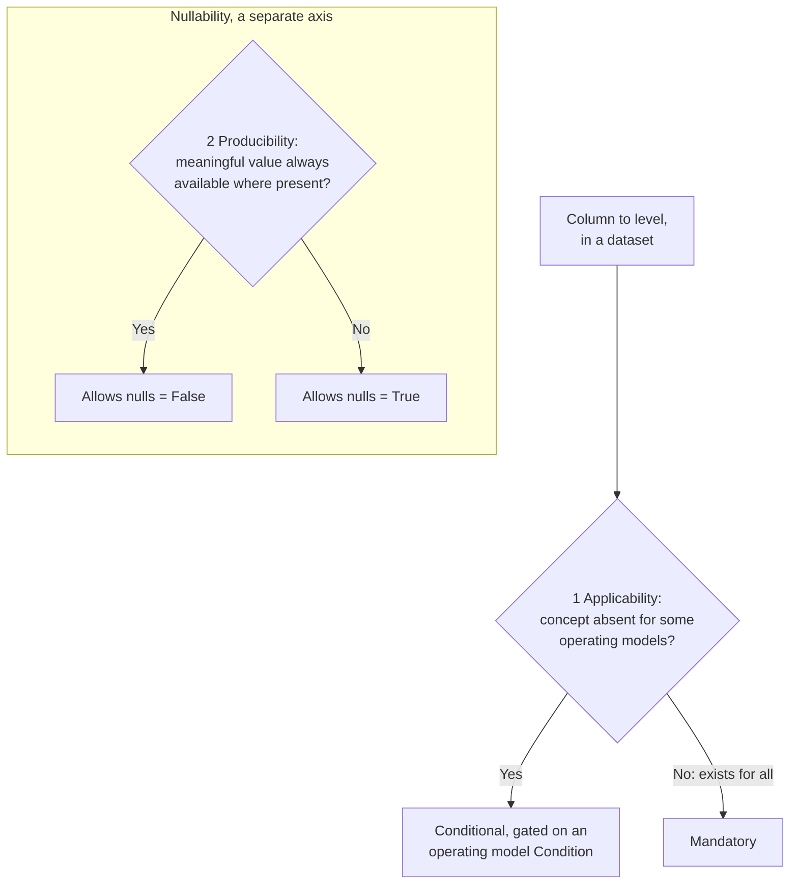

# Column Feature-Level Rubric: Mandatory and Conditional

## Overview

These principles decide whether a FOCUS column is Mandatory or Conditional, and whether its value may be null, at the time the column is proposed, so the level is decided up front instead of argued after the column ships. They apply to existing and net-new columns alike.

Level and nullability are two axes, decided separately. Level says whether the column is present, and when. Nullability says whether the value may be null when the column is present. Mandatory is a bar a column earns by applying to every operating model, not the default it starts from.

Applied as intended, the rubric holds three things true (each detailed below):

* A column only some operating models can produce takes Conditional, not Mandatory.
* Nullability never stands in for that applicability decision.
* Derivation never sets a feature level by itself; each column is leveled on its own inputs.

This is the first of two parts: the principles here, the mechanics (procedure, data-driven tests, machine-readable check) in a companion guideline. The bar to meet: two people applying these principles to the same column reach the same level, without the author in the room.

**Contents:**

* [Scope of This Revision](#scope-of-this-revision)
* [Key Concepts](#key-concepts)
* [Core Principles](#core-principles)
* [The Interim Boundary Rule](#the-interim-boundary-rule)
* [The Two Decision Inputs](#the-two-decision-inputs)
* [Normative Content Defined by the Rubric](#normative-content-defined-by-the-rubric)
* [Applying the Principles: A Worked Example](#applying-the-principles-a-worked-example)
* [Relationship to the Companion Guideline](#relationship-to-the-companion-guideline)

## Scope of This Revision

This revision supplies criteria for two of the four feature levels, Mandatory and Conditional, and for nullability. It starts from a column the working group has decided to carry in a dataset, and decides which of the two levels that column takes.

Two questions sit outside this revision and are deferred to a later one:

* **The criteria for Recommended and Optional.** How a column reaches either level, and what becomes of the columns that hold them today, is not settled here. This revision takes no position on either question, and changes neither the meaning of those levels nor the level of any column that currently holds one.
* **Whether a proposed column belongs in the schema at all.** The tests for that admission decision, whether the data is needed rather than merely useful, and whether a column already computable from other columns earns a place, are not part of this revision. That includes the boundary between a column that breaks a use case by its absence and one that only refines a result another column already delivers.

The narrowing is deliberate. Mandatory and Conditional carry the applicability asymmetry that blocks adoption for generators whose operating models do not match cloud-shaped assumptions, and the criteria separating those two levels can be stated as a test two reviewers apply the same way. The criteria for the remaining levels are not yet at that standard, and this revision does not force them.

## Key Concepts

* **Operating model.** The collective set of business concepts underlying a FOCUS-compliant dataset. For leveling, read it as the characteristics that decide which FOCUS concepts apply to a generator (regions, commitment discounts, virtual currency, and so on), independent of category.
* **Operating model Condition.** A named entry in the specification's Conditions section (specification/conditions/), each reading "the operating model includes X" (includes regions, includes commitment discounts). The Conditions section is the single list, and every Conditional column links to one or more of its entries; a single column's presence may be gated by more than one Condition.
* **Leveling unit.** A column within a dataset, not a Column ID in the abstract. The same Column ID may take a different level, nullability, or set of Conditions in each dataset, judged per dataset.
* **The two axes.**

| Axis | Values | Decides |
|---|---|---|
| Feature level | Mandatory, Conditional, Recommended, Optional | Whether the column is present, and when |
| Nullability | Allows nulls = True / False | Whether the value may be null when present |

The four levels and their `MUST`/`SHOULD`/`MAY` obligations are already defined in the [FOCUS Feature Level](../../specification/overview.md#focus-feature-level) section; this rubric changes how a level is chosen, not what it means. Recommended and Optional appear in the table because the specification defines them and columns still carry them, and they stay exactly as they are: supplying criteria for them is deferred work, not work this revision has done.

## Core Principles

1. **Level by operating model, not technology category.** A category (cloud, SaaS, PaaS, data center, AI) describes the generator, not the schema, and has no say in the level. When applicability varies, name an operating model Condition. *(A SaaS provider whose operating model includes regions takes the region obligation; being in the SaaS category does not exempt it.)*
2. **Operating model Conditions are self-asserted; defaults are not ceilings.** A generator may meet any operating model Condition, whatever its category, and asserting one takes on the matching obligation. Category defaults describe what is common today; they never cap a generator down, and exceeding them is never non-conformant. An asserted Condition is checked by conformance like any other requirement. How assertions are recorded is mechanics for the companion. *(A data-center generator whose model includes commitment discounts asserts that Condition and carries the commitment columns, though its category default would not.)*
3. **Two axes, kept apart.** Level and nullability are decided separately: level is whether the column is present and when, nullability is whether its value may be null when present. *(ChargeClass is Mandatory on the level axis yet Allows nulls = True on the nullability axis.)*
4. **Mandatory is earned, not assumed.** A column is Mandatory only when its concept exists for every operating model and a value is naturally producible, so no reasonable generator carries it null on every row. A column a reasonable model would leave entirely null is Conditional, gated on the operating model Condition where the concept lives. The default between them is Conditional. A column can harden to Mandatory later as adoption proves it universal; it is not presumed so up front. *(BilledCost clears the bar. RegionId does not: a flat-rate SaaS has no region, so it is Conditional.)*
5. **Honest nulls, never fabrication.** When a value is not meaningful or not available, it is null. FOCUS never asks a generator to invent a placeholder, and a level that forces one must change. Fabrication is inventing a value for a concept the model lacks. Producing the representation of a concept the model has is not fabrication. Availability is judged against the operating model, not the current billing export. A model with unit pricing has SKUs to identify, so producing SkuId is identification. A value with one correct answer given the model (BillingAccountType) is populated as a matter of conformance.
6. **No level rests on a fabricated value.** A column is never kept Mandatory by fabricating a value only to satisfy the requirement when the model has nothing to report. A value that would be genuinely null for a whole class of models makes the column Conditional, not Mandatory with a fabricated value for those models. A value a generator can report truthfully, even a single value that holds for its whole dataset, is not fabricated.
7. **Derivation is directional.** A derivation runs one way, from source columns to a derived column; the two are not equals. A derived column cannot be more present than its sources: when a source is absent, so is the derived column. The reverse never holds. A derived column that is absent or narrower does not pull its sources down, and each source is leveled by its own inputs. So a source and a column derived from it may sit at different levels, the source Mandatory and the derived Conditional, when the derived concept applies to fewer models. (A cost restated in a second currency derives from the billing-currency cost: absent when that cost is absent, but a generator that does not restate omits it while the source cost stands alone.)

## The Interim Boundary Rule

The hardest split is between two outcomes:

* **Mandatory, Allows nulls = True.** The concept exists for every operating model, so the column is always present, but a truthful value is not on every row (an ordinary charge carries a null ChargeClass). Nulls are row-level, never a whole model null throughout. Presence is guaranteed, so consumers and joins can rely on it.
* **Conditional.** The column is present only when it applies, and fully mandatory when it does. The column set varies between dataset instances. Conditional is not optional, and an absent column is clearer than one null for a whole model.

The rule:

* Input 1 decides which applies, holding to principle 4: one unusual model that lacks the column may be an exception that keeps it Mandatory; a pattern of models leaving it null makes it Conditional.
* Until the companion calibrates that line from generator data, a column at the boundary is Conditional.
* The Mandatory exception holds only when the working group records which operating model is judged exceptional, and why. Until the companion names a home, that record lives with the leveling decision (the pull request or issue).
* A value present and truthful for every model does not reach the boundary, even a constant one, and stays Mandatory. ServiceProviderName may repeat on every row of a single-provider dataset and still stays Mandatory.

## The Two Decision Inputs

Every leveling decision answers two questions, one per axis. Applicability sets the level; producibility sets nullability. They are numbered for reference.

1. **Applicability variance.** Does the column apply to some operating models but not others? Test the concept fixed by the column's Description and glossary term, not a broader or narrower one. When a reasonable model would have it null on every row because the concept does not exist for it, the column is Conditional, gated on the operating model Condition marking where the concept exists. When the concept exists for every model, the column is Mandatory and input 2 sets nullability.
   * **Substitution signals non-universality.** If the column can only be filled for the models that lack its concept by substituting or deriving another value, the concept is not universal and the column is Conditional.
   * **A rule that holds for every model, versus one that patches only the models missing the concept.** A value defined in terms of another column in every operating model keeps the concept universal, so the column is Mandatory, even where the two values differ from row to row (EffectiveCost is defined against BilledCost for every generator: equal to it for ordinary charges, and computed from it, not substituted for a missing concept, where commitments amortize). A value supplied only for the models that lack the concept marks the concept non-universal, so Conditional. The fallback does not settle the level; which of the two it is does.
   * **Concept absent vs never produced.** When the concept is absent for a class of models, Conditional (a flat-rate SaaS has no region concept to populate). When the concept exists for every model but a generator has never produced an instance, Mandatory, with nulls set by input 2 (any generator marks a correction to a closed billing period with ChargeClass, so one that never issued such a correction still carries the column, null on its rows). The test is whether the concept exists, not whether a value has been produced.
   * **Read only presence gates here.** A Condition that gates nullability leaves the level Mandatory and feeds input 2. The discriminator is scope: a presence gate means a model can lack the characteristic outright, so no row ever carries a value and the column is absent whole (a model with no regions). A gate that still leaves values on some rows for every model is row-level nullability, however phrased (no model can lack corrections to closed billing periods, so ChargeClass's null rule is nullability, not a Condition). One exception versus a pattern is settled by the Interim Boundary Rule.
2. **Producibility.** When the column applies, can the model produce a meaningful value, or is the honest answer null? Judge against the operating model, not the current export (principle 5). Set Allows nulls = False only when a meaningful value is available on every row where the column is present. Otherwise set Allows nulls = True. This sets nullability, never the level, and never allows fabrication.

Borderline applicability, the concept present for most models and absent for a few, is settled by the companion's test; until then such a column takes the Conditional default from the Interim Boundary Rule.

## Normative Content Defined by the Rubric

The rubric provides guidance for defining the normative content related to feature leveling and column nullability.

The rubric helps identify:

* applicable operating model Conditions,
* Feature Levels for FOCUS datasets and FOCUS columns,
* Nullability for FOCUS columns.

Feature Levels are defined independently of category. Conditional columns are expressed through operating model Conditions rather than category-specific rules such as "Mandatory for cloud" or "Optional for SaaS".

> **Note:** Category-based expectations are informative only and are out of scope for this rubric. They should be addressed separately, potentially in the companion guideline or other guidance material.

## Applying the Principles: A Worked Example

Informative. The two inputs for RegionId:

* **Applicability variance.** Some models have no customer-visible region (a flat-rate SaaS) and would have RegionId null on every row. Applicability varies, so Conditional, gated on the operating model Condition that the model includes regions.
* **Producibility.** Where the model includes regions, a region is available but not always on every row, so Allows nulls = True.

Result: RegionId is Conditional, gated on the model includes regions, Allows nulls = True.

A second example, ContractCommitmentId, in a dataset other than Cost and Usage:

* **Applicability variance.** Every Contract Commitment dataset has commitments to identify, so the concept is universal. Mandatory.
* **Producibility.** An identifier is always available where the dataset exists, so Allows nulls = False.

Result: ContractCommitmentId is Mandatory, Allows nulls = False. The same Column ID is leveled independently in each dataset that carries it.

## Relationship to the Companion Guideline

This guideline defines the principles for assigning feature levels and nullability. The companion guideline is intended to define the mechanics needed to apply these principles consistently and support conformance validation.

The following topics should be considered for the companion guideline:

* The step-by-step leveling procedure.
* How a generator's asserted operating model Conditions are recorded.
* The applicability test, including the matrix and the threshold at which a column moves between Mandatory and Conditional.
* The disposition of variance that does not map to an operating model Condition.
* The back-test against current columns.
* Where informative category-based expectations are recorded.
* The machine-readable check, including:
  * Reading all relevant requirement surfaces.
  * Consuming a machine-readable derivation source.
  * Linking Conditional columns to the Conditions section.

The principles stand on their own, and a team can adopt them without waiting for the mechanics.
