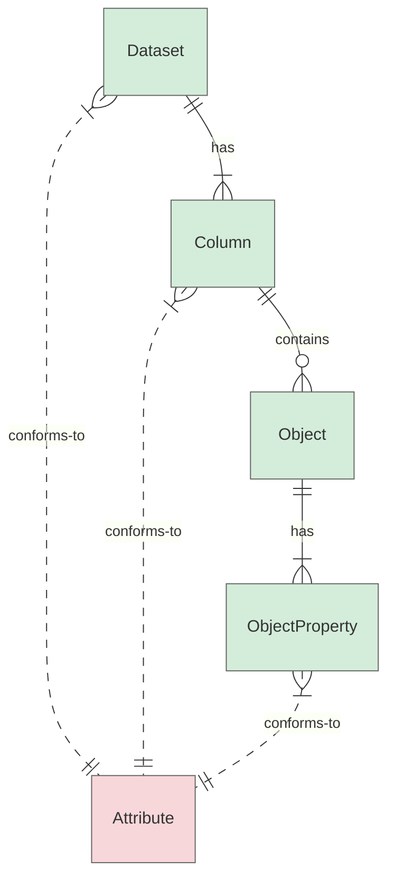

# Normative Requirements Guidelines

This section defines guidelines for authoring normative requirements in the FOCUS specification. These guidelines define **how** to write normative requirements to ensure clarity, consistency, and testability. It does not define the requirements themselves (the "what") but concentrates on their **structure, subjects, and verifiability**.

The guidelines cover authoring of normative requirements for the following entities:

* **FOCUS datasets** — the primary containers of structured data as defined in FOCUS.
* **FOCUS columns** — individual columns within FOCUS datasets, defined by FOCUS (may contain nested objects and object properties, which can have additional normative rules).
* **Custom columns** — individual columns within FOCUS datasets, not defined by FOCUS.
* **FOCUS attributes** — reusable sets of normative constraints that datasets, columns, or column sub-elements (such as objects and object properties) conform to; guidelines cover how to author requirements within Attribute sections.

The diagram below illustrates the relationships among these entities and shows where normative requirements apply:



**Nodes:**

* 🟩 FOCUS schema-level entity (normative subject)
* 🟥 FOCUS normative rule set (not a normative subject)

**Relationships:**

* `|| -- has -- |{` : one parent to one-or-more enumerated structural members
* `|| -- contains -- o{` : one parent to zero-or-more child entities (array of objects)
* `}| .. conforms-to .. ||` : many children to one parent conformance relationship

**Exceptions:**

* `CustomColumnHandling` is a special Attribute that references other Attributes (e.g., `NullHandling`, `DateTimeFormat`) to establish recommended conformance for custom columns. This cross-reference pattern is an exception rather than a general relationship shown in the diagram.

## Dataset Abstraction and Normative Subject Convention

By glossary definition, the following concepts are used:

* **FOCUS Dataset** — the primary dataset concept defined by the FOCUS specification.
* **Dataset Instance** — represents a concrete instantiation of a **FOCUS Dataset Instance**.
* **Dataset Artifact** — represents a physical or delivered form of a **FOCUS Dataset Instance Artifact**.

However, by design decision, the specification adopts the following normative conventions:

* **FOCUS Dataset is used as the canonical normative subject** for dataset-level requirements.
* Normative requirements are intentionally written against **FOCUS Dataset**, even when the constraint applies to:
  * a dataset specification,
  * a dataset instance, or
  * a dataset instance artifact.
* The intended level of application (specification vs. instance vs. artifact) is inferred from context rather than encoded in the normative subject.

This choice is intentional and overrides interpretations based solely on abstraction level.

## Notation Conventions

This document uses the following notation conventions in requirement patterns and examples:

* `<placeholder>` — a named placeholder to be replaced with a specific value (used in code block patterns)
* `{placeholder}` — a named placeholder to be replaced with a specific value (used in prose and tables)
* `[optional element]` — an optional element that applies only under certain conditions
* `[A|B]` — a choice between two alternatives (e.g., `[Dataset|Column]`)
* `...` — indicates that additional content exists but is not shown in the example

## Core Normative Authoring Rules

### Normative Requirement Structure

The recommended pattern for a normative requirement is:

``` markdown
<Subject (+qualifier)> + <BCP 14 Keyword> + <Verifiable State Descriptor> + <Object (+qualifier)> [+ Conditions]
```

* Each normative requirement MUST:
  * identify exactly one **normative subject** to which the requirement applies
  * contain exactly one **BCP 14 keyword** (MUST, SHOULD, MAY, MUST NOT, etc.), indicating the obligation level
  * express exactly one **verifiable constraint**
* Each normative requirement SHOULD describe a **verifiable state** of the object rather than behavior

### Structural Anchor Requirement

Each Requirements section for a schema-level construct MUST begin with a single **structural anchor requirement**.

The structural anchor requirement:

* introduces the scope of the subsequent normative requirements,
* MUST appear as the first normative statement in the section,
* exists to support automated parsing and validation, and
* is non-verifiable and does not introduce an enforceable constraint.

The canonical form of a structural anchor requirement is:

``` markdown
<Entity> MUST adhere to the following requirements:
```

For **Attribute Requirements** sections, a different canonical form applies:

``` markdown
[Dataset|Column] conforming to <AttributeId> attribute MUST adhere to the following requirements:
```

See [Section Structural Anchor Requirement for Attributes](#structural-anchor-requirement-for-attributes) for details.

### Normative Subject

#### Allowed Subjects

The normative subject MUST be a schema-level entity, such as:

* **FOCUS Dataset**, whereby use of:  
  * `FOCUS dataset` keyword represents any FOCUS dataset  
  * `FOCUS dataset` keyword with a qualifier represents a qualified subset of FOCUS datasets  
  * A single FOCUS dataset explicitly identified by `<FOCUS Dataset ID>` (e.g., `CostAndUsage`)

* **FOCUS Dataset Column**, whereby use of:  
  * `FOCUS dataset column` keyword represents any column in a FOCUS dataset (either a FOCUS column or a custom column)  
  * `FOCUS dataset column` keyword with a qualifier represents a qualified subset of FOCUS dataset columns (e.g., `FOCUS dataset column containing numeric values`)

* **FOCUS Column**, whereby use of:  
  * `FOCUS column` keyword represents any FOCUS column  
  * `FOCUS column` keyword with a qualifier represents a qualified subset of FOCUS columns (e.g., `FOCUS column containing numeric values`)  
  * A single FOCUS column explicitly identified by `<FOCUS Column ID>` (e.g., `BilledCost`)

* **Custom Column**, whereby use of:  
  * `Custom column` keyword represents any custom column  
  * `Custom column` keyword with a qualifier represents a qualified subset of custom columns (e.g., `Custom column containing numeric values`)

* **Structural sub-elements within Columns** (objects, keys, key values):
  * `object`, `key`, or `value` keywords MUST NOT be used alone. Always reference them in context.
  * Examples of valid subject forms for structural sub-elements:
    * `Key in Object in [FOCUS|Custom] column containing JsonObjectFormat values`
    * `Key value in Object in [FOCUS|Custom] column containing key-value pairs`
    * `Object in FOCUS dataset column`
    * `Object in array in FOCUS dataset column`
    * `Key in Object in FOCUS dataset column`
    * `Key value in Object in FOCUS dataset column`
    * `Key in FOCUS dataset column`
    * `Key value in FOCUS dataset column`

The subject SHOULD be explicit and unambiguous.

**Exception for Aggregate Expressions:** When a requirement describes an aggregate or derived value (e.g., sums, products, counts), the aggregate expression (e.g., `The sum of`, `The product of`) MAY be used as the grammatical subject when it improves readability. The column or metric being constrained MUST still be clearly identifiable within the requirement.

#### Disallowed Subjects

The following MUST NOT be used as normative subjects:

* Actors (e.g. data generator, service provider, consumer)
* Processes or mechanisms (e.g. Delivery Handling, Correction Handling, etc.)

### State, Not Behavior

Normative requirements MUST describe a **verifiable state**, not an operational process or behavior.

Specifically:

* Process-oriented verbs such as *ensure*, *handle*, *support*, or *provide* MUST NOT be used.
* If a requirement refers to actor behavior, it MUST be expressed as:
  * a constraint on the resulting dataset state, or
  * a constraint on a schema-defined artifact.

### Use of BCP 14 Keywords

* Each normative bullet MUST contain exactly one BCP 14 keyword (MUST, SHOULD, MAY, MUST NOT, SHOULD NOT). See [BCP14](https://tools.ietf.org/html/bcp14) [[RFC2119](https://tools.ietf.org/html/rfc2119)][[RFC8174](https://tools.ietf.org/html/rfc8174)].
* A bullet containing more than one normative keyword MUST be split.

* **Exception for Composite Requirements:** While each individual bullet (parent or nested) MUST contain only one BCP 14 keyword, a Composite Requirement as a whole MAY contain multiple keywords to express nuanced obligations. In such cases, the logical strength of the requirement is governed by the hierarchy defined in section [Composite Requirements](#composite-requirements).

### Splitting Requirements

A requirement MUST be split into multiple bullets if it:

* contains more than one BCP 14 keyword,
* combines multiple obligations (e.g., multiple verifiable state descriptors, multiple objects, or multiple conditions that result in distinct constraints),
* contains a hidden constraint expressed as a definition (e.g., `ColumnA MUST be Z, where Z is defined as Y`),
* applies constraints to multiple subjects, even with a single BCP 14 keyword (e.g., `ColumnA and ColumnB MUST be X`).

### Composite Requirements

Composite (parent + nested) requirements MAY be used to group related constraints under a shared condition, context, or subject.

Composite requirements MUST adhere to the following guidelines:

* **Nuanced Obligation:** When a parent bullet uses a BCP 14 keyword (e.g., MUST), it establishes a mandatory requirement to evaluate the nested constraints. Each nested bullet then defines the specific nuance of that obligation for its respective subject or condition using its own BCP 14 keyword.
* **Shared Conditionality:** Nested bullets MUST share the same condition if defined by the parent bullet.
* **Context and Subject Consistency:** Nested bullets SHOULD maintain a consistent business context. While nested bullets SHOULD NOT introduce a different subject type, they MAY reference different subjects (e.g., a FOCUS dataset and its custom columns) provided they all relate to the same primary business context defined by the parent bullet.

**Exception for Conformance Recommendations:** When a parent bullet uses a SHOULD keyword to establish recommended conformance to a set of requirements (e.g., in `CustomColumnHandling` or when a column declares conformance to an attribute like `UnitFormat`), the weakest keyword in the hierarchy applies to the overall conformance.

Composite requirements SHOULD be used when grouping improves readability and:

* Multiple requirements share the same Business Context.
* Multiple requirements share the same subject.

Flat parallel bullets SHOULD be preferred when ordering keywords alone is sufficient for clarity and readability.

### Contextual Information (e.g., Definitions, Examples) and Normative Authority (Requirements)

While normative requirements MUST focus on **enforceable constraints** and **verifiable states**, definitions, informative clauses, and examples MAY be included within a requirement where necessary to provide essential context and ensure unambiguous interpretation.

#### Separation of Concerns:

* **Definitions:** If a definition is complex or applies to multiple requirements, it SHOULD be placed in the **Glossary** or the preamble section and referenced as a link within the requirement.
* **Complex Logic:** If an informative or normative clause is complex or applies to multiple requirements, it SHOULD be placed in the **Implementation Context** section to maintain the clarity of the core requirement.
* **Normative Authority:** To ensure consistency, BCP 14 keywords MUST ONLY be used within the **Requirements** section. The content in the **Glossary**, preamble, or **Implementation Context** MUST NOT contain BCP 14 keywords.

#### Non-Normative Examples:

* **Incorporation:** Examples incorporated in requirements MUST be clearly identified using "e.g." and placed within parentheses `(e.g., ...)` to distinguish them from the normative constraint.

### DRY (Don't Repeat Yourself) Principle

Each normative requirement MUST be defined in exactly one place across the specification. The following rules determine where a requirement belongs:

* If a requirement applies broadly to multiple datasets, columns, or column sub-elements (e.g., objects within columns), it SHOULD be defined as an Attribute requirement, with conformance declared by those entities.

* If a requirement involves multiple columns within a single dataset, it MUST be defined on the primary column it describes. Other columns involved MUST NOT restate it as a normative requirement but MAY reference it in their introductory description.

  Example: `ListCost MUST equal the product of ListUnitPrice and PricingQuantity when ListUnitPrice is not null and PricingQuantity is not null.` — this requirement is defined on `ListCost`. `ListUnitPrice` and `PricingQuantity` MAY reference it in their introductory description but MUST NOT restate it as a normative requirement.

* If a requirement spans multiple datasets, it MUST be defined on the column in the dataset that is the primary owner of the validation. Other datasets involved MUST NOT restate it as a normative requirement but MAY reference it in their introductory description.

  Example: A cross-dataset sum validation comparing `BilledCost` aggregated by `InvoiceId` and `InvoiceIssuerName` between `InvoiceDetail` and `CostAndUsage` is defined on `InvoiceDetail.BilledCost`, as `InvoiceDetail` is the primary owner of invoice-level validation. `CostAndUsage` MAY reference it in its introductory description but MUST NOT restate it as a normative requirement.

## Dataset Requirements

### Logical Grouping of Dataset Requirements

Grouping and ordering of dataset-level normative requirements ensures clarity, consistency, and maintainability across all FOCUS datasets, making related or similar requirements easy to identify and follow.

1. **Dataset Requirements** (subject: `{DatasetId}`)
   1. **Dataset Presence:** Defines whether, and under what conditions, a dataset must be present in the FOCUS delivery.
   1. **Column Presence in Dataset:** Defines which columns must or are recommended to be present within a dataset, and under which conditions. FOCUS columns are listed first, followed by custom columns.
   1. **Dataset Attribute Conformance:** Defines requirements where a dataset MUST conform to one or more FOCUS-defined Attributes (e.g., `DatasetCompleteness`, `DatasetConfiguration`).
   1. **Other:** Captures requirements with `{DatasetId}` as subject that do not fall into the above categories.
2. **FOCUS Column Requirements** (subject: `{DatasetId} FOCUS columns`)
   1. **FOCUS Column Attribute Conformance:** Defines requirements where FOCUS columns within a dataset MUST conform to one or more FOCUS-defined Attributes (e.g., `NullHandling`).
   1. **Other:** Captures requirements with `{DatasetId} FOCUS columns` as subject that do not fall into the above categories.
3. **Custom Column Requirements** (subject: `{DatasetId} custom columns`)
   1. **Custom Column Attribute Conformance:** Defines requirements where custom columns within a dataset MUST conform to `CustomColumnHandling`.
   1. **Other:** Captures requirements with `{DatasetId} custom columns` as subject that do not fall into the above categories.
4. **Other Dataset-Related Requirements** (subject: varies)
   1. **Documentation:** Defines requirements for dataset documentation.
   1. **Other:** Captures requirements that do not fall into the above categories.

#### Tabular Overview of Dataset Normative Requirement Grouping and Specifications

| Subject | Requirement Group | When required? | Example |
|---|---|---|---|
| Dataset | Dataset Presence | Always | {DatasetId} MUST be present when {Condition}. |
| Dataset | Column Presence in Dataset | Always | {DatasetId} MUST include {ColumnId}. |
| Dataset | Dataset Attribute Conformance | Always | {DatasetId} MUST conform to DatasetCompleteness requirements. |
| Dataset | Other Dataset Requirements | When applicable | CostAndUsage MUST have its data generator-calculated split cost allocation method documented and accessible to practitioners. |
| FOCUS columns | FOCUS Column Attribute Conformance | Always | {DatasetId} *FOCUS columns* MUST conform to NullHandling requirements. |
| FOCUS columns | Other FOCUS Column Requirements | When applicable | |
| Custom columns | Custom Column Attribute Conformance | Always | {DatasetId} *custom columns* MUST conform to CustomColumnHandling requirements. |
| Custom columns | Other Custom Column Requirements | When applicable | |
| Documentation | Documentation | When applicable | {DatasetId} documentation MUST specify how records correspond to invoice line items. |
| Other | Other | When applicable | |

### Ordering of Dataset Requirements Within Groups

To further enhance readability, individual requirements within each group SHOULD be ordered as follows:

* **MUST** – an absolute requirement
* **MUST NOT** – a prohibition
* **SHOULD** – recommended but not mandatory
* **SHOULD NOT** – discouraged but not strictly prohibited
* **MAY** – optional
* **MAY NOT** – optional prohibition / permitted not to

**Important Note:** The term **RECOMMENDED** (recommended but not mandatory; previously used only for presence-related normative requirements) is no longer permitted for use in normative requirements as of December 2025. The keyword **SHOULD** must be used instead. Please refer to the [**Editorial Style Guidelines**](editorial-guidelines.md).

* For detailed interpretation of keywords such as `MUST`, `MUST NOT`, `SHOULD`, `SHOULD NOT`, `MAY`, and others, see [BCP14](https://tools.ietf.org/html/bcp14) [[RFC2119](https://tools.ietf.org/html/rfc2119)][[RFC8174](https://tools.ietf.org/html/rfc8174)].

**Exception for Column Presence:** Requirements within the **Column Presence in Dataset** group MUST be ordered alphabetically by the referenced Column ID, taking precedence over the BCP 14 keyword ordering.

### Structuring Individual Dataset Requirements

* **Start with the DatasetId**: Whenever possible, begin each requirement with the DatasetId to make the requirement clear and focused.
* **Use Asterisks for Lists**: All unordered lists representing normative requirements must use an asterisk (`*`) for the bullet character. Do not use dashes (`-`) or plus signs (`+`). This ensures visual consistency across the specification and aligns with our automated linting standards.

  **Example Pattern 1**

  ```markdown
  * <DatasetId> MUST be present[ when <Condition>].
  ```

### Consistent Wording and Patterns in Dataset Requirements

Use standardized phrasing and terminology, and apply common requirement patterns where applicable to ensure clarity and consistency across datasets and corresponding requirements.

#### Dataset Requirement Patterns

##### Technical Requirements: Dataset Presence

```markdown
* <DatasetId> MUST be present[ when <Condition>].
```

##### Technical Requirements: Column Presence

```markdown
* <DatasetId> MUST include <ColumnId>.
* <DatasetId> MUST include <ColumnId> when <Condition>.
* <DatasetId> SHOULD include <ColumnId>.
* <DatasetId> SHOULD include <ColumnId> when <Condition>.
```

##### Technical Requirements: Technical Attributes Conformance

```markdown
* <DatasetId> MUST conform to <TechnicalAttributeId> requirements.
```

##### Business Requirements: Business/Contextual Attributes Conformance

```markdown
* <DatasetId> MUST conform to <BusinessAttributeId> requirements.
```

### Dataset Normative Requirements Examples

**Notes:**

* The examples below are **snippets** that illustrate patterns only, not full listings. The `...` indicates additional requirements exist in the full dataset specification.
* Authors should consult the actual FOCUS dataset specification files as the **source of truth**, as these guidelines may not always reflect the latest version.

#### **Contract Commitment**

```markdown
ContractCommitment MUST adhere to the following requirements:

* ContractCommitment MUST be present when the service provider supports *contract commitments*.
* ContractCommitment column presence MUST adhere to the following requirements:
  * ContractCommitment MUST include [BillingCurrency](#datasets.contractcommitment.billingcurrency).
  * ContractCommitment MUST include [ContractCommitmentApplicability](#datasets.contractcommitment.contractcommitmentapplicability).
  * ContractCommitment MUST include [ContractCommitmentBenefitCategory](#datasets.contractcommitment.contractcommitmentbenefitcategory).
  * ContractCommitment MUST include [ContractCommitmentCategory](#datasets.contractcommitment.contractcommitmentcategory).
  * ContractCommitment MUST include [ContractCommitmentCost](#datasets.contractcommitment.contractcommitmentcost).
  * ...
* ContractCommitment MUST conform to [DatasetCompleteness](#attributes.datasetcompleteness) requirements.
* ...
* ContractCommitment FOCUS columns MUST conform to [NullHandling](#attributes.nullhandling) requirements.
* ContractCommitment custom columns MUST conform to [CustomColumnHandling](#attributes.customcolumnhandling) requirements.
* ...
```

#### **Cost and Usage**

```markdown
CostAndUsage MUST adhere to the following requirements:

* CostAndUsage MUST be present.
* CostAndUsage column presence MUST adhere to the following requirements:
  * CostAndUsage SHOULD include [AllocatedMethodDetails](#datasets.costandusage.allocatedmethoddetails) when the data generator supports [Data Generator-Calculated Split Cost Allocation](#datagenerator-calculatedsplitcostallocationhandling).
  * CostAndUsage MUST include [AllocatedMethodId](#datasets.costandusage.allocatedmethodid) when the data generator supports [Data Generator-Calculated Split Cost Allocation](#attributes.datagenerator-calculatedsplitcostallocationhandling).
  * CostAndUsage MUST include [AllocatedResourceId](#datasets.costandusage.allocatedresourceid) when the data generator supports [Data Generator-Calculated Split Cost Allocation](#attributes.datagenerator-calculatedsplitcostallocationhandling).
  * CostAndUsage MUST include [AllocatedResourceName](#datasets.costandusage.allocatedresourcename) when the data generator supports [Data Generator-Calculated Split Cost Allocation](#attributes.datagenerator-calculatedsplitcostallocationhandling).
  * CostAndUsage MUST include [AllocatedTags](#datasets.costandusage.allocatedtags) when the service provider supports [Data Generator-Calculated Split Cost Allocation](#datagenerator-calculatedsplitcostallocationhandling).
  * CostAndUsage SHOULD include [AvailabilityZone](#datasets.costandusage.availabilityzone) when the host provider supports deploying resources or services within an *availability zone*.
  * ...
* CostAndUsage MUST conform to [DatasetCompleteness](#attributes.datasetcompleteness) requirements.
* CostAndUsage MUST conform to [DatasetConfiguration](#attributes.datasetconfiguration) requirements.
* ...
* CostAndUsage [*FOCUS columns*](#glossary:FOCUS-column) MUST conform to [DataGeneratorCalculatedSplitCostAllocationHandling](#attributes.datagenerator-calculatedsplitcostallocationhandling) requirements when the data generator supports data generator-calculated split cost allocation.
* CostAndUsage *FOCUS columns* MUST conform to [NullHandling](#attributes.nullhandling) requirements.
* ...
* CostAndUsage [*custom columns*](#glossary:custom-column) MUST conform to [CustomColumnHandling](#attributes.customcolumnhandling) requirements.
* ...
```

## Column Requirements

### Logical Grouping of Column Requirements

Grouping and ordering of requirements ensure clarity, logical flow, and consistency across all columns, making related requirements easy to identify and follow. This structure should be maintained for consistency across the specification.

**Note:** This section provides a current preview of the requirements grouping and ordering. Members should review how this applies to specific columns and provide feedback. The order may be adjusted based on that feedback.

  1. **Technical Requirements**
     1. **Data Type**: Establishes a foundational expectation, ensuring all subsequent rules align with this type.
     1. **Value Format**: Ensures the value (if present) adheres to specific structural or syntactic rules.
     1. **Nullability**: Clarifies when the value can or cannot exist, ensuring all subsequent rules align with column nullability.
     1. **Values and Value Ranges**: Further constrains valid values, assuming the format is already correct.
     1. **Column-to-Column Relationships**: Defines dependencies and consistency rules between related columns.
  2. **Business & Contextual Requirements**
     1. **Unit/Denomination**: Ensures consistency in measurement or currency.
     1. **Uniqueness**: Defines uniqueness constraints for data integrity.
     1. **Fallback/Substitute Values**: Specifies what alternative values may be used if the expected value is missing.
     1. **Relationships Outside the Spec**: Defines dependencies on external systems or datasets.
     1. **Cost Validation**: Defines how cost-related values are calculated and validated, including mathematical relationships, dependencies on other columns, and business-specific logic.
     1. **Other**: Requirements that do not fall into one of the previous categories.

#### Tabular Overview of Column Normative Requirement Grouping and Specifications

| Requirement Type | Requirement Group | When required? | Example |
|---|---|---|---|
| Technical | Data Type | Always | {ColumnId} MUST be of type String. |
| Technical | Value Format | Always (except normalized dimensions) | {ColumnId} MUST conform to {AttributeId} requirements. |
| Technical | Nullability | Always | {ColumnId} MUST/MUST NOT/SHOULD/SHOULD NOT/MAY be null when {Condition}. |
| Technical | Values and Value Ranges | Metrics and normalized dimensions | {ColumnId} MUST be a non-negative decimal value.<br/>{ColumnId} MUST be one of the allowed values. |
| Technical | Column-to-Column Relationships | When applicable | {ColumnId} SHOULD/MUST remain consistent over time for a given ReferencedColumnId. |
| Business | Unit/Denomination | When applicable | {ColumnId} MUST be denominated in the BillingCurrency. |
| Business | Uniqueness | When applicable | BillingAccountId MUST be a unique identifier within an invoice issuer. |
| Business | Fallback/Substitute Values | When applicable | {ColumnId} MUST NOT duplicate {OtherColumnId} when {Condition}. |
| Business | Relationships Outside the Spec | When applicable | BillingCurrency MUST match the currency used in the invoice generated by the invoice issuer. |
| Business | Cost Validation | When applicable | {CostColumnId} MUST equal the product of {UnitPriceColumnId} and PricingQuantity when {UnitPriceColumnId} is not null and PricingQuantity is not null. |
| Business | Other | When applicable | HostProviderName MUST reflect the name of the host provider when explicitly selected by the customer. |

### Ordering of Column Requirements Within Groups

To further enhance readability, individual requirements within each group SHOULD be ordered as follows:

* **MUST** – an absolute requirement
* **MUST NOT** – a prohibition
* **SHOULD** – recommended but not mandatory
* **SHOULD NOT** – discouraged but not strictly prohibited
* **MAY** – optional
* **MAY NOT** – optional prohibition / permitted not to

**Important Note:** The term **RECOMMENDED** (recommended but not mandatory; previously used only for presence-related normative requirements) is no longer permitted for use in normative requirements as of December 2025. The keyword **SHOULD** must be used instead. Please refer to the [**Editorial Style Guidelines**](editorial-guidelines.md).

* For detailed interpretation of keywords such as `MUST`, `MUST NOT`, `SHOULD`, `SHOULD NOT`, `MAY`, and others, see [BCP14](https://tools.ietf.org/html/bcp14) [[RFC2119](https://tools.ietf.org/html/rfc2119)][[RFC8174](https://tools.ietf.org/html/rfc8174)].

### Structuring Individual Column Requirements

* **Start with the ColumnId**: Whenever possible, begin each requirement with the ColumnId to make the requirement clear and focused.
* **Use Asterisks for Lists**: All unordered lists representing normative requirements MUST use an asterisk (`*`) for the bullet character. Do not use dashes (`-`) or plus signs (`+`). This ensures visual consistency across the specification and aligns with our automated linting standards.

  **Example Pattern 1**

  ```markdown
  * <ColumnId> MUST/MUST NOT/SHOULD/MUST be null when <Condition>.
  ```

* **Use {ColumnId} for Column and Value References**: Whenever possible, use {ColumnId} when referring to a column or its values.

* **Default to Singular Form**: Column references should be singular, with the understanding that the requirement applies to all values in the column.

### Additional Guidelines for Columns in JSON Format

FOCUS defines two JSON-based value formats for columns: Key-Value Format and JSON Object Format. Each has distinct conventions for structuring requirements. The guidelines below are organized by format type.

#### Key-Value Format Columns

##### Key-Value Format Column Definition Structure

* **Single Requirements section**: Key-Value Format columns specify all requirements in a single Requirements section covering the column itself, including nullability, key and value constraints, and conformance declarations.

##### Key-Value Pairs

* **References to Key-Value Pairs depend on the context**: The terminology for key-value pairs varies depending on the column and context. For instance, when referring to key-value pairs, **`tags`**, **`user-defined tags`**, and **`data generator-defined tags`** are used in **`Tags`**, whereas **`SkuPriceDetails property`** is used in **`SkuPriceDetails`**.

* **Default to Plural for Key-Value Pairs**: When referring to key-value pairs, **tags** and **properties** should be used in the plural form to reflect the fact that the column may contain multiple key-value pairs.

##### Keys and Values

* **Refer to Keys and Values Explicitly**: When specifying normative requirements for keys and values, use precise terminology based on the column context:
  * In **`Tags`**, refer to **tag key** when addressing only the key, and **tag value** when addressing only the value.
  * In **`SkuPriceDetails`**, refer to **property key** when addressing only the key, and **property value** when addressing only the value.
  * When linking a key to its value, use **corresponding value**.

* **First Mention and Context**: In the case of `SkuPriceDetails property key`, the first mention explicitly uses `SkuPriceDetails property key` to establish the context. Subsequent references to `property key` and `property value` omit `SkuPriceDetails` as the context is already understood. In contrast, for `Tags`, this is not necessary, as the context is inherently clear from the column name.

* **Start Key-Specific Requirements with the Key Term**: When a requirement applies to a key, it SHOULD begin with **tag key**, **property key**, or the applicable term for that column.

* **Start Value-Specific Requirements with the Value Term**: When a requirement applies to a value, it SHOULD begin with **tag value**, **property value**, or the applicable term for that column.

* **Plural vs. Singular Form for Keys and Values**:
  * Use plural when referring to keys or values to reflect the fact that the column may contain multiple keys/values (e.g., `property keys`, `tag values`).
  * Use singular when defining requirements for a key or value of a single tag or property (e.g., `property key`, `tag value`), with the understanding that the requirement applies to all occurrences.

#### JSON Object Format Columns

##### JSON Object Format Column Definition Structure

* **Separate requirements into Column Requirements and Object Requirements sections**: JSON Object Format columns have requirements at two levels. Separating these into distinct sections provides better clarity.
  * **Column Requirements** specify requirements of the column itself, such as data type, value format conformance (e.g., `StringHandling`, `JsonObjectFormat`), nullability, and object conformance.
  * **Object Requirements** specify requirements of the object structure, including formal JSON Schema conformance and property-level constraints (e.g., expected keys, value formats, relationships between properties).

##### Schema Requirements

* **Reference the Object in Column Requirements**: JSON Object Format columns SHOULD declare conformance to the corresponding object in the Column Requirements section using the following pattern:

  ```markdown
  * <ColumnId> MUST conform to <ObjectId> requirements[ when <Condition>].
  ```

* **Reference the JSON Schema in Object Requirements**: JSON Object Format columns SHOULD reference the corresponding JSON Schema in the Object Requirements section using the following pattern:

  ```markdown
  * <ObjectId> MUST conform to the <ObjectSchemaId> JSON Schema.
  ```

  The referenced schema should be consistent with the [JSON Schema Specification](https://json-schema.org/specification) (Draft 2020-12).

##### Object Properties

* **Use Dot-Notation to Reference Object Properties**: When specifying normative requirements for properties within JSON Object Format columns, use dot-notation to reference object properties (e.g., `ContractAppliedObject.Elements[*].ContractId`, `AllocatedMethodDetailsObject.Elements[*].AllocatedRatio`). Use bracket notation with `[*]` to indicate all elements within an array.

* **Use the Object Property Path for Property and Value References**: Whenever possible, use the dot-notation path when referring to an object property or its values.

* **Start Property-Specific Requirements with the Object Property Path**: When a requirement applies to a property in a JSON Object Format column, it should begin with the dot-notation path (e.g., `ContractAppliedObject.Elements[*].ContractCommitmentId MUST be a unique identifier within the service provider.`).

* **Singular Form for Object Properties**: Use singular (dot-notation path with `[*]`) when defining requirements for individual property values, with the understanding that `[*]` applies the requirement to all elements in the array (e.g., `ContractAppliedObject.Elements[*].ContractId MUST be a unique identifier within the service provider.`).

* **Aggregate Expressions for Object Properties**: For aggregate requirements over object properties, the **Exception for Aggregate Expressions** in the [Normative Subject](#normative-subject) section applies (e.g., `The sum of AllocatedMethodDetailsObject.Elements[*].AllocatedRatio across all allocated charges related to a single origin charge MUST equal 1 (100%).`).

### Grouping of Nullability-Related and Subsequent Column Requirements

* When there is only one nullability-related requirement, state it directly. If there are multiple, list them as nested bullets under the introductory bullet 'ColumnId nullability is defined as follows:'

  **Example Pattern 1**

  ```markdown
  * <ColumnId> MUST adhere to the following nullability requirements:
    * <ColumnId> MUST be null when <Condition>.
    * <ColumnId> MUST NOT be null when <Condition>.
  ```

* When requirements follow conditional logic (e.g., `If... Else If... Else`), the order should be adjusted so that the most specific conditions appear first, while the most general requirement (e.g., a MUST or SHOULD) is placed last as the fallback rule (`In all other cases` clause).

  **Example Pattern 2**

  ```markdown
  * <ColumnId> MUST adhere to the following nullability requirements:
    * <ColumnId> MUST/MUST NOT/SHOULD/SHOULD NOT/MAY be null when <Condition>.
    * <ColumnId> MUST/MUST NOT/SHOULD/SHOULD NOT/MAY be null when <Condition>.
    * <ColumnId> MUST/MUST NOT/SHOULD/SHOULD NOT/MAY be null in all other cases.
  ```

  **Example Pattern 3**

  ```markdown
  * <ColumnId> MUST adhere to the following nullability requirements:
    * <ColumnId> MUST be null when <Condition>.
    * When <Condition>, <ColumnId> MUST adhere to the following requirements:
      * <ColumnId> MUST NOT be null when <Condition>.
      * <ColumnId> MAY be null when <Condition>.
  ```

### Grouping of Column Requirements Based on Specific Conditions

* **Parent Condition**
  * When a specific condition (or set of conditions) applies to a subset of requirements, you may group them under that condition.
  * The requirement's bullet should start with the {Condition}, and the following requirements should begin with the {ColumnId}.
  * For conditions that apply to multiple nested requirements, use the following pattern:

  ```markdown
    When <Condition(s)>, <ColumnId> MUST adhere to the following requirements:
  ```

  **Example Pattern 1**
  
  ```markdown
  * When <Condition>, <ColumnId> MUST adhere to the following requirements:
    * <ColumnId> MUST NOT be null when <Condition>.
    * <ColumnId> MAY be null when <Condition>.
  ```

* **Nested Condition**
  * For nested conditions, if the parent condition already defines the adherence (e.g., {ColumnId} adheres to the following additional requirements), do not repeat this phrase. Simply state the nested condition, and then list the specific requirements for that condition under the nested bullet.

  **Example Pattern 2**

  ```markdown
  * When <Condition>, <ColumnId> MUST adhere to the following requirements:
    * <ColumnId> MUST be <SpecificRequirement>.
    * When <NestedCondition>:
      * <ColumnId> MUST be <SpecificRequirement>.
      * <ColumnId> MUST be <SpecificRequirement>.
  ```

### Consistent Wording and Patterns in Column Requirements

To ensure clarity and consistency across columns and corresponding requirements, it is important to:

* Follow common requirement patterns where applicable
* Use standardized phrasing and terminology

#### Column Requirement Patterns

##### Technical Requirements: Data Type

```markdown
* <ColumnId> MUST be of type String.
* <ColumnId> MUST be of type Decimal.
* <ColumnId> MUST be of type Date/Time.
```

##### Technical Requirements: Value Format

```markdown
* <ColumnId> MUST conform to <FormatAttributeId> requirements.
```

##### Technical Requirements: Nullability

```markdown
* <ColumnId> MUST NOT be null.
```

```markdown
* <ColumnId> MUST/MUST NOT/SHOULD/SHOULD NOT/MAY be null when <Condition>.
```

```markdown
* <ColumnId> MUST adhere to the following nullability requirements:
  * <ColumnId> MUST/MUST NOT/SHOULD/SHOULD NOT/MAY be null when <Condition1>.
  * <ColumnId> MUST/MUST NOT/SHOULD/SHOULD NOT/MAY be null when <Condition2>.
```

```markdown
* <ColumnId> MUST adhere to the following nullability requirements:
  * <ColumnId> MUST be null when <Condition>.
  * When <Condition>, <ColumnId> MUST adhere to the following requirements:
    * <ColumnId> MUST NOT be null when <Condition>.
    * <ColumnId> MAY be null when <Condition>.
```

```markdown
* <ColumnId> MUST adhere to the following nullability requirements:
  * <ColumnId> MUST/MUST NOT/SHOULD/SHOULD NOT/MAY be null when <Condition>.
  * <ColumnId> MUST/MUST NOT/SHOULD/SHOULD NOT/MAY be null when <Condition>.
  * <ColumnId> MAY be null in all other cases.
```

```markdown
* <ColumnId> MUST adhere to the following nullability requirements:
  * When <Condition>, <ColumnId> MUST adhere to the following requirements:
    * <ColumnId> MUST NOT be null when <Condition>.
    * <ColumnId> MAY be null when <Condition>.
  * <ColumnId> MUST be null in all other cases.
```

##### Technical Requirements: Values and Value Ranges

```markdown
* <ColumnId> MUST be a non-negative decimal value.
* <ColumnId> MUST be one of the allowed values.
```

##### Technical Requirements: Column-to-Column Relationships

```markdown
* <ColumnId> SHOULD/MUST remain consistent over time for a given <OtherColumnId>.
```

##### Business & Contextual Requirements: Unit/Denomination

```markdown
* <ColumnId> MUST be denominated in the BillingCurrency.
* <ColumnId> MUST be expressed in the <OtherColumnId>.
```

##### Business & Contextual Requirements: Uniqueness

```markdown
* <ColumnId> MUST be a unique identifier within <Scope>.
```

##### Business & Contextual Requirements: Fallback/Substitute Values

```markdown
* <ColumnId> MUST NOT duplicate <OtherColumnId> when <Condition>
```

##### Business & Contextual Requirements: Relationships Outside the Spec

```markdown
* The sum of <ColumnId> in a given billing period MUST/MAY NOT match the sum of the invoices received for that billing period for a billing account.
```

##### Business & Contextual Requirements: Cost Validation

```markdown
* <CostColumnId> MUST equal the product of <UnitPriceColumnId> and PricingQuantity when <UnitPriceColumnId> is not null and PricingQuantity is not null.
```

#### Column Requirement Standardized Terminology

##### Identifiers and Uniqueness within Scope

* Patterns:

  ```markdown
  * {ColumnId} MUST be a unique identifier within {Scope}.
  * {ColumnId} SHOULD be a fully-qualified identifier.
  ```

* Examples:

  ```markdown
  * BillingAccountId MUST be a unique identifier within a service provider.
  * ResourceId SHOULD be a fully-qualified identifier.
  ```

##### Column Aggregation

* Pattern: `The sum of {ColumnId} in a given billing period...`
* Example: `The sum of BilledCost in a given billing period...`

##### Column Value Consistency

* Patterns:

  ```markdown
  * {ColumnId} MUST/SHOULD remain consistent over time for a given {OtherColumnId}.
  ```

* Examples:

  ```markdown
  * SkuMeter SHOULD remain consistent over time for a given SkuId.
  * CommitmentDiscountUnit MUST remain consistent over time for a given CommitmentDiscountId.
  ```

##### References to Charge and Billing Periods

* Patterns:

  ```markdown
  * ...in a given billing period...
  * ...in a given charge period...
  ```

##### Preferred Terminology for Numerical References

* Patterns: When specifying quantities in normative requirements, follow these conventions:
  * Use `one` instead of `1`.
  * Use `more than one` instead of `2 or more`.

* Examples:

  ```markdown
  * When the service provider has only one user-defined [*tag scheme*](#glossary:tag-scheme). (instead of: When the service provider has only 1 user-defined *tag scheme*.)
  * When the service provider has more than one user-defined *tag scheme*. (instead of: When the service provider has 2 or more user-defined *tag schemes*.)
  ```

### Column Normative Requirements Examples

**Notes:**

* The examples below are **snippets** that illustrate patterns only, not full listings. The `...` indicates additional requirements exist in the full column specification.
* Authors should consult the actual FOCUS column specification files as the **source of truth**, as these guidelines may not always reflect the latest version.

#### **List Unit Price**

```markdown
ListUnitPrice MUST adhere to the following requirements:

* ListUnitPrice MUST be of type Decimal.
* ListUnitPrice MUST conform to [NumericFormat](#attributes.numericformat) requirements.
* ListUnitPrice MUST adhere to the following nullability requirements:
  * ListUnitPrice MUST be null when [SkuPriceId](#datasets.costandusage.skupriceid) is null.
  * ListUnitPrice MUST be null when [ChargeCategory](#datasets.costandusage.chargecategory) is "Tax".
  * ListUnitPrice MUST NOT be null when [SkuPriceId](#datasets.costandusage.skupriceid) is not null.
  * ListUnitPrice MUST NOT be null when ChargeCategory is "Usage" or "Purchase" and [ChargeClass](#datasets.costandusage.chargeclass) is not "Correction".
  * ListUnitPrice MAY be null in all other cases.
* When ListUnitPrice is not null, ListUnitPrice MUST adhere to the following requirements:
  * ListUnitPrice MUST be a non-negative decimal value.
  * ...
```

#### **Commitment Discount Quantity**

```markdown
CommitmentDiscountQuantity MUST adhere to the following requirements:

* CommitmentDiscountQuantity MUST be of type Decimal.
* CommitmentDiscountQuantity MUST conform to [NumericFormat](#attributes.numericformat) requirements.
* CommitmentDiscountQuantity MUST adhere to the following nullability requirements:
  * CommitmentDiscountQuantity MUST be null when [SkuPriceId](#datasets.costandusage.skupriceid) is null.
  * When ChargeCategory is "Usage" or "Purchase" and CommitmentDiscountId is not null, CommitmentDiscountQuantity MUST adhere to the following requirements:
    * CommitmentDiscountQuantity MUST NOT be null when [ChargeClass](#datasets.costandusage.chargeclass) is not "Correction".
    * CommitmentDiscountQuantity MAY be null when ChargeClass is "Correction".
  * CommitmentDiscountQuantity MUST be null in all other cases.
* CommitmentDiscountQuantity MUST be a valid decimal value when not null.
* When CommitmentDiscountQuantity is not null and ChargeCategory is "Purchase", CommitmentDiscountQuantity MUST adhere to the following requirements:
  * CommitmentDiscountQuantity MUST be the quantity of CommitmentDiscountUnit, paid fully or partially upfront, that is eligible for consumption over the *commitment discount's* *term* when [ChargeFrequency](#datasets.costandusage.chargefrequency) is "One-Time".
  * ...
```

## Attribute Requirements

### Role of Attributes in the Specification

Attributes define reusable sets of normative constraints applicable to FOCUS datasets, columns (both FOCUS and custom), and column sub-elements (e.g., objects, keys, key values). Although Attributes are FOCUS entities, they serve only as containers for these constraints and are not treated as normative subjects of requirements.

An entity is considered conforming to an Attribute if it explicitly declares conformance or inherits it from a parent entity. For example, when a dataset declares conformance to `NullHandling`, all columns within that dataset are considered conforming to that Attribute.

Conformance to an Attribute can be declared at:

* **Dataset level:** The dataset declares conformance, and all columns within the dataset inherit it (e.g., `CostAndUsage MUST conform to NullHandling requirements.`).
* **Column group level:** The dataset declares conformance for a specific group of columns (e.g., `CostAndUsage FOCUS columns MUST conform to FocusColumnHandling requirements.` or `CostAndUsage custom columns MUST conform to CustomColumnHandling requirements.`). This pattern is used to apply attributes separately to FOCUS columns and custom columns within a dataset.
* **Column level:** A specific column declares conformance directly (e.g., `BilledCost MUST conform to NumericFormat requirements.`).

Normative requirements defined in an Attribute section are evaluated within the scope of conforming entities but apply only to the subjects explicitly defined by each requirement. Conformance determines the set of entities in scope, while the requirement subject determines which of those entities are targeted.

### Structural Anchor Requirement for Attributes

Each Attribute Requirements section MUST begin with a structural anchor requirement.

The structural anchor requirement:

* uses the primary schema-level entity as the subject,
* references the Attribute ID to establish the conformance context,
* introduces the scope of the subsequent requirements,
* is non-verifiable and non-enforceable,
* exists solely for structural consistency and automated parsing.

The canonical form of the structural anchor requirement is:

```markdown
[Dataset|Column] conforming to <AttributeId> attribute MUST adhere to the following requirements:
```

Where `[Dataset|Column]` is the primary schema-level entity targeted by the Attribute — either Dataset or Column. Most Attributes target either datasets or columns, but not both. When an Attribute targets both datasets and columns, a separate structural anchor requirement MUST be used for each entity type.

When an Attribute is applicable only under specific conditions, the structural anchor requirement MAY be preceded by an applicability criteria condition:

```markdown
When <actor> <applicability-criteria-condition>, [Dataset|Column] conforming to <AttributeId> attribute MUST adhere to the following requirements:
```

### Normative Subjects in Attribute Requirements

Unlike column-level and dataset-level requirements, where the subject is a specific named dataset, column, or column sub-element, Attribute requirements are expressed against normative subjects that represent normative FOCUS entities, i.e., datasets, columns, or column sub-elements.

These subjects define the targets of individual requirements within the scope of conforming entities. While conformance determines which entities are in scope, the subject of each requirement determines which of those entities are affected.

When an Attribute's requirements do not apply to all entities within scope but only to a subset, a qualifier condition narrows the scope by describing that subset (e.g., `When FOCUS column contains numeric values, FOCUS column MUST adhere to the following requirements`). This ensures that the applicability of each requirement is explicit and does not rely solely on the conformance declaration.

The following table provides an overview of anchor subject types and requirement subjects used across all attributes, with each Attribute typically targeting only a subset of these subjects.

| Anchor Subject Type | Requirement Subject |
|---|---|
| Dataset | FOCUS dataset |
| Column | FOCUS dataset column |
| Column | FOCUS column |
| Column | Custom column |
| Column | Object in FOCUS dataset column |
| Column | Object in array in FOCUS dataset column |
| Column | Key in Object in FOCUS dataset column |
| Column | Key value in Object in FOCUS dataset column |
| Column | Key in FOCUS dataset column |
| Column | Key value in FOCUS dataset column |

### FOCUS Dataset Column vs FOCUS Column vs Custom Column Requirements

Requirements that can apply to all columns in a FOCUS dataset (both FOCUS columns and custom columns) use `*FOCUS dataset column*` as the normative subject. This approach is used by the majority of attributes (e.g., `NullHandling`, `DateTimeFormat`, `NumericFormat`, `StringHandling`) to define column-agnostic requirements. Requirements specific to FOCUS-defined columns use `*FOCUS column*` as the normative subject and are defined in `FocusColumnHandling` attribute. Requirements specific to custom columns use `*Custom column*` as the normative subject and are defined in `CustomColumnHandling` attribute.

When an Attribute uses `*FOCUS dataset column*` as the subject:

* The requirements can apply equally to both FOCUS columns and custom columns.
* `CustomColumnHandling` establishes the conformance level (typically SHOULD) for custom columns at the attribute reference level, not within individual requirements.

### `CustomColumnHandling` Attribute

`CustomColumnHandling` serves as the single source of truth for all custom column requirements. It is a special Attribute that:

* Defines column ID naming requirements (e.g., `x_` prefix as MUST, Pascal case as SHOULD).
* Typically references other attributes (e.g., `NullHandling`, `DateTimeFormat`, `NumericFormat`) with `SHOULD conform` to establish recommended conformance for custom columns.
* Lists specific requirements that must remain mandatory for custom columns (e.g., documented schema for JSON objects, single numeric value for numeric columns).

Datasets declare conformance to `CustomColumnHandling` for custom columns using the pattern:

```markdown
* <DatasetId> *custom columns* MUST conform to CustomColumnHandling requirements.
```

This pattern ensures custom column requirements are centralized in one Attribute rather than duplicated across individual attributes.

### Grouping of Attribute Requirements

Structured grouping and ordering of Attribute requirements improves clarity, consistency, and maintainability across the specification by making related requirements easier to locate and understand, without introducing any additional normative meaning.

The groups defined here represent an ordering convention, not a structural requirement. Requirements within each group MAY be expressed as flat parallel bullets or as composite (parent + nested) bullets — whichever improves clarity and readability.

The only **exception** is the **Structural Attribute Anchor Requirement** (group 0), which by its nature always acts as a parent composite requirement.

Attributes may include requirements that apply to one or more intended normative subjects. To make the applicability of each Attribute, and each of its individual requirements, as transparent as possible, intended normative subjects serve as the basis for grouping. This ensures that readers can readily determine whether a requirement applies to a dataset, a subset of datasets, FOCUS columns, or custom columns.

0. **Structural Attribute Anchor Requirement:** Introduces the scope of the Attribute and provides a stable parsing entry point; it does not introduce a verifiable constraint.
1. **FOCUS Dataset-level Attribute Requirements:**
   1. **Global FOCUS Dataset Requirements:** Applicable to all FOCUS datasets that declare conformance to the Attribute, regardless of their structure, specific role or context.
   1. **Qualified FOCUS Dataset Requirements:** Applicable to a subset of FOCUS datasets that declare conformance to the Attribute and are identified through a qualifier.
   1. **Specific FOCUS Dataset Requirements:** Applicable to a specific FOCUS dataset, identified explicitly by Dataset ID.
2. **FOCUS Dataset Column-level Attribute Requirements:** Applicable to all columns (FOCUS columns and custom columns) in FOCUS datasets that declare conformance to the Attribute.
   1. **Global FOCUS Dataset Column Requirements:** Applicable to all FOCUS dataset columns that declare conformance to the Attribute, regardless of their structure, specific role or context.
   1. **Qualified FOCUS Dataset Column Requirements:** Applicable to a subset of FOCUS dataset columns that declare conformance to the Attribute and are identified through a qualifier.
3. **FOCUS Column-level Attribute Requirements:** Applicable to FOCUS columns that declare conformance to the Attribute.
   1. **Global FOCUS Column Requirements:** Applicable to all FOCUS columns that declare conformance to the Attribute, regardless of their structure, specific role or context.
   1. **Qualified FOCUS Column Requirements:** Applicable to a subset of FOCUS columns that declare conformance to the Attribute and are identified through a qualifier.
   1. **Specific FOCUS Column Requirements:** Applicable to a specific FOCUS column, identified explicitly by Column ID.
4. **FOCUS Column sub-element Attribute Requirements:** Applicable to structural sub-elements within columns that declare conformance to the Attribute.
   1. **Objects in Columns containing JsonObjectFormat values**
   1. **Keys in Objects in Columns containing JsonObjectFormat values**
   1. **Key values in Objects in Columns containing JsonObjectFormat values**
   1. **Keys in Columns containing Key-Value pair format values**
   1. **Key values in Columns containing Key-Value pair format values**
5. **Custom Column Attribute Requirements:**
   1. **Global Custom Column Requirements:** Applicable to all Custom columns, regardless of their structure or purpose.
   1. **Qualified Custom Column Requirements:** Applicable to a subset of Custom columns, identified through a qualifier.

### Ordering of Attribute Requirements within Groups

To further enhance readability, individual requirements within each group SHOULD be ordered as follows:

* Requirements targeting the general subject (e.g., FOCUS column) first
* Requirements targeting qualified subjects (e.g., FOCUS column containing numeric values) after
* Within each subject, order by BCP 14 keyword:
  * **MUST** – an absolute requirement
  * **MUST NOT** – a prohibition
  * **SHOULD** – recommended but not mandatory
  * **SHOULD NOT** – discouraged but not strictly prohibited
  * **MAY** – optional
  * **MAY NOT** – optional prohibition / permitted not to

**Important Note:** The term **RECOMMENDED** (recommended but not mandatory; previously used only for presence-related normative requirements) is no longer permitted for use in normative requirements as of December 2025. The keyword **SHOULD** must be used instead. Please refer to the [**Editorial Style Guidelines**](editorial-guidelines.md).

* For detailed interpretation of keywords such as `MUST`, `MUST NOT`, `SHOULD`, `SHOULD NOT`, `MAY`, and others, see [BCP14](https://tools.ietf.org/html/bcp14) [[RFC2119](https://tools.ietf.org/html/rfc2119)][[RFC8174](https://tools.ietf.org/html/rfc8174)].

### Attribute Normative Requirements Examples

**Notes:**

* The examples below are **snippets** that illustrate patterns only, not full listings. The `...` indicates additional requirements exist in the full column specification.
* Authors should consult the actual FOCUS attribute specification files as the **source of truth**, as these guidelines may not always reflect the latest version.

#### Null Handling

This example illustrates the baseline pattern for an Attribute with flat bullets and no qualifiers.

```markdown
Column conforming to NullHandling attribute MUST adhere to the following requirements:

* [*FOCUS dataset column*](#glossary:FOCUS-dataset-column) MUST use `null` for absent values when the *FOCUS dataset column* is defined as nullable.
* *FOCUS dataset column* MUST NOT contain empty strings or placeholder strings (e.g., `Not Applicable`) for absent values when the *FOCUS dataset column* contains string values.
* *FOCUS dataset column* MUST NOT contain placeholder numeric values (e.g., `0`) for absent values when the *FOCUS dataset column* contains numeric values.
```

#### Date/Time Format

This example illustrates an Attribute with flat bullets and a nested composite requirement.

```markdown
Column conforming to DateTimeFormat attribute MUST adhere to the following requirements:

* [*FOCUS dataset column*](#glossary:FOCUS-dataset-column) MUST be expressed in UTC (Coordinated Universal Time) to avoid ambiguity and ensure consistency across different time zones.
* *FOCUS dataset column* MUST conform to the ISO 8601 standard, which provides a globally recognized format for representing dates and times (see [ISO 8601-1:2019](https://www.iso.org/standard/70907.html) governing document for details).
* When column represents a specific moment in time, *FOCUS dataset column* MUST adhere to the following requirements:
  * *FOCUS dataset column* MUST use the extended ISO 8601 format with UTC offset (`YYYY-MM-DDTHH:mm:ssZ`).
  * *FOCUS dataset column* MUST include both the date and time components, separated with the letter `T`.
  * *FOCUS dataset column* MUST use two-digit hours (`HH`), minutes (`mm`), and seconds (`ss`).
  * *FOCUS dataset column* MUST end with the ISO 8601 UTC designator `Z`.
```

#### JSON Object Format

This example illustrates an Attribute with sub-element requirements (Object, Key, Key value) expressed as flat bullets.

```markdown
Column conforming to JsonObjectFormat attribute MUST adhere to the following requirements:

* [*FOCUS dataset column*](#glossary:FOCUS-dataset-column) MUST contain a serialized JSON string, consistent with the [ECMA 404](https://www.ecma-international.org/wp-content/uploads/ECMA-404_2nd_edition_december_2017.pdf) definition of an object.
* *FOCUS dataset column* MUST conform to all requirements of the corresponding column definition, which may specify or restrict the shape or contents of the object.
* Object in *FOCUS dataset column* SHOULD NOT exceed 3 levels of nesting.
* Key in Object in *FOCUS dataset column* MUST be unique.
* Key value in Object in *FOCUS dataset column* MUST be of type number, string, boolean (`true` or `false`), array, object, or `null`.
* Object in array in *FOCUS dataset column* MUST adhere to the following requirements:
  * Object in array in *FOCUS dataset column* MUST be of a consistent type.
  * Object in array in *FOCUS dataset column* MUST NOT be repeated.
  * Object in array in *FOCUS dataset column* MUST NOT be null.
```

#### Dataset Completeness

This example illustrates an Attribute with a Dataset anchor and nested composite requirement.

```markdown
Dataset conforming to DatasetCompleteness attribute MUST adhere to the following requirements:

* *FOCUS dataset* MUST include *custom columns* for all corresponding *native dataset* columns except those explicitly listed as exclusions with justification (e.g., deprecated fields, overlap with *FOCUS columns*) in publicly-available documentation.
* *FOCUS dataset* MUST have all included *custom columns* documented in publicly-available documentation, including description, purpose, and relationship to *native dataset* columns.
* *FOCUS dataset* MUST ensure *custom columns* retain the fidelity of corresponding *native dataset* values without lossy transformations (e.g., rounding or truncation).
* *FOCUS dataset* MUST NOT alter the aggregated values of summable [*metrics*](#glossary:metric) (e.g., costs and quantities) due to the inclusion of *custom columns*.
* ...
* *FOCUS dataset* MUST adhere to the following column ordering requirements:
  * *FOCUS dataset* SHOULD list all *FOCUS columns* before all *custom columns*.
  * *FOCUS dataset* SHOULD sort *FOCUS columns* alphabetically by their Column ID within the *FOCUS columns* group.
  * *FOCUS dataset* SHOULD sort *custom columns* alphabetically by their Column ID within the *custom columns* group.
```
