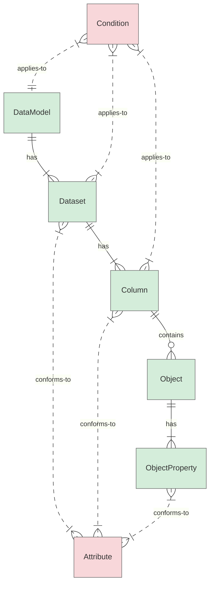

# Normative Requirements Guidelines

## Table of Contents

* [Overview and Purpose](#overview-and-purpose)
* [Notation Conventions](#notation-conventions)
* [FOCUS Dataset Abstraction Levels and Terminology](#focus-dataset-abstraction-levels-and-terminology)
* [Core Normative Authoring Rules](#core-normative-authoring-rules)
  * [Normative Requirement Model](#normative-requirement-model)
  * [Structural Anchor](#structural-anchor)
  * [Standalone Requirements](#standalone-requirements)
  * [Composite Requirements](#composite-requirements)
  * [Structural Grouping Bullets](#structural-grouping-bullets)
  * [Atomic Requirements](#atomic-requirements)
  * [FOCUS Entity Reference Conventions](#focus-entity-reference-conventions)
  * [Constrainable Entity](#constrainable-entity)
  * [Explicit Conditions in Normative Requirements](#explicit-conditions-in-normative-requirements)
  * [Verifiable State Descriptor: State, Not Behavior](#verifiable-state-descriptor-state-not-behavior)
  * [Use of BCP 14 Keywords](#use-of-bcp-14-keywords)
  * [Splitting Requirements](#splitting-requirements)
  * [Separation of Normative and Non-Normative Content](#separation-of-normative-and-non-normative-content)
  * [DRY (Don't Repeat Yourself) Principle](#dry-dont-repeat-yourself-principle)
  * [Tone and Grammar](#tone-and-grammar)
* [Dataset Requirements](#dataset-requirements)
  * [Logical Grouping of Dataset Requirements](#logical-grouping-of-dataset-requirements)
  * [Ordering of Dataset Requirements Within Groups](#ordering-of-dataset-requirements-within-groups)
  * [Consistent Wording and Patterns in Dataset Requirements](#consistent-wording-and-patterns-in-dataset-requirements)
  * [Dataset Normative Requirements Examples](#dataset-normative-requirements-examples)
* [Column Requirements](#column-requirements)
  * [Logical Grouping of Column Requirements](#logical-grouping-of-column-requirements)
  * [Cross-Dataset Column Definitions](#cross-dataset-column-definitions)
  * [Ordering of Column Requirements Within Groups](#ordering-of-column-requirements-within-groups)
  * [Additional Guidelines for Columns in JSON Format](#additional-guidelines-for-columns-in-json-format)
  * [Grouping of Nullability-Related and Subsequent Column Requirements](#grouping-of-nullability-related-and-subsequent-column-requirements)
  * [Grouping of Column Requirements Based on Specific Conditions](#grouping-of-column-requirements-based-on-specific-conditions)
  * [Consistent Wording and Patterns in Column Requirements](#consistent-wording-and-patterns-in-column-requirements)
  * [Column Normative Requirements Examples](#column-normative-requirements-examples)
* [Attribute Requirements](#attribute-requirements)
  * [Role of Attributes in the Specification](#role-of-attributes-in-the-specification)
  * [Structural Anchor for Attributes](#structural-anchor-for-attributes)
  * [Constrainable Entities in Attribute Requirements](#constrainable-entities-in-attribute-requirements)
  * [FOCUS Dataset Column vs FOCUS Column vs Custom Column Requirements](#focus-dataset-column-vs-focus-column-vs-custom-column-requirements)
  * [`CustomColumnHandling` Attribute](#customcolumnhandling-attribute)
  * [Grouping of Attribute Requirements](#grouping-of-attribute-requirements)
  * [Ordering of Attribute Requirements Within Groups](#ordering-of-attribute-requirements-within-groups)
  * [Attribute Normative Requirements Examples](#attribute-normative-requirements-examples)

## Overview and Purpose

This section defines guidelines for authoring normative requirements in the FOCUS specification. These guidelines define **how** to write normative requirements to ensure clarity, consistency, and testability. It does not define the requirements themselves (the "what"), but instead specifies the **structure, Constrainable Entities, and verifiability** of normative requirements.

The guidelines cover authoring of normative requirements for the following entities:

* **FOCUS Data Model** — a collection of one or more FOCUS datasets that define a particular representation of FOCUS data. Data Model defines normative requirements governing dataset composition and the conditions under which specific datasets are required or optional.
* **FOCUS datasets** — the primary containers of structured data as defined in FOCUS.
* **FOCUS columns** — individual columns within FOCUS datasets, defined by FOCUS. Columns may contain nested objects and object properties, which can have additional normative requirements through reusable attributes.
* **Custom columns** — individual columns within FOCUS datasets, not defined by FOCUS. These guidelines describe how normative requirements should be authored for custom extensions while preserving interoperability.
* **FOCUS attributes** — reusable sets of normative constraints that datasets, columns, or column sub-elements (such as objects and object properties) conform to. These guidelines define how normative requirements are authored within Attribute sections and subsequently reused throughout the specification.
* **FOCUS Conditions** — reusable applicability expressions that define the circumstances under which normative requirements apply. Conditions apply to Data Model, Datasets, and Columns to express when specific normative requirements become applicable.

The diagram below illustrates the relationships among these entities and identifies where normative requirements may be authored and applied throughout the FOCUS specification:



**Nodes:**

* 🟩 FOCUS Constrainable Entity
* 🟥 FOCUS Entity that organizes, reuses, or qualifies normative requirements (not a Constrainable Entity)

**Relationships:**

* `|| -- has -- |{` : one parent to one-or-more enumerated structural members
* `|| -- contains -- o{` : one parent to zero-or-more child entities (array of objects)
* `}| .. conforms-to .. |{` : many children to one-or-more parents conformance relationship
* `}| .. applies-to .. |{` : e.g., many Conditions apply to many target entities

**Exceptions:**

* `CustomColumnHandling` is a special Attribute that references other Attributes (e.g., `NullHandling`, `DateTimeFormat`) to establish recommended conformance for custom columns. This cross-reference pattern is an exception rather than a general relationship shown in the diagram.

> **Note:** These guidelines do not currently apply to FOCUS Metadata requirements, which are out of scope.

## Notation Conventions

This document uses the following notation conventions in requirement patterns and examples:

* `<placeholder>` — a named placeholder to be replaced with a specific value (used in code block patterns)
* `{placeholder}` — a named placeholder to be replaced with a specific value (used in prose and tables)
* `[optional element]` — an optional element that applies only under certain conditions
* `[A|B]` — a choice between two alternatives (e.g., `[Dataset|Column]`)
* `...` — indicates that additional content exists but is not shown in the example

## FOCUS Dataset Abstraction Levels and Terminology

The FOCUS specification distinguishes between the abstract dataset concept, its implementations, and its physical representations.

The FOCUS glossary defines the following dataset concepts:

* **FOCUS dataset** — the primary dataset concept defined by the FOCUS specification.
* **Dataset instance** — represents a specific implementation of a **FOCUS dataset** provided by a data generator.
* **Dataset artifact** — represents a physical representation of a specific **FOCUS dataset instance** delivered by a data generator.

## Core Normative Authoring Rules

### Normative Requirement Model

The following core concepts define the structure of normative content in the FOCUS specification:

* **Entity** — any uniquely identifiable element of the FOCUS specification model.
* **Constrainable Entity** — a FOCUS Entity whose conformance can be directly evaluated through normative requirements and to which an obligation and constraint can be applied. Every Constrainable Entity is an Entity, but not every Entity is a Constrainable Entity. Attributes and Conditions are FOCUS Entities that organize, reuse, or qualify normative requirements; they are not themselves Constrainable Entities.
* **Obligation** — the conformance level expressed by a BCP 14 keyword.
* **Constraint** — one verifiable state against which conformance of a Constrainable Entity is evaluated.
* **Condition** — an applicability expression that qualifies when a normative requirement applies.
* **Normative bullet** — a bullet that contains a BCP 14 keyword.
* **Normative requirement** — an authored construct expressed in one of two forms:
  * a [standalone requirement](#standalone-requirements), represented by a single normative bullet, or
  * a [composite requirement](#composite-requirements), represented by a hierarchy of nested normative bullets.
* **Atomic requirement** — the smallest resolved conformance unit derived from a normative requirement. Each atomic requirement defines exactly one verifiable constraint. A standalone requirement resolves into exactly one atomic requirement; a composite requirement resolves into multiple atomic requirements.

The conceptual model is:

> Atomic Requirement = Constrainable Entity + Obligation + Constraint [+ Condition]

At the atomic conformance-unit level, each atomic requirement constrains one Constrainable Entity. A composite authored construct can resolve into multiple atomic requirements, each of which independently satisfies this model. The Condition component is present only when applicability is conditional.

Although every normative bullet contains a BCP 14 keyword, not every normative bullet introduces a conformance constraint. Some normative bullets serve solely to group nested normative bullets under a shared condition or context:

* A [condition grouping bullet](#condition-grouping-bullets) defines a shared condition inherited by nested normative bullets.
* A [context grouping bullet](#context-grouping-bullets) provides organizational context for nested normative bullets.

In addition to normative bullets, the requirement structure includes a structural anchor that provides scope but does not introduce a conformance constraint:

* A [structural anchor](#structural-anchor) defines the scope of a Requirements section.

### Structural Anchor

A structural anchor is a structural construct that defines the scope of a Requirements section for a schema-level construct. It supports automated parsing and validation, does not introduce a verifiable constraint, and is not resolved into an atomic requirement.

Requirements section for a schema-level construct MUST satisfy the following structural rules:

* Requirements section MUST begin with a single structural anchor.
* Structural anchor MUST appear as the first normative statement in the section.

The canonical form of a structural anchor is:

``` markdown
<Entity> MUST adhere to the following requirements:
```

The entity in the grammatical subject position establishes scope but is not constrained by the structural anchor. It functions as a Constrainable Entity only in the atomic requirements resolved within that scope.

For **Attribute Requirements** sections, a different canonical form applies:

``` markdown
[Dataset|Column] conforming to <AttributeId> attribute MUST adhere to the following requirements:
```

See [Structural Anchor for Attributes](#structural-anchor-for-attributes) section for details.

### Standalone Requirements

A standalone requirement is a normative requirement represented by a single normative bullet. The normative bullet and the requirement have a one-to-one correspondence, and the requirement resolves into exactly one atomic requirement.

Standalone requirement MUST adhere to the following rules:

* Standalone requirement MUST contain exactly one Constrainable Entity.
* Standalone requirement MUST contain exactly one BCP 14 keyword indicating the obligation level.
* Standalone requirement MUST express exactly one constraint.
* Standalone requirement MUST describe a verifiable state of the object, not behavior.

Standalone normative requirements use the following canonical form:

``` markdown
* <GrammaticalSubject> <BCP-14-Keyword> <VerifiableStateDescriptor>[ Conditions].
```

* **Example** (illustrative):

``` markdown
* CommitmentDiscountQuantity MUST be of type Decimal.
```

### Composite Requirements

A composite requirement is a normative requirement represented by a hierarchy of normative bullets. Parent bullets establish scope, conditions, or obligations for their nested bullets, while lowest-level normative bullets define individual constraints.

Composite requirements SHOULD be used to group related requirements when hierarchical grouping improves readability, particularly when multiple requirements share a common business context, such as when:

* multiple requirements share the same conditions or scope; or
* multiple requirements share the same subject.

Flat parallel bullets SHOULD be preferred when the ordering of requirements alone is sufficient for clarity and readability.

Atomic requirements are derived from the lowest-level normative bullets together with all applicable constraints established by their ancestor bullets. Parent bullets used solely for structural grouping do not define atomic requirements.

Composite requirements MUST adhere to the following guidelines:

* **Hierarchical Obligation:** When a parent bullet uses a BCP 14 keyword (e.g., MUST), it establishes an obligation to evaluate the nested constraints. Each nested bullet then defines the specific requirement for its respective subject or condition using its own BCP 14 keyword. The applicable obligation for each nested bullet is determined by its own BCP 14 keyword, not by an aggregate of the hierarchy — except as noted in `Exception for Recommended Conformance` below.
* **Shared Conditionality:** Nested bullets MUST inherit any condition established by the parent bullet.
* **Context and Subject Consistency:** Nested bullets SHOULD maintain a consistent business context. While nested bullets SHOULD NOT introduce a different subject type, they MAY reference different subjects (e.g., a FOCUS dataset and its custom columns) provided they all relate to the same primary business context defined by the parent bullet.

**Exception for Recommended Conformance:** When a parent bullet uses a SHOULD keyword to establish recommended conformance to a set of requirements (e.g., in `CustomColumnHandling` or when a column declares conformance to an attribute like `UnitFormat`), the weakest keyword in the hierarchy applies to the overall conformance.

**Examples** (illustrative):

* Incorrect:

```markdown
* When ChargeCategory is "Purchase", CostAndUsage MUST adhere to the following requirements:
  * BillingCurrency MUST conform to CurrencyCodeFormat requirements.
  * ResourceId MUST be a unique identifier within a service provider.
  * InvoiceDetail documentation MUST describe invoice reconciliation methodology.
```

* Correct:

```markdown
* When ChargeCategory is "Purchase", CommitmentDiscountQuantity MUST adhere to the following requirements:
  * CommitmentDiscountQuantity MUST NOT be null when ChargeClass is not "Correction".
  * CommitmentDiscountQuantity MAY be null when ChargeClass is "Correction".
  * CommitmentDiscountQuantity MUST be expressed in CommitmentDiscountUnit when not null.
```

### Structural Grouping Bullets

A **structural grouping bullet** is a parent bullet within a [composite requirement](#composite-requirements) that groups related nested normative bullets under a shared condition or context.

Structural grouping bullets appear in two variants: condition grouping bullets and context grouping bullets. The effect on [atomic requirements](#atomic-requirements) derived from the composite requirement depends on the grouping variant.

An entity in the grammatical subject position of a structural grouping bullet establishes shared condition or context but is not constrained by that grouping bullet. The entity functions as a Constrainable Entity in each resolved atomic requirement that constrains it.

#### Condition Grouping Bullets

A condition grouping bullet introduces a shared condition that applies to all nested bullets. The condition is inherited when resolving nested normative bullets into atomic requirements.

It uses the following canonical form:

``` markdown
* When <Condition>, <GrammaticalSubject> MUST adhere to the following requirements:
```

* **Example** (illustrative):

``` markdown
* When ListUnitPrice is not null, ListUnitPrice MUST adhere to the following requirements:
```

#### Context Grouping Bullets

A context grouping bullet introduces a shared context for a group of related nested bullets without introducing a shared condition. The context is used for structural organization and does not add constraints to the resolved atomic requirements.

Context grouping bullets may be used for different requirement contexts, such as **column presence** and **nullability**.

##### Column Presence Grouping Bullets

Column presence grouping bullets are used in dataset requirements. They use the following canonical form:

``` markdown
* <GrammaticalSubject> <ContextLabel> MUST adhere to the following requirements:
```

* **Example** (illustrative):

``` markdown
* ContractCommitment column presence MUST adhere to the following requirements:
```

##### Nullability Grouping Bullets

Nullability grouping bullets are used in column requirements. They use the following canonical form:

``` markdown
* <GrammaticalSubject> MUST adhere to the following <ContextLabel> requirements:
```

* **Example** (illustrative):

``` markdown
* CommitmentDiscountQuantity MUST adhere to the following nullability requirements:
```

### Atomic Requirements

An atomic requirement is the smallest resolved conformance unit derived from a normative requirement. Atomic requirements are not authored independently; they are derived from standalone or composite requirements and represent the individual constraints evaluated during conformance validation.

A standalone normative bullet corresponds to one atomic requirement.



A lowest-level normative bullet within a composite requirement corresponds to one atomic requirement after applying all applicable constraints inherited from its ancestor bullets.



Atomic requirement MUST adhere to the following rules:

* Atomic requirement MUST resolve to exactly one Constrainable Entity to which the requirement applies.
* Atomic requirement MUST resolve to exactly one obligation level defined by a BCP 14 keyword.
* Atomic requirement MUST express exactly one constraint.
* Atomic requirement MUST describe a verifiable state of the object, not behavior.

Structural anchors and structural grouping bullets do not represent atomic requirements because they do not define verifiable constraints.

### FOCUS Entity Reference Conventions

#### General FOCUS Entity Reference Conventions

The following conventions apply to references to FOCUS entities in normative requirements:

* References to FOCUS entities MUST use one of the following:
  * a generic keyword (e.g., `FOCUS column`, `Custom column`),
  * the entity ID (e.g., `BilledCost`, `NullHandling`), or
  * a dot-notation reference path for object properties (e.g., `ContractAppliedObject.Elements[*].ContractId`).
* References to FOCUS entities MUST NOT use their Display Names.
* References to FOCUS entities SHOULD default to singular form, with the understanding that the requirement applies to all applicable instances, values, or elements of the referenced entity unless otherwise specified.

#### FOCUS Dataset Reference Conventions

When a normative requirement references a FOCUS dataset concept, different conventions apply depending on the position of the reference within the requirement.

> **Note:** Dataset concepts referenced in this section (FOCUS dataset, dataset instance, dataset artifact) are defined in [FOCUS Dataset Abstraction Levels and Terminology](#focus-dataset-abstraction-levels-and-terminology).

When a FOCUS dataset concept appears in the **grammatical subject position**:

* `FOCUS dataset` MUST be used as the canonical reference to the Constrainable Entity even when the constraint applies to:
  * a dataset specification,
  * a dataset instance, or
  * a dataset instance artifact.
* The intended level of application (specification vs. instance vs. artifact) MUST be inferred from context rather than encoded in the grammatical subject.

When a FOCUS dataset concept appears in a **non-subject position** (e.g., in conditions, scope clauses, or explanatory context within the requirement body):

* One of the following precise glossary terms MUST be used:
  * `FOCUS dataset` — when referring to the abstract dataset definition established by FOCUS.
  * `dataset instance` — when referring to a specific implementation of a FOCUS dataset provided by a data generator.
  * `dataset artifact` — when referring to a physical representation of a specific dataset instance delivered by a data generator.
* Generic terms such as `dataset` or `datasets` MUST NOT be used when the precise abstraction level is known.

**Examples** (illustrative):

```markdown
* *FOCUS dataset* MUST preserve all previously delivered *dataset artifacts* when using Append delivery mechanism.
```

```markdown
* BilledCost MUST be 0 for *charges* generated by entities that are not responsible or authorized for invoicing, to avoid double-counting when merging multiple *dataset instances*.
```

```markdown
* EffectiveCost MUST be 0 when ChargeCategory is "Purchase" and the purchase is intended to cover related eligible *charges*. This requirement applies even when the *covered charges* originate from different CostAndUsage *dataset instances*, possibly from a different ServiceProviderName.
```

### Constrainable Entity

This section defines allowed and disallowed forms of Constrainable Entity in normative requirements, and the grammatical subject forms used to reference them. Reference conventions (use of IDs, prohibition on Display Names, singular form) are defined in the [FOCUS Entity Reference Conventions](#focus-entity-reference-conventions) section.

#### Grammatical Subject Structure

A normative bullet references its Constrainable Entity through the **grammatical subject**, i.e., the text at the subject position of the bullet. The grammatical subject consists of:

* a **reference to a Constrainable Entity** (using an ID, generic keyword, or dot-notation path per [FOCUS Entity Reference Conventions](#focus-entity-reference-conventions)), and
* optionally, one or more **qualifiers** that specify a subset, aspect, or context of the Constrainable Entity.

Common qualifier types are:

* **content or type** (e.g., `FOCUS column containing numeric values`)
* **structural context** (e.g., `Key in Object in FOCUS dataset column`)
* **aspect** (e.g., `InvoiceDetail documentation`, `FOCUS dataset delivery mechanism documentation`)

Rules in this document that refer to what a requirement **constrains** apply to the Constrainable Entity. Rules that refer to the **wording or position** of the reference apply to the grammatical subject.

The grammatical subject SHOULD be explicit and unambiguous.

**Exception for Aggregate Expressions:** When a requirement describes an aggregate or derived value (e.g., sums, products, counts), the aggregate expression (e.g., `The sum of`, `The product of`) MAY be used as the grammatical subject when it improves readability. The aggregate expression is not itself a Constrainable Entity; the column or metric being constrained MUST still be clearly identifiable within the requirement.

#### Allowed Constrainable Entities

A Constrainable Entity MUST be a schema-level FOCUS Entity. The subsections below enumerate the allowed categories.

##### Data Model Entity

* **FOCUS Data Model**, whereby `DataModel` identifies the FOCUS Data Model.

##### Dataset Entities

* **FOCUS Dataset**, whereby use of:
  * `FOCUS dataset` keyword represents any FOCUS dataset
  * `FOCUS dataset` keyword with a qualifier represents a qualified subset of FOCUS datasets
  * A single FOCUS dataset explicitly identified by `<FOCUS Dataset ID>` (e.g., `CostAndUsage`)

##### Dataset Column Entities

* **FOCUS Dataset Column**, whereby use of:
  * `FOCUS dataset column` keyword represents any column in a FOCUS dataset (either a FOCUS column or a custom column)
  * `FOCUS dataset column` keyword with a qualifier represents a qualified subset of FOCUS dataset columns (e.g., `FOCUS dataset column containing numeric values`)

* **FOCUS Column**, whereby use of:
  * `FOCUS column` keyword represents any FOCUS column
  * `FOCUS column` keyword with a qualifier represents a qualified subset of FOCUS columns (e.g., `FOCUS column containing numeric values`)
  * A single FOCUS column explicitly identified by `<FOCUS Column ID>` (e.g., `BilledCost`)

* **Custom Column**, whereby use of:
  * `Custom column` keyword represents any custom column
  * `Custom column` keyword with a qualifier represents a qualified subset of custom columns (e.g., `Custom column containing numeric values`)

##### Sub-Element Entities

* **Structural sub-elements within Columns** (objects and object properties, including keys and key values):
  * `object`, `key`, or `value` keywords MUST NOT be used alone. Always reference them in context.
  * Examples of valid subject forms for structural sub-elements:
    * `Key in Object in [FOCUS|Custom] column containing JsonObjectFormat values`
    * `Key value in Object in [FOCUS|Custom] column containing key-value pairs`
    * `Object in FOCUS dataset column`
    * `Object in array in FOCUS dataset column`
    * `Key in Object in FOCUS dataset column`
    * `Key value in Object in FOCUS dataset column`
    * `Key in FOCUS dataset column`
    * `Key value in FOCUS dataset column`
    * `<term> key` / `<term> value` for column-specific key-value terminology (e.g., `Tag keys`, `Property value`)
    * `<ObjectId>` for JSON Object-level requirements (e.g., `ContractAppliedObject`)
    * `<ObjectId>.<PropertyPath>` for JSON Object property-level requirements (e.g., `ContractCommitmentApplicabilityObject.Applicability.Cost`)
    * `<ObjectId>.<PropertyPath>[*].<PropertyPath>` for properties within arrays (e.g., `ContractAppliedObject.Elements[*].ContractId`, `ContractCommitmentApplicabilityObject.Inclusions[*].Dimension`)

##### Documentation Qualifier Forms

The `documentation` qualifier specifies the documentation aspect of a Constrainable Entity enumerated above.

* **Documentation aspect qualifier**, whereby use of:
  * `<Entity keyword> documentation` represents documentation of any entity of that type (e.g., `FOCUS dataset documentation`, `FOCUS column documentation`, `Custom column documentation`)
  * `<Entity ID> documentation` represents documentation of a specific entity (e.g., `InvoiceDetail documentation`, `BilledCost documentation`)
  * `<Entity reference> <SubQualifier> documentation` represents documentation of a specific aspect of an entity (e.g., `FOCUS dataset delivery mechanism documentation`, `Custom column JSON object schema documentation`)

#### Disallowed Constrainable Entities

The following MUST NOT be used as Constrainable Entities or as the grammatical subjects of normative requirements:

* Actors (e.g., `data generator`, `service provider`, `consumer`)
* Processes or mechanisms (e.g., `Delivery Handling`, `Correction Handling`, etc.)

> **Note:** Actors and processes/mechanisms can appear inside a qualifier (most commonly inside a documentation qualifier that describes what the documentation is about). In such cases the Constrainable Entity is the FOCUS entity being documented (typically a FOCUS dataset or column), and the actor or mechanism appears only within the qualifier chain, never as the entity reference itself. For example, in `FOCUS dataset delivery mechanism documentation`, the Constrainable Entity is `FOCUS dataset` and `delivery mechanism documentation` is the qualifier chain that narrows to the documentation of the delivery mechanism aspect.

### Explicit Conditions in Normative Requirements

* Requirement MUST include an explicit condition when applicability is conditional and cannot be inferred from the Constrainable Entity and any associated qualifiers.
* Conditional logic MUST be expressed using one of the following approved conditional keywords:
  * `when`
  * `unless`
  * `only when`
  * `except when`

### Verifiable State Descriptor: State, Not Behavior

Normative requirements MUST describe a **verifiable state**, not an operational process or behavior.

Specifically:

* The primary verb of the obligation (i.e., the verb that directly follows the BCP-14 keyword) MUST define a verifiable state.
* Process-oriented verbs (e.g., `ensure`, `handle`, `support`, `provide`) MUST NOT be used as the primary verb of the obligation.
* Process-oriented verbs MAY be used in non-normative or explanatory clauses (e.g., to describe intent or rationale).
* When a requirement refers to actor behavior, it MUST be expressed as a constraint on the resulting state of a schema-level entity (e.g., dataset, column, object), including its documentation aspect where applicable.

#### Common Non-Compliant Verbs (Non-Exhaustive)

* The following verbs are commonly used in a process-oriented way when defining requirements:
  * `ensure`
  * `handle`
  * `support`
  * `provide`
  * `allow`
  * `enable`
  * `manage`
  * `process`
  * `enforce`
  * `prefix`
  * `alter`
  * `document`

* These verbs are prohibited when applied as obligations on actors or processes but may be used when defining verifiable states of documentation.

* **Example** (illustrative):

  * `Document X MUST provide Y` is non-compliant because it describes a behavior of the documentation process rather than a verifiable state of the documentation itself.
  * However, `Documentation for X MUST include Y` is compliant because it describes a verifiable state of the documentation.

> **Note:** This list is not exhaustive. Any verb that describes an action, responsibility, or implementation behavior rather than a verifiable state is considered non-compliant in the normative position.

### Use of BCP 14 Keywords

* Normative bullet MUST contain exactly one of the following BCP 14 keywords: `MUST`, `MUST NOT`, `SHOULD`, `SHOULD NOT`, `MAY`.
* Normative bullet MUST NOT contain any of the following BCP 14 keywords: `REQUIRED`, `SHALL`, `SHALL NOT`, `RECOMMENDED`, `NOT RECOMMENDED`, `OPTIONAL`.
* Normative bullet containing more than one BCP 14 keyword MUST be split (see [Splitting Requirements](#splitting-requirements) section).

**Exception for Composite Requirements:** While each individual bullet (parent or nested) MUST contain only one BCP 14 keyword, a Composite Requirement as a whole MAY contain multiple keywords to express nuanced obligations. In such cases, the applicable obligation for each nested bullet is governed by the rules defined in [Composite Requirements](#composite-requirements).

> **Note:** The keyword `RECOMMENDED` was previously used for presence-related normative requirements with the meaning "recommended but not mandatory." This usage is deprecated as of December 2025.

For detailed interpretation of BCP 14 keywords, see [BCP14](https://tools.ietf.org/html/bcp14) [[RFC2119](https://tools.ietf.org/html/rfc2119)][[RFC8174](https://tools.ietf.org/html/rfc8174)].

### Splitting Requirements

#### Splitting Normative Bullets

A normative requirement is composed of one or more normative bullets (see [Normative Requirement Model](#normative-requirement-model)). The following rules define when a normative bullet MUST be split into multiple bullets:

* Normative bullet MUST be split if it constrains more than one Constrainable Entity (e.g., `ColumnA and ColumnB MUST be X`).
* Normative bullet MUST be split if it contains more than one BCP 14 keyword (e.g., a bullet containing both `MUST` and `SHOULD`).
* Normative bullet MUST be split if it combines more than one constraint (e.g., multiple verifiable state descriptors, or multiple independent conditions using "and" or "or" that produce distinct constraints).
* Normative bullet MUST be split if it contains a hidden constraint expressed as a non-normative definition (e.g., `ColumnA MUST be a valid Y, where a valid Y satisfies condition Z.`). The hidden constraint MUST be extracted into its own normative bullet so that each constraint is expressed explicitly.

**Examples** (illustrative):

* Incorrect:

```markdown
* ContractAppliedObject.Elements[*].ContractId and ContractAppliedObject.Elements[*].ContractCommitmentId MUST be a unique identifier within the service provider.
```

* Correct:

```markdown
* ContractAppliedObject.Elements[*].ContractId MUST be a unique identifier within the service provider.
* ...
* ContractAppliedObject.Elements[*].ContractCommitmentId MUST be a unique identifier within the service provider.
```

* Correct:

```markdown
* PricingQuantity MUST be null when ChargeCategory is "Tax" or "Adjustment".
```

* Correct:

```markdown
* BillingPeriodStart MUST be less than or equal to BillingPeriodEnd.
```

#### Applying Splitting Rules

The splitting rules above are authoring rules that apply to individual normative bullets.

For a [standalone requirement](#standalone-requirements), these rules are sufficient because a standalone requirement is authored as a single normative bullet.

For a [composite requirement](#composite-requirements), the splitting rules apply independently to each normative bullet, whether the bullet is a parent or nested bullet.

Composite requirements intentionally allow variation across bullets. A nested bullet MAY:

* use a different BCP 14 keyword than its parent or siblings (see Exception for Composite Requirements in [Use of BCP 14 Keywords](#use-of-bcp-14-keywords));
* reference a different Constrainable Entity than its parent or siblings (see Context and Subject Consistency in [Composite Requirements](#composite-requirements)).

Such variation across parent and nested bullets is not itself a splitting trigger. Splitting rules apply only to the contents of an individual normative bullet.

However, inherited context within a composite requirement MAY introduce additional constraints that are only visible after resolution — for example, a nested bullet may appear well-formed in isolation but, combined with inherited conditions or scope, may resolve into an atomic requirement containing a hidden constraint. Therefore, every resolved [atomic requirement](#atomic-requirements) MUST also satisfy the rules defined for atomic requirements.

If a resolved atomic requirement violates those rules, the authored requirement MUST be rephrased, typically by splitting one or more normative bullets.

### Separation of Normative and Non-Normative Content

While normative requirements MUST focus on **enforceable constraints** and **verifiable states**, definitions, informative clauses, and examples MAY be included within a requirement where necessary to provide essential context and ensure unambiguous interpretation.

#### Separation of Concerns

* **Definitions:** If a definition is complex or applies to multiple requirements, it SHOULD be placed in the **Glossary** or the preamble section and referenced as a link within the requirement.
* **Complex Logic:** If an informative or normative clause is complex or applies to multiple requirements, it SHOULD be placed in the **Implementation Context** section to maintain the clarity of the core requirement.
* **Normative Authority:** To ensure consistency, BCP 14 keywords MUST ONLY be used within the **Requirements** section. The content in the **Glossary**, preamble, or **Implementation Context** MUST NOT contain BCP 14 keywords.

#### Non-Normative Examples

* **Incorporation:** Examples incorporated in requirements MUST be clearly identified using "e.g." and placed within parentheses `(e.g., ...)` to distinguish them from the normative constraint.

> **Note:** Formatting and presentation requirements for examples, notes, links, and other editorial constructs are defined in the [Editorial Guidelines](editorial-guidelines.md).

### DRY (Don't Repeat Yourself) Principle

Each normative requirement MUST be defined in exactly one place across the specification. The following rules determine where a requirement belongs:

* If a requirement applies broadly to multiple datasets, columns, or column sub-elements (e.g., objects within columns), it SHOULD be defined as an Attribute requirement, with conformance declared by those entities.

* If a requirement involves multiple columns within a single dataset, it MUST be defined on the primary column it describes. Other columns involved MUST NOT restate it as a normative requirement but MAY reference it in their introductory description.

  * The primary owner is the entity whose conformance would fail if the requirement is violated.

  * **Example:** `ListCost MUST equal the product of ListUnitPrice and PricingQuantity when ListUnitPrice is not null and PricingQuantity is not null.` — this requirement is defined on `ListCost`. `ListUnitPrice` and `PricingQuantity` MAY reference it in their introductory description but MUST NOT restate it as a normative requirement.

* If a requirement spans multiple datasets, it MUST be defined on the column in the dataset that is the primary owner of the validation. Other datasets involved MUST NOT restate it as a normative requirement but MAY reference it in their introductory description.

  * **Example:** A cross-dataset sum validation comparing `BilledCost` aggregated by `InvoiceId` and `InvoiceIssuerName` between `InvoiceDetail` and `CostAndUsage` is defined on `InvoiceDetail.BilledCost`, as `InvoiceDetail` is the primary owner of invoice-level validation. `CostAndUsage` MAY reference it in its introductory description but MUST NOT restate it as a normative requirement.

### Tone and Grammar

* Normative requirements MUST NOT contain contractions (e.g., use "do not" instead of "don't") to maintain a formal, professional tone throughout the specification.
* Normative bullets MUST NOT begin with an article ("A"/"An"/"The") to ensure conciseness and universal applicability; "each" is implicit.

**Exception for Aggregate Expression Subjects:** Normative bullets whose subject is an aggregate expression MAY begin with "The" (e.g., `The sum of <ColumnId> ... MUST equal ...`), as permitted in [Constrainable Entity](#constrainable-entity).

> **Note:** The rules in this document apply to normative requirements authored in the FOCUS specification. They do not govern the bullets that state the rules themselves.

## Dataset Requirements

### Logical Grouping of Dataset Requirements

Grouping and ordering of dataset-level normative requirements ensures clarity, consistency, and maintainability across all FOCUS datasets, making related or similar requirements easy to identify and follow.

1. **Dataset Requirements** (subject: `{DatasetId}`)
   1. **Dataset Presence:** Defines whether, and under what conditions, a dataset must be present in a FOCUS-compliant delivery.
   1. **Column Presence in Dataset:** Defines which columns must or are recommended to be present within a dataset, and under which conditions. FOCUS columns are listed first, followed by custom columns.
   1. **Dataset Attribute Conformance:** Defines requirements where a dataset MUST conform to one or more FOCUS-defined Attributes (e.g., `DatasetCompleteness`, `DatasetConfiguration`).
   1. **Other:** Captures requirements with `{DatasetId}` as subject that do not fall into the above categories.
2. **FOCUS Column Requirements** (subject: `{DatasetId} FOCUS columns`)
   1. **FOCUS Column Attribute Conformance:** Defines requirements where FOCUS columns within a dataset MUST conform to one or more FOCUS-defined Attributes (e.g., `NullHandling`).
   1. **Other:** Captures requirements with `{DatasetId} FOCUS columns` as subject that do not fall into the above categories.
3. **Custom Column Requirements** (subject: `{DatasetId} custom columns`)
   1. **Custom Column Attribute Conformance:** Defines requirements where custom columns within a dataset MUST conform to `CustomColumnHandling`.
   1. **Other:** Captures requirements with `{DatasetId} custom columns` as subject that do not fall into the above categories.
4. **Other Dataset-Level Requirements** (subject: varies)
   1. **Documentation:** Defines requirements for dataset documentation.
   1. **Other:** Captures requirements that do not fall into the above categories.

#### Tabular Overview of Dataset Normative Requirement Grouping and Specifications

| Subject | Requirement Group | When required? | Example |
|---|---|---|---|
| Dataset | Dataset Presence | Always | {DatasetId} MUST be present when {Condition}. |
| Dataset | Column Presence in Dataset | Always | {DatasetId} MUST include {ColumnId}. |
| Dataset | Dataset Attribute Conformance | Always | {DatasetId} MUST conform to DatasetCompleteness requirements. |
| Dataset | Other Dataset Requirements | When applicable | CostAndUsage MUST have its data generator-calculated split cost allocation method documented and accessible to practitioners. |
| FOCUS columns | FOCUS Column Attribute Conformance | Always | {DatasetId} *FOCUS columns* MUST conform to NullHandling requirements. |
| FOCUS columns | Other FOCUS Column Requirements | When applicable | |
| Custom columns | Custom Column Attribute Conformance | Always | {DatasetId} *custom columns* MUST conform to CustomColumnHandling requirements. |
| Custom columns | Other Custom Column Requirements | When applicable | |
| Documentation | Documentation | When applicable | {DatasetId} documentation MUST specify how records correspond to invoice line items. |
| Other | Other | When applicable | |

### Ordering of Dataset Requirements Within Groups

To further enhance readability, individual requirements within each group SHOULD be ordered as follows:

* `MUST` – an absolute requirement
* `MUST NOT` – a prohibition
* `SHOULD` – recommended but not mandatory
* `SHOULD NOT` – discouraged but not strictly prohibited
* `MAY` – optional

**Exception for Column Presence:** Requirements within the **Column Presence in Dataset** group MUST be ordered alphabetically by the referenced Column ID, taking precedence over the obligation strength ordering.

> **Note:** This ordering is intended to improve reviewability and consistency but can be overridden where ordering carries semantic meaning.

### Consistent Wording and Patterns in Dataset Requirements

Use standardized phrasing and terminology, and apply common requirement patterns where applicable to ensure clarity and consistency across datasets and corresponding requirements.

#### Dataset Requirement Patterns

##### Technical Requirements: Dataset Presence

```markdown
* <DatasetId> MUST be present[ when <Condition>].
```

##### Technical Requirements: Column Presence

```markdown
* <DatasetId> MUST include <ColumnId>.
* <DatasetId> MUST include <ColumnId> when <Condition>.
* <DatasetId> SHOULD include <ColumnId>.
* <DatasetId> SHOULD include <ColumnId> when <Condition>.
```

##### Technical Requirements: Technical Attributes Conformance

```markdown
* <DatasetId> MUST conform to <TechnicalAttributeId> requirements.
```

##### Business Requirements: Business/Contextual Attributes Conformance

```markdown
* <DatasetId> MUST conform to <BusinessAttributeId> requirements.
```

##### Other Requirements: Documentation

```markdown
* <DatasetId> documentation MUST <VerifiableStateDescriptor>.
```

```markdown
* <DatasetId> documentation MUST adhere to the following requirements:
  * <DatasetId> documentation MUST <VerifiableStateDescriptor>.
```

### Dataset Normative Requirements Examples

> **Notes:**
>
> * The examples below are **snippets** that illustrate patterns only, not full listings. The `...` indicates additional requirements exist in the full dataset specification.
> * Authors should consult the actual FOCUS attribute specification files as the **source of truth**, as these guidelines do not necessarily reflect the latest version.

#### **Contract Commitment**

```markdown
ContractCommitment MUST adhere to the following requirements:

* ContractCommitment MUST be present when the service provider supports *contract commitments*.
* ContractCommitment column presence MUST adhere to the following requirements:
  * ContractCommitment MUST include [BillingCurrency](#datasets.contractcommitment.billingcurrency).
  * ContractCommitment MUST include [ContractCommitmentApplicability](#datasets.contractcommitment.contractcommitmentapplicability).
  * ContractCommitment MUST include [ContractCommitmentBenefitCategory](#datasets.contractcommitment.contractcommitmentbenefitcategory).
  * ContractCommitment MUST include [ContractCommitmentCategory](#datasets.contractcommitment.contractcommitmentcategory).
  * ContractCommitment MUST include [ContractCommitmentCost](#datasets.contractcommitment.contractcommitmentcost).
  * ...
* ContractCommitment MUST conform to [DatasetCompleteness](#attributes.datasetcompleteness) requirements.
* ...
* ContractCommitment FOCUS columns MUST conform to [NullHandling](#attributes.nullhandling) requirements.
* ContractCommitment custom columns MUST conform to [CustomColumnHandling](#attributes.customcolumnhandling) requirements.
* ...
```

> **Note:** The column presence-related bullet is a context grouping bullet. It is not, in itself, a normative requirement and does not define a normative constraint. It serves only as a grouping context. See [Structural Grouping Bullets](#structural-grouping-bullets) and [Composite Requirements](#composite-requirements) sections for details.

#### **Cost and Usage**

```markdown
CostAndUsage MUST adhere to the following requirements:

* CostAndUsage MUST be present.
* CostAndUsage column presence MUST adhere to the following requirements:
  * CostAndUsage SHOULD include [AllocatedMethodDetails](#datasets.costandusage.allocatedmethoddetails) when the data generator supports [Data Generator-Calculated Split Cost Allocation](#datagenerator-calculatedsplitcostallocationhandling).
  * CostAndUsage MUST include [AllocatedMethodId](#datasets.costandusage.allocatedmethodid) when the data generator supports [Data Generator-Calculated Split Cost Allocation](#attributes.datagenerator-calculatedsplitcostallocationhandling).
  * CostAndUsage MUST include [AllocatedResourceId](#datasets.costandusage.allocatedresourceid) when the data generator supports [Data Generator-Calculated Split Cost Allocation](#attributes.datagenerator-calculatedsplitcostallocationhandling).
  * CostAndUsage MUST include [AllocatedResourceName](#datasets.costandusage.allocatedresourcename) when the data generator supports [Data Generator-Calculated Split Cost Allocation](#attributes.datagenerator-calculatedsplitcostallocationhandling).
  * CostAndUsage MUST include [AllocatedTags](#datasets.costandusage.allocatedtags) when the service provider supports [Data Generator-Calculated Split Cost Allocation](#datagenerator-calculatedsplitcostallocationhandling).
  * CostAndUsage SHOULD include [AvailabilityZone](#datasets.costandusage.availabilityzone) when the host provider supports deploying resources or services within an *availability zone*.
  * ...
* CostAndUsage MUST conform to [DatasetCompleteness](#attributes.datasetcompleteness) requirements.
* CostAndUsage MUST conform to [DatasetConfiguration](#attributes.datasetconfiguration) requirements.
* ...
* CostAndUsage [*FOCUS columns*](#glossary:FOCUS-column) MUST conform to [DataGeneratorCalculatedSplitCostAllocationHandling](#attributes.datagenerator-calculatedsplitcostallocationhandling) requirements when the data generator supports data generator-calculated split cost allocation.
* CostAndUsage *FOCUS columns* MUST conform to [NullHandling](#attributes.nullhandling) requirements.
* ...
* CostAndUsage [*custom columns*](#glossary:custom-column) MUST conform to [CustomColumnHandling](#attributes.customcolumnhandling) requirements.
* ...
```

> **Note:** The column presence-related bullet is a context grouping bullet. It is not, in itself, a normative requirement and does not define a normative constraint. It serves only as a grouping context. See [Structural Grouping Bullets](#structural-grouping-bullets) and [Composite Requirements](#composite-requirements) sections for details.

## Column Requirements

### Logical Grouping of Column Requirements

Grouping and ordering of requirements ensure clarity, logical flow, and consistency across all columns, making related requirements easy to identify and follow. This structure should be maintained for consistency across the specification.

> **Note:** This section provides a current preview of the requirements grouping and ordering. Members should review how this applies to specific columns and provide feedback. The order may be adjusted based on that feedback.

  1. **Technical Requirements**
     1. **Data Type**: Establishes a foundational expectation, ensuring all subsequent rules align with this type.
     1. **Value Format**: Ensures the value (if present) adheres to specific structural or syntactic rules.
     1. **Nullability**: Clarifies when the value can or cannot exist, ensuring all subsequent rules align with column nullability.
     1. **Values and Value Ranges**: Further constrains valid values, assuming the format is already correct.
     1. **Column-to-Column Relationships**: Defines dependencies and consistency rules between related columns.
  2. **Business and Contextual Requirements**
     1. **Unit/Denomination**: Ensures consistency in measurement or currency.
     1. **Uniqueness**: Defines uniqueness constraints for data integrity.
     1. **Fallback/Substitute Values**: Specifies what alternative values may be used if the expected value is missing.
     1. **Relationships Outside the Spec**: Defines dependencies on external systems or datasets.
     1. **Cost Validation**: Defines how cost-related values are calculated and validated, including mathematical relationships, dependencies on other columns, and business-specific logic.
     1. **Other**: Requirements that do not fall into one of the previous categories.

#### Tabular Overview of Column Normative Requirement Grouping and Specifications

| Requirement Type | Requirement Group | When required? | Example |
|---|---|---|---|
| Technical | Data Type | Always | {ColumnId} MUST be of type String. |
| Technical | Value Format | Always (except normalized dimensions) | {ColumnId} MUST conform to {AttributeId} requirements. |
| Technical | Nullability | Always | {ColumnId} MUST/MUST NOT/SHOULD/SHOULD NOT/MAY be null when {Condition}. |
| Technical | Values and Value Ranges | Metrics and normalized dimensions | {ColumnId} MUST be a non-negative decimal value.<br/>{ColumnId} MUST be one of the allowed values. |
| Technical | Column-to-Column Relationships | When applicable | {ColumnId} SHOULD/MUST remain consistent over time for a given ReferencedColumnId. |
| Business | Unit/Denomination | When applicable | {ColumnId} MUST be denominated in the BillingCurrency. |
| Business | Uniqueness | When applicable | BillingAccountId MUST be a unique identifier within an invoice issuer. |
| Business | Fallback/Substitute Values | When applicable | {ColumnId} MUST NOT duplicate {OtherColumnId} when {Condition}. |
| Business | Relationships Outside the Spec | When applicable | BillingCurrency MUST match the currency used in the invoice generated by the invoice issuer. |
| Business | Cost Validation | When applicable | {CostColumnId} MUST equal the product of {UnitPriceColumnId} and PricingQuantity when {UnitPriceColumnId} is not null and PricingQuantity is not null. |
| Business | Other | When applicable | HostProviderName MUST reflect the name of the host provider when explicitly selected by the customer. |

### Cross-Dataset Column Definitions

* **Same Column Names Across Datasets**: When defining columns with the same name across different datasets (e.g., `ChargeCategory` in `CostAndUsage` versus `InvoiceDetail`), the normative and informative text MAY differ to accommodate dataset-specific requirements. However, the author SHOULD provide informative guidance within the specification explaining the reason for this divergence.

### Ordering of Column Requirements Within Groups

To further enhance readability, individual requirements within each group SHOULD be ordered as follows:

* `MUST` – an absolute requirement
* `MUST NOT` – a prohibition
* `SHOULD` – recommended but not mandatory
* `SHOULD NOT` – discouraged but not strictly prohibited
* `MAY` – optional

**Exception for Semantic Ordering:** Obligation strength ordering is intended to improve reviewability, readability, and consistency, but is overridden in contexts where ordering carries semantic meaning, such as in nullability requirements (see [Grouping of Nullability-Related and Subsequent Column Requirements](#grouping-of-nullability-related-and-subsequent-column-requirements) for details).

### Additional Guidelines for Columns in JSON Format

FOCUS defines two JSON-based value formats for columns: Key-Value Format and JSON Object Format. Each has distinct conventions for structuring requirements. The guidelines below are organized by format type.

#### Key-Value Format Columns

##### Key-Value Format Column Definition Structure

* **Single Requirements section**: Key-Value Format columns specify all requirements in a single Requirements section covering the column itself, including nullability, key and value constraints, and conformance declarations.

##### Key-Value Pairs

* **References to Key-Value Pairs depend on the context**: The terminology for key-value pairs varies depending on the column and context. For instance, when referring to key-value pairs, **`tags`**, **`user-defined tags`**, and **`data generator-defined tags`** are used in **`Tags`**, whereas **`SkuPriceDetails property`** is used in **`SkuPriceDetails`**.

* **Default to Plural for Key-Value Pairs**: When referring to key-value pairs, **tags** and **properties** should be used in the plural form to reflect the fact that the column may contain multiple key-value pairs.

##### Keys and Values

* **Refer to Keys and Values Explicitly**: When specifying normative requirements for keys and values, use precise terminology based on the column context:
  * In **`Tags`**, refer to **tag key** when addressing only the key, and **tag value** when addressing only the value.
  * In **`SkuPriceDetails`**, refer to **property key** when addressing only the key, and **property value** when addressing only the value.
  * When linking a key to its value, use **corresponding value**.

* **First Mention and Context**: In the case of `SkuPriceDetails property key`, the first mention explicitly uses `SkuPriceDetails property key` to establish the context. Subsequent references to `property key` and `property value` omit `SkuPriceDetails` as the context is already understood. In contrast, for `Tags`, this is not necessary, as the context is inherently clear from the column name.

* **Start Key-Specific Requirements with the Key Term**: When a requirement applies to a key, it SHOULD begin with **tag key**, **property key**, or the applicable term for that column.

* **Start Value-Specific Requirements with the Value Term**: When a requirement applies to a value, it SHOULD begin with **tag value**, **property value**, or the applicable term for that column.

* **Plural vs. Singular Form for Keys and Values**:
  * Use plural when referring to keys or values to reflect the fact that the column may contain multiple keys/values (e.g., `property keys`, `tag values`).
  * Use singular when defining requirements for a key or value of a single tag or property (e.g., `property key`, `tag value`), with the understanding that the requirement applies to all occurrences.

#### JSON Object Format Columns

##### JSON Object Format Column Definition Structure

* **Separate requirements into Column Requirements and Object Requirements sections**: JSON Object Format columns have requirements at two levels. Separating these into distinct sections provides better clarity.
  * **Column Requirements** specify requirements of the column itself, such as data type, value format conformance (e.g., `StringHandling`, `JsonObjectFormat`), nullability, and object conformance.
  * **Object Requirements** specify requirements of the object structure, including formal JSON Schema conformance and property-level constraints (e.g., expected keys, value formats, relationships between properties).

##### Schema Requirements

* **Reference the Object in Column Requirements**: JSON Object Format columns SHOULD declare conformance to the corresponding object in the Column Requirements section using the following pattern:

```markdown
* <ColumnId> MUST conform to <ObjectId> requirements[ when <Condition>].
```

* **Reference the JSON Schema in Object Requirements**: JSON Object Format columns SHOULD reference the corresponding JSON Schema in the Object Requirements section using the following pattern:

```markdown
* <ObjectId> MUST conform to the <ObjectSchemaId> JSON Schema.
```

  The referenced schema should be consistent with the [JSON Schema Specification](https://json-schema.org/specification) (Draft 2020-12).

##### Object Properties

* **Use Dot-Notation to Reference Object Properties**: When specifying normative requirements for properties within JSON Object Format columns, use dot-notation to reference object properties (e.g., `ContractAppliedObject.Elements[*].ContractId`, `AllocatedMethodDetailsObject.Elements[*].AllocatedRatio`). Use bracket notation with `[*]` to indicate all elements within an array.

* **Use the Object Property Path for Property and Value References**: Whenever possible, use the dot-notation path when referring to an object property or its values.

* **Start Property-Specific Requirements with the Object Property Path**: When a requirement applies to a property in a JSON Object Format column, it should begin with the dot-notation path (e.g., `ContractAppliedObject.Elements[*].ContractCommitmentId MUST be a unique identifier within the service provider.`).

* **Singular Form for Object Properties**: Use singular (dot-notation path with `[*]`) when defining requirements for individual property values, with the understanding that `[*]` applies the requirement to all elements in the array (e.g., `ContractAppliedObject.Elements[*].ContractId MUST be a unique identifier within the service provider.`).

* **Aggregate Expressions for Object Properties**: For aggregate requirements over object properties, the **Exception for Aggregate Expressions** in the [Constrainable Entity](#constrainable-entity) section applies (e.g., `The sum of AllocatedMethodDetailsObject.Elements[*].AllocatedRatio across all allocated charges related to a single origin charge MUST equal 1 (100%).`).

### Grouping of Nullability-Related and Subsequent Column Requirements

* When there is only one nullability-related requirement, state it directly. If there are multiple, list them as nested bullets under a context grouping bullet (see [Structural Grouping Bullets](#structural-grouping-bullets)) using the following pattern:

```markdown
* <ColumnId> MUST adhere to the following nullability requirements:
  * <ColumnId> MUST be null when <Condition>.
  * <ColumnId> MUST NOT be null when <Condition>.
```

* When requirements follow conditional logic (e.g., `If... Else If... Else`), the order should be adjusted so that the most specific conditions appear first, while the most general requirement (e.g., a MUST or SHOULD) is placed last as the fallback rule (`In all other cases` clause).

```markdown
* <ColumnId> MUST adhere to the following nullability requirements:
  * <ColumnId> MUST/MUST NOT/SHOULD/SHOULD NOT/MAY be null when <Condition>.
  * <ColumnId> MUST/MUST NOT/SHOULD/SHOULD NOT/MAY be null when <Condition>.
  * <ColumnId> MUST/MUST NOT/SHOULD/SHOULD NOT/MAY be null in all other cases.
```

```markdown
* <ColumnId> MUST adhere to the following nullability requirements:
  * <ColumnId> MUST be null when <Condition>.
  * When <Condition>, <ColumnId> MUST adhere to the following requirements:
    * <ColumnId> MUST NOT be null when <Condition>.
    * <ColumnId> MAY be null when <Condition>.
```

> **Note:** The column nullability-related bullet is a context grouping bullet. It is not, in itself, a normative requirement and does not define a normative constraint. It serves only as a grouping context. See [Structural Grouping Bullets](#structural-grouping-bullets) and [Composite Requirements](#composite-requirements) sections for details.

### Grouping of Column Requirements Based on Specific Conditions

* **Parent Condition**
  * When a specific condition (or set of conditions) applies to a subset of requirements, you may group them under that condition.
  * The requirement's bullet should start with the {Condition}, and the following requirements should begin with the {ColumnId}.
  * For conditions that apply to multiple nested requirements, use one of the following patterns:

```markdown
* When <Condition(s)>, <ColumnId> MUST adhere to the following requirements:
```

```markdown
* When <Condition>, <ColumnId> MUST adhere to the following requirements:
  * <ColumnId> MUST NOT be null when <Condition>.
  * <ColumnId> MAY be null when <Condition>.
```

* **Nested Condition**
  * For nested conditions, if the parent condition already defines the adherence (e.g., {ColumnId} adheres to the following additional requirements), do not repeat this phrase. Simply state the nested condition, and then list the specific requirements for that condition under the nested bullet.

```markdown
* When <Condition>, <ColumnId> MUST adhere to the following requirements:
  * <ColumnId> MUST be <SpecificRequirement>.
  * When <NestedCondition>:
    * <ColumnId> MUST be <SpecificRequirement>.
    * <ColumnId> MUST be <SpecificRequirement>.
```

> **Note:** The condition-related parent bullet is a condition grouping bullet. It is not, in itself, a normative requirement and does not define a normative constraint. It serves only as a shared condition for its nested bullets. See [Structural Grouping Bullets](#structural-grouping-bullets) and [Composite Requirements](#composite-requirements) sections for details.

### Consistent Wording and Patterns in Column Requirements

To ensure clarity and consistency across columns and corresponding requirements, it is important to:

* Follow common requirement patterns where applicable
* Use standardized phrasing and terminology

#### Column Requirement Patterns

##### Technical Requirements: Data Type

```markdown
* <ColumnId> MUST be of type String.
* <ColumnId> MUST be of type Decimal.
* <ColumnId> MUST be of type Date/Time.
```

##### Technical Requirements: Value Format

```markdown
* <ColumnId> MUST conform to <FormatAttributeId> requirements.
```

* Value Format requirements define conformance to formatting or representation-related attributes (e.g., `StringHandling`, `JsonObjectFormat`, and `CurrencyCodeFormat`).

##### Technical Requirements: Nullability

```markdown
* <ColumnId> MUST NOT be null.
```

```markdown
* <ColumnId> MUST/MUST NOT/SHOULD/SHOULD NOT/MAY be null when <Condition>.
```

```markdown
* <ColumnId> MUST adhere to the following nullability requirements:
  * <ColumnId> MUST/MUST NOT/SHOULD/SHOULD NOT/MAY be null when <Condition1>.
  * <ColumnId> MUST/MUST NOT/SHOULD/SHOULD NOT/MAY be null when <Condition2>.
```

```markdown
* <ColumnId> MUST adhere to the following nullability requirements:
  * <ColumnId> MUST be null when <Condition>.
  * When <Condition>, <ColumnId> MUST adhere to the following requirements:
    * <ColumnId> MUST NOT be null when <Condition>.
    * <ColumnId> MAY be null when <Condition>.
```

```markdown
* <ColumnId> MUST adhere to the following nullability requirements:
  * <ColumnId> MUST/MUST NOT/SHOULD/SHOULD NOT/MAY be null when <Condition>.
  * <ColumnId> MUST/MUST NOT/SHOULD/SHOULD NOT/MAY be null when <Condition>.
  * <ColumnId> MAY be null in all other cases.
```

```markdown
* <ColumnId> MUST adhere to the following nullability requirements:
  * When <Condition>, <ColumnId> MUST adhere to the following requirements:
    * <ColumnId> MUST NOT be null when <Condition>.
    * <ColumnId> MAY be null when <Condition>.
  * <ColumnId> MUST be null in all other cases.
```

##### Technical Requirements: Values and Value Ranges

```markdown
* <ColumnId> MUST be a non-negative decimal value.
* <ColumnId> MUST be one of the allowed values.
```

##### Technical Requirements: Column-to-Column Relationships

```markdown
* <ColumnId> SHOULD/MUST remain consistent over time for a given <OtherColumnId>.
```

##### Business and Contextual Requirements: Unit/Denomination

```markdown
* <ColumnId> MUST be denominated in the BillingCurrency.
* <ColumnId> MUST be expressed in the <OtherColumnId>.
```

##### Business and Contextual Requirements: Uniqueness

```markdown
* <ColumnId> MUST be a unique identifier within <Scope>.
```

##### Business and Contextual Requirements: Fallback/Substitute Values

```markdown
* <ColumnId> MUST NOT duplicate <OtherColumnId> when <Condition>
```

##### Business and Contextual Requirements: Relationships Outside the Spec

```markdown
* The sum of <ColumnId>[ for a given <Scope>] MUST equal ...
* The sum of <ColumnId>[ for a given <Scope>] MUST NOT differ from ...
* The sum of <ColumnId>[ for a given <Scope>] MAY differ from ...
```

##### Business and Contextual Requirements: Cost Validation

```markdown
* <CostColumnId> MUST equal the product of <UnitPriceColumnId> and PricingQuantity when <UnitPriceColumnId> is not null and PricingQuantity is not null.
```

##### Other Requirements: Documentation

```markdown
* <ColumnId> documentation MUST <VerifiableStateDescriptor>.
```

```markdown
* <ColumnId> documentation MUST adhere to the following requirements:
  * <ColumnId> documentation MUST <VerifiableStateDescriptor>.
```

#### Column Requirement Standardized Terminology

##### Identifiers and Uniqueness Within Scope

* Patterns:

```markdown
* {ColumnId} MUST be a unique identifier within {Scope}.
* {ColumnId} SHOULD be a fully-qualified identifier.
```

* Examples:

```markdown
* BillingAccountId MUST be a unique identifier within a service provider.
* ResourceId SHOULD be a fully-qualified identifier.
```

##### Column Aggregation

* Pattern: `The sum of {ColumnId} in a given billing period...`
* Example: `The sum of BilledCost in a given billing period...`

##### Column Value Consistency

* Patterns:

```markdown
* {ColumnId} MUST/SHOULD remain consistent over time for a given {OtherColumnId}.
```

* Examples:

```markdown
* SkuMeter SHOULD remain consistent over time for a given SkuId.
* CommitmentDiscountUnit MUST remain consistent over time for a given CommitmentDiscountId.
```

##### References to Charge and Billing Periods

* Patterns:

```markdown
* ...in a given billing period...
* ...in a given charge period...
```

##### Preferred Terminology for Numerical References

* For numerical references in normative requirements, follow the Editorial Guidelines [number formatting](editorial-guidelines.md#formatting) rules.

* Examples:

```markdown
* When the service provider has only one user-defined [*tag scheme*](#glossary:tag-scheme). (instead of: When the service provider has only 1 user-defined *tag scheme*.)
* When the service provider has more than one user-defined *tag scheme*. (instead of: When the service provider has 2 or more user-defined *tag schemes*.)
```

### Column Normative Requirements Examples

> **Notes:**
>
> * The examples below are **snippets** that illustrate patterns only, not full listings. The `...` indicates additional requirements exist in the full column specification.
> * Authors should consult the actual FOCUS column specification files as the **source of truth**, as these guidelines may not always reflect the latest version.

#### **List Unit Price**

```markdown
ListUnitPrice MUST adhere to the following requirements:

* ListUnitPrice MUST be of type Decimal.
* ListUnitPrice MUST conform to [NumericFormat](#attributes.numericformat) requirements.
* ListUnitPrice MUST adhere to the following nullability requirements:
  * ListUnitPrice MUST be null when [SkuPriceId](#datasets.costandusage.skupriceid) is null.
  * ListUnitPrice MUST be null when [ChargeCategory](#datasets.costandusage.chargecategory) is "Tax".
  * ListUnitPrice MUST NOT be null when [SkuPriceId](#datasets.costandusage.skupriceid) is not null.
  * ListUnitPrice MUST NOT be null when ChargeCategory is "Usage" or "Purchase" and [ChargeClass](#datasets.costandusage.chargeclass) is not "Correction".
  * ListUnitPrice MAY be null in all other cases.
* When ListUnitPrice is not null, ListUnitPrice MUST adhere to the following requirements:
  * ListUnitPrice MUST be a non-negative decimal value.
  * ...
```

#### **Commitment Discount Quantity**

```markdown
CommitmentDiscountQuantity MUST adhere to the following requirements:

* CommitmentDiscountQuantity MUST be of type Decimal.
* CommitmentDiscountQuantity MUST conform to [NumericFormat](#attributes.numericformat) requirements.
* CommitmentDiscountQuantity MUST adhere to the following nullability requirements:
  * CommitmentDiscountQuantity MUST be null when [SkuPriceId](#datasets.costandusage.skupriceid) is null.
  * When ChargeCategory is "Usage" or "Purchase" and CommitmentDiscountId is not null, CommitmentDiscountQuantity MUST adhere to the following requirements:
    * CommitmentDiscountQuantity MUST NOT be null when [ChargeClass](#datasets.costandusage.chargeclass) is not "Correction".
    * CommitmentDiscountQuantity MAY be null when ChargeClass is "Correction".
  * CommitmentDiscountQuantity MUST be null in all other cases.
* CommitmentDiscountQuantity MUST be a valid decimal value when not null.
* When CommitmentDiscountQuantity is not null and ChargeCategory is "Purchase", CommitmentDiscountQuantity MUST adhere to the following requirements:
  * CommitmentDiscountQuantity MUST be the quantity of CommitmentDiscountUnit, paid fully or partially upfront, that is eligible for consumption over the *commitment discount's* *term* when [ChargeFrequency](#datasets.costandusage.chargefrequency) is "One-Time".
  * ...
```

## Attribute Requirements

### Role of Attributes in the Specification

Attributes define reusable sets of normative constraints applicable to FOCUS datasets, columns (both FOCUS and custom), and column sub-elements (e.g., objects and object properties, including keys and key values). Although Attributes are FOCUS Entities, they serve only as containers for these constraints and are not Constrainable Entities.

An entity is considered conforming to an Attribute if it explicitly declares conformance or inherits it from a parent entity. For example, when a dataset declares conformance to `NullHandling`, all columns within that dataset are considered conforming to that Attribute.

Conformance to an Attribute can be declared at:

* **Dataset level:** The dataset declares conformance, and all columns within the dataset inherit it (e.g., `CostAndUsage MUST conform to NullHandling requirements.`).
* **Column group level:** The dataset declares conformance for a specific group of columns (e.g., `CostAndUsage FOCUS columns MUST conform to FocusColumnHandling requirements.` or `CostAndUsage custom columns MUST conform to CustomColumnHandling requirements.`). This pattern is used to apply attributes separately to FOCUS columns and custom columns within a dataset.
* **Column level:** A specific column declares conformance directly (e.g., `BilledCost MUST conform to NumericFormat requirements.`).

Normative requirements defined in an Attribute section are evaluated within the scope of conforming entities but apply only to the Constrainable Entities explicitly identified by each requirement. Conformance determines the set of entities in scope, while the Constrainable Entity determines which of those entities is targeted.

### Structural Anchor for Attributes

Each Attribute Requirements section MUST begin with a structural anchor.

The structural anchor:

* uses the primary schema-level entity as the subject,
* references the Attribute ID to establish the conformance context,
* introduces the scope of the subsequent requirements,
* is non-verifiable and non-enforceable,
* exists solely for structural consistency and automated parsing.

The canonical form of the structural anchor is:

```markdown
[Dataset|Column] conforming to <AttributeId> attribute MUST adhere to the following requirements:
```

Where `[Dataset|Column]` is the primary schema-level entity targeted by the Attribute — either Dataset or Column. Most Attributes target either datasets or columns, but not both. When an Attribute targets both datasets and columns, a separate structural anchor MUST be used for each entity type.

When an Attribute is applicable only under specific conditions, the structural anchor MAY be preceded by an operating model condition:

```markdown
When <Actor> <OperatingModelCondition>, [Dataset|Column] conforming to <AttributeId> attribute MUST adhere to the following requirements:
```

### Constrainable Entities in Attribute Requirements

Unlike column-level and dataset-level requirements, where the Constrainable Entity is a specific named dataset, column, or column sub-element, Attribute requirements identify generic Constrainable Entities, i.e., datasets, columns, or column sub-elements.

These Constrainable Entities define the targets of individual requirements within the scope of conforming entities. While conformance determines which entities are in scope, the Constrainable Entity of each requirement determines which one is affected.

When an Attribute's requirements do not apply to all entities within scope but only to a subset, a qualifier condition narrows the scope by describing that subset (e.g., `When FOCUS column contains numeric values, FOCUS column MUST adhere to the following requirements`). This ensures that the applicability of each requirement is explicit and does not rely solely on the conformance declaration.

The following table provides an overview of anchor subject types and grammatical subject forms used across all Attributes. Each grammatical subject form identifies a Constrainable Entity, optionally accompanied by a qualifier. Each Attribute typically targets only a subset of these Constrainable Entities.

| Anchor Subject Type | Constrainable Entity (with optional qualifier) |
|---|---|
| Dataset | FOCUS dataset |
| Dataset | FOCUS dataset with documentation qualifier |
| Column | FOCUS dataset column |
| Column | FOCUS column |
| Column | Custom column |
| Column | Object in FOCUS dataset column |
| Column | Object in array in FOCUS dataset column |
| Column | Key in Object in FOCUS dataset column |
| Column | Key value in Object in FOCUS dataset column |
| Column | Key in FOCUS dataset column |
| Column | Key value in FOCUS dataset column |
| Column | FOCUS dataset column with documentation qualifier |

### FOCUS Dataset Column vs FOCUS Column vs Custom Column Requirements

Requirements that can apply to all columns in a FOCUS dataset (both FOCUS columns and custom columns) use `*FOCUS dataset column*` as the Constrainable Entity. This approach is used by the majority of attributes (e.g., `NullHandling`, `DateTimeFormat`, `NumericFormat`, `StringHandling`) to define column-agnostic requirements. Requirements specific to FOCUS-defined columns use `*FOCUS column*` as the Constrainable Entity and are defined in `FocusColumnHandling` attribute. Requirements specific to custom columns use `*Custom column*` as the Constrainable Entity and are defined in `CustomColumnHandling` attribute.

When an Attribute uses `*FOCUS dataset column*` as the subject:

* The requirements can apply equally to both FOCUS columns and custom columns.
* `CustomColumnHandling` establishes the conformance level (typically SHOULD) for custom columns at the attribute reference level, not within individual requirements.

### `CustomColumnHandling` Attribute

`CustomColumnHandling` serves as the single source of truth for all custom column requirements. It is a special Attribute that:

* Defines column ID naming requirements (e.g., `x_` prefix as MUST, Pascal case as SHOULD).
* Typically references other attributes (e.g., `NullHandling`, `DateTimeFormat`, `NumericFormat`) with `SHOULD conform` to establish recommended conformance for custom columns.
* Lists specific requirements that must remain mandatory for custom columns (e.g., documented schema for JSON objects, single numeric value for numeric columns).

Datasets declare conformance to `CustomColumnHandling` for custom columns using the following pattern:

```markdown
* <DatasetId> *custom columns* MUST conform to CustomColumnHandling requirements.
```

This pattern ensures custom column requirements are centralized in one Attribute rather than duplicated across individual attributes.

### Grouping of Attribute Requirements

Structured grouping and ordering of Attribute requirements improves clarity, consistency, and maintainability across the specification by making related requirements easier to locate and understand, without introducing any additional normative meaning.

The groups defined here represent an ordering convention, not a structural requirement. Requirements within each group MAY be expressed as flat parallel bullets or as composite (parent + nested) bullets — whichever improves clarity and readability.

The only **exception** is the **Structural Attribute Anchor** (group 0), which by its nature always acts as a parent composite requirement.

Attributes may include requirements that apply to one or more intended Constrainable Entities. To make the applicability of each Attribute, and each of its individual requirements, as transparent as possible, intended Constrainable Entities serve as the basis for grouping. This ensures that readers can readily determine whether a requirement applies to a dataset, a subset of datasets, FOCUS columns, or custom columns.

0. **Structural Attribute Anchor:** Introduces the scope of the Attribute and provides a stable parsing entry point; it does not introduce a verifiable constraint.
1. **FOCUS Dataset-level Attribute Requirements:**
   1. **Global FOCUS Dataset Requirements:** Applicable to all FOCUS datasets that declare conformance to the Attribute, regardless of their structure, specific role or context.
   1. **Qualified FOCUS Dataset Requirements:** Applicable to a subset of FOCUS datasets that declare conformance to the Attribute and are identified through a qualifier.
   1. **Specific FOCUS Dataset Requirements:** Applicable to a specific FOCUS dataset, identified explicitly by Dataset ID.
2. **FOCUS Dataset Column-level Attribute Requirements:** Applicable to all columns (FOCUS columns and custom columns) in FOCUS datasets that declare conformance to the Attribute.
   1. **Global FOCUS Dataset Column Requirements:** Applicable to all FOCUS dataset columns that declare conformance to the Attribute, regardless of their structure, specific role or context.
   1. **Qualified FOCUS Dataset Column Requirements:** Applicable to a subset of FOCUS dataset columns that declare conformance to the Attribute and are identified through a qualifier.
3. **FOCUS Column-level Attribute Requirements:** Applicable to FOCUS columns that declare conformance to the Attribute.
   1. **Global FOCUS Column Requirements:** Applicable to all FOCUS columns that declare conformance to the Attribute, regardless of their structure, specific role or context.
   1. **Qualified FOCUS Column Requirements:** Applicable to a subset of FOCUS columns that declare conformance to the Attribute and are identified through a qualifier.
   1. **Specific FOCUS Column Requirements:** Applicable to a specific FOCUS column, identified explicitly by Column ID.
4. **FOCUS Column sub-element Attribute Requirements:** Applicable to structural sub-elements within columns that declare conformance to the Attribute.
   1. **Objects in Columns containing JsonObjectFormat values**
   1. **Keys in Objects in Columns containing JsonObjectFormat values**
   1. **Key values in Objects in Columns containing JsonObjectFormat values**
   1. **Keys in Columns containing Key-Value pair format values**
   1. **Key values in Columns containing Key-Value pair format values**
5. **Custom Column Attribute Requirements:**
   1. **Global Custom Column Requirements:** Applicable to all Custom columns, regardless of their structure or purpose.
   1. **Qualified Custom Column Requirements:** Applicable to a subset of Custom columns, identified through a qualifier.
6. **Other Attribute Requirements:**
   1. **Documentation:** Defines requirements for documentation associated with entities conforming to the Attribute.
   1. **Other:** Captures requirements that do not fall into the above categories.

### Ordering of Attribute Requirements Within Groups

To further enhance readability, individual requirements within each group SHOULD be ordered as follows:

* Requirements targeting the general subject (e.g., FOCUS column) first
* Requirements targeting qualified subjects (e.g., FOCUS column containing numeric values) after
* Within each subject, order by BCP 14 keyword:
  * `MUST` – an absolute requirement
  * `MUST NOT` – a prohibition
  * `SHOULD` – recommended but not mandatory
  * `SHOULD NOT` – discouraged but not strictly prohibited
  * `MAY` – optional

> **Note:** This ordering is intended to improve reviewability and consistency but can be overridden where ordering carries semantic meaning.

### Attribute Normative Requirements Examples

> **Notes:**
>
> * The examples below are **snippets** that illustrate patterns only, not full listings. The `...` indicates additional requirements exist in the full column specification.
> * Authors should consult the actual FOCUS attribute specification files as the **source of truth**, as these guidelines do not necessarily reflect the latest version.

#### Null Handling

This example illustrates the baseline pattern for an Attribute with flat bullets and no qualifiers.

```markdown
Column conforming to NullHandling attribute MUST adhere to the following requirements:

* [*FOCUS dataset column*](#glossary:FOCUS-dataset-column) MUST use `null` for absent values when the *FOCUS dataset column* is defined as nullable.
* *FOCUS dataset column* MUST NOT contain empty strings or placeholder strings (e.g., `Not Applicable`) for absent values when the *FOCUS dataset column* contains string values.
* *FOCUS dataset column* MUST NOT contain placeholder numeric values (e.g., `0`) for absent values when the *FOCUS dataset column* contains numeric values.
```

#### Date/Time Format

This example illustrates an Attribute with flat bullets and a nested composite requirement.

```markdown
Column conforming to DateTimeFormat attribute MUST adhere to the following requirements:

* [*FOCUS dataset column*](#glossary:FOCUS-dataset-column) MUST be expressed in UTC (Coordinated Universal Time) to avoid ambiguity and ensure consistency across different time zones.
* *FOCUS dataset column* MUST conform to the ISO 8601 standard, which provides a globally recognized format for representing dates and times (see [ISO 8601-1:2019](https://www.iso.org/standard/70907.html) governing document for details).
* When column represents a specific moment in time, *FOCUS dataset column* MUST adhere to the following requirements:
  * *FOCUS dataset column* MUST use the extended ISO 8601 format with UTC offset (`YYYY-MM-DDTHH:mm:ssZ`).
  * *FOCUS dataset column* MUST include both the date and time components, separated with the letter `T`.
  * *FOCUS dataset column* MUST use two-digit hours (`HH`), minutes (`mm`), and seconds (`ss`).
  * *FOCUS dataset column* MUST end with the ISO 8601 UTC designator `Z`.
```

#### JSON Object Format

This example illustrates an Attribute with sub-element requirements (Object, Key, Key value) expressed as flat bullets.

```markdown
Column conforming to JsonObjectFormat attribute MUST adhere to the following requirements:

* [*FOCUS dataset column*](#glossary:FOCUS-dataset-column) MUST contain a serialized JSON string, consistent with the [ECMA 404](https://www.ecma-international.org/wp-content/uploads/ECMA-404_2nd_edition_december_2017.pdf) definition of an object.
* *FOCUS dataset column* MUST conform to all requirements of the corresponding column definition, which may specify or restrict the shape or contents of the object.
* Object in *FOCUS dataset column* SHOULD NOT exceed 3 levels of nesting.
* Key in Object in *FOCUS dataset column* MUST be unique.
* Key value in Object in *FOCUS dataset column* MUST be of type number, string, boolean (`true` or `false`), array, object, or `null`.
* Object in array in *FOCUS dataset column* MUST adhere to the following requirements:
  * Object in array in *FOCUS dataset column* MUST be of a consistent type.
  * Object in array in *FOCUS dataset column* MUST NOT be repeated.
  * Object in array in *FOCUS dataset column* MUST NOT be null.
```

#### Dataset Completeness

This example illustrates an Attribute with a Dataset anchor and nested composite requirement.

```markdown
Dataset conforming to DatasetCompleteness attribute MUST adhere to the following requirements:

* *FOCUS dataset* MUST include *custom columns* for all corresponding *native dataset* columns except those explicitly listed as exclusions with justification (e.g., deprecated fields, overlap with *FOCUS columns*) in publicly-available documentation.
* *FOCUS dataset* MUST have all included *custom columns* documented in publicly-available documentation, including description, purpose, and relationship to *native dataset* columns.
* ...
* *FOCUS dataset* MUST adhere to the following column ordering requirements:
  * *FOCUS dataset* SHOULD list all *FOCUS columns* before all *custom columns*.
  * *FOCUS dataset* SHOULD sort *FOCUS columns* alphabetically by their Column ID within the *FOCUS columns* group.
  * *FOCUS dataset* SHOULD sort *custom columns* alphabetically by their Column ID within the *custom columns* group.
```
