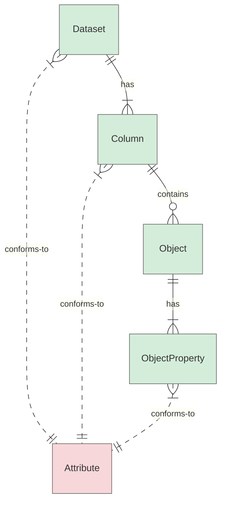

# Normative Requirements Guidelines

This section defines guidelines for authoring normative requirements in the FOCUS specification. These guidelines define **how** to write normative requirements to ensure clarity, consistency, and testability. It does not define the requirements themselves (the "what") but concentrates on their **structure, subjects, and verifiability**.

The guidelines cover normative requirements applicable to:

* **FOCUS Datasets** — the primary containers of structured data as defined in FOCUS.
* **Columns** — individual columns within datasets (may contain nested objects and object properties, which can have additional normative rules)
* **Attributes** — schema-level rules that datasets, columns, or object properties must conform to.

The diagram below illustrates the relationships among these entities and shows where normative requirements apply:



**Nodes:**

* 🟩 FOCUS schema-level entity (normative subject)
* 🟥 FOCUS normative rule set (not a normative subject)

**Relationships:**

* `|| -- has -- |{` : one parent to one-or-more enumerated structural members
* `|| -- contains -- o{` : one parent to zero-or-more child entities (array of objects)
* `}| .. conforms-to .. ||` : many children to one parent conformance relationship

## Note on FOCUS Dataset, Dataset Instance, and Glossary Alignment

> **Important clarification**

By glossary definition, the following concepts are used:

* **FOCUS Dataset** — the primary dataset concept defined by the FOCUS specification.
* **Dataset Instance** — represents a concrete instantiation of a **FOCUS Dataset Instance**.
* **Dataset Artifact** — represents a physical or delivered form of a **FOCUS Dataset Instance Artifact**.

However, by design decision, the specification adopts the following normative conventions:

* **FOCUS Dataset is used as the canonical normative subject** for dataset-level requirements.
* Normative requirements are intentionally written against **FOCUS Dataset**, even when the constraint applies to:
  * a dataset specification,
  * a dataset instance, or
  * a dataset instance artifact.
* The intended level of application (specification vs. instance vs. artifact) is inferred from context rather than encoded in the normative subject.

This choice is intentional and overrides interpretations based solely on abstraction level.

## Core Normative Authoring Rules

### 1. Normative Requirement Structure

The recommended pattern for a normative requirement is:

``` markdown
<Subject (+qualifier)> + <BCP 14 Keyword> + <Verifiable State Descriptor> + <Object (+qualifier)> [+ Conditions]
```

* Each normative requirement MUST:
  * identify exactly one **normative subject** to which the requirement applies
  * contain exactly one **BCP 14 keyword** (MUST, SHOULD, MAY, MUST NOT, etc.), indicating the obligation level
  * express exactly one **verifiable constraint**
* Each normative requirement SHOULD describe a **verifiable state** of the object rather than behavior

### 2. Structural Anchor Requirement

Each Requirements section for a schema-level construct MUST begin with a single **structural anchor requirement**.

The structural anchor requirement:

* introduces the scope of the subsequent normative requirements,
* MUST appear as the first normative statement in the section,
* exists to support automated parsing and validation, and
* is non-verifiable and does not introduce an enforceable constraint.

The canonical form of a structural anchor requirement is:

> `<Entity> MUST adhere to the following requirements:`

For **Attribute Requirements** sections, the Attribute ID MAY be used as the subject of the structural anchor requirement.
This usage is a structural exception only and MUST NOT be interpreted as implying that Attributes are normative subjects or independently enforceable schema entities.

### 3. Normative Subject

#### 3.1 Allowed Subjects

The normative subject MUST be a schema-level entity, such as:

* **FOCUS Dataset**, whereby use of:  
  * `FOCUS dataset` keyword represents any FOCUS dataset  
  * `FOCUS dataset` keyword with a qualifier represents a qualified subset of FOCUS datasets  
  * A single FOCUS dataset explicitly identified by `<FOCUS Dataset ID>` (e.g., `CostAndUsage`)

* **FOCUS Column**, whereby use of:  
  * `FOCUS column` keyword represents any FOCUS column  
  * `FOCUS column` keyword with a qualifier represents a qualified subset of FOCUS columns (e.g., `FOCUS column containing numeric values`)  
  * A single FOCUS column explicitly identified by `<FOCUS Column ID>` (e.g., `BilledCost`)

* **Custom Column**, whereby use of:  
  * `Custom column` keyword represents any custom column  
  * `Custom column` keyword with a qualifier represents a qualified subset of custom columns (e.g., `Custom column containing numeric values`)

* **Structural sub-elements within Columns** (objects, keys, key values):  
  *Note: MUST NOT use `object`, `key`, or `value` keywords alone. Always reference them in context, e.g.:*  
  * `Object in Columns containing JsonObjectFormat values`  
  * `Key in Object in FOCUS/Custom column containing JsonObjectFormat values`  
  * `Key value in Object in FOCUS/Custom column containing key-value pairs`

The subject SHOULD be explicit and unambiguous.

**Exception:** A structural anchor requirement MAY use the ID of the enclosing schema construct as its subject, even if that construct is not otherwise an allowed normative subject (e.g., `<FOCUS Attribute  ID>`). This exception applies only to structural anchor requirements.

#### 3.2 Disallowed Subjects

The following MUST NOT be used as normative subjects:

* Actors (e.g. data generator, service provider, consumer)
* Processes or mechanisms (e.g. Delivery Handling, Correction Handling, etc.)

### 4. State, Not Behavior

Normative requirements MUST describe a **verifiable state**, not an operational process or behavior.

Specifically:

* Process-oriented verbs such as *ensure*, *handle*, *support*, or *provide* MUST NOT be used.
* If a requirement refers to actor behavior, it MUST be reformulated as:
  * a constraint on the resulting dataset state, or
  * a constraint on a schema-defined artifact.

### 5. Use of BCP 14 Keywords

* Each normative bullet MUST contain exactly one BCP 14 keyword (MUST, SHOULD, MAY, MUST NOT, SHOULD NOT).
* A bullet containing more than one normative keyword MUST be split.

### 6. Splitting Requirements

A requirement MUST be split into multiple bullets if it:

* combines multiple obligations,
* combines a rule and an exception,
* mixes a definition with a constraint,
* applies different constraints to different subjects.

### 7. Composite Requirements

Composite (parent + nested) requirements MAY be used when strictly controlled.

They are allowed only when:

* the parent bullet introduces exactly one normative subject, and
* all nested bullets:
  * apply to that same subject,
  * do not introduce a new normative context.

Nested bullets MUST NOT introduce a different subject.

### 8. Definitions vs. Normative Requirements

* Definitions, explanations, rationale, and examples MUST NOT be expressed as normative requirements.
* Definitions SHOULD be written as plain declarative statements without BCP 14 keywords.
* Normative bullets SHOULD be reduced to the enforceable constraint only.

## Dataset Requirements

### 1. Logical Grouping of Dataset Requirements

Grouping and ordering of dataset-level normative requirements ensures clarity, consistency, and maintainability across all FOCUS datasets, making related or similar requirements easy to identify and follow.

  1. **Technical Requirements**
     1. **Dataset Presence:** Defines whether, and under what conditions, a dataset must be present in the FOCUS delivery.
     2. **Column Presence in Dataset:** Intended to define which columns must or are recommended to be present within a dataset, and under which conditions.
     3. **Technical Attributes Conformance:** Captures technical requirements that apply to all (or most) columns within the dataset (e.g., column handling, null handling). These requirements reflect general technical rules rather than rules for individual columns.
  2. **Business & Contextual Requirements**
     1. **Business/Contextual Attributes Conformance:** Captures business logic and contextual requirements that span multiple columns within the dataset (e.g., discount handling, invoice handling). These rules are not tied to a single column but define broader dataset behavior.
     2. **Other Business/Contextual Requirements (*FOR FUTURE USE*):** Captures additional dataset-level rules that do not fall into the above categories but are relevant for interpretation, validation, or integration.

#### Tabular Overview of Dataset Normative Requirement Grouping and Specifications

| Requirement Type | Requirement Group                                      | When Required?                               | Example                                                    |
|------------------|--------------------------------------------------------|----------------------------------------------|------------------------------------------------------------|
| Technical        | Dataset Presence                                       | Always                                       | {DatasetId} MUST be present when {Condition}.              |
| Technical        | Column Presence in Dataset                             | {DatasetId} MUST include {ColumnId} | N/A                                                        |
| Technical        | Technical Attributes Conformance                       | Always or when applicable                    | {DatasetId} MUST conform to ColumnHandling requirements.   |
| Business         | Business/Contextual Attributes Conformance             | When applicable                              | {DatasetId} MUST conform to DiscountHandling requirements. |
| Business         | Other Business/Contextual Requirements (FOR FUTURE USE)| For future use                               | N/A                                                        |

### 2. Ordering of Dataset Requirements Within Groups

* Within each group of requirements, order individual requirements as follows:
  * **MUST** – an absolute requirement
  * **MUST NOT** – a prohibition
  * **SHOULD** – recommended but not mandatory
  * **SHOULD NOT** – discouraged but not strictly prohibited
  * **MAY** – optional

  > ***Important Note:*** *The term **RECOMMENDED** (recommended but not mandatory; previously used only for presence-related normative requirements) is no longer permitted for use in normative requirements as of December 2025. The keyword **SHOULD** must be used instead. Please refer to the [**Editorial Style Guidelines**](#editorialstyleguidelines).*

* For detailed interpretation of keywords such as "MUST", "MUST NOT", "SHOULD", "SHOULD NOT", "MAY", and others, see [BCP14](https://tools.ietf.org/html/bcp14) [[RFC2119](https://tools.ietf.org/html/rfc2119)][[RFC8174](https://tools.ietf.org/html/rfc8174)].

### 3. Structuring Individual Dataset Requirements

* **Start with the DatasetId**: Whenever possible, begin each requirement with the DatasetId to make the requirement clear and focused.

  **Example Pattern 1**

  *Note: Text in square brackets [ ] indicates optional elements that apply only under certain conditions.*

  ```markdown
  * <DatasetId> MUST be present[ when <Condition>].
  ```

### 4. Consistent Wording and Patterns in Dataset Requirements

Use standardized phrasing and terminology, and apply common requirement patterns where applicable to ensure clarity and consistency across datasets and corresponding requirements.

#### 4.1. Dataset Requirement Patterns

##### 4.1.1. Technical Requirements: Dataset Presence

```markdown
* <DatasetId> MUST be present[ when <Condition>].
```

##### 4.1.2. Technical Requirements: Column Presence

```markdown
* <DatasetId> MUST include <ColumnId>.
* <DatasetId> MUST include <ColumnId> when <Condition>.
* <DatasetId> SHOULD include <ColumnId>.
* <DatasetId> SHOULD include <ColumnId> when <Condition>.
```

##### 4.1.3. Technical Requirements: Technical Attributes Conformance

```markdown
* <DatasetId> MUST conform to <TechnicalAttributeId> requirements.
```

##### 4.1.4. Business Requirements: Business/Contextual Attributes Conformance

```markdown
* <DatasetId> MUST conform to <BusinessAttributeId> requirements.
```

### 5. Dataset Normative Requirements Examples

#### **Contract Commitment**

ContractCommitment adheres to the following requirements:

* ContractCommitment MUST be present when the provider supports *contract commitments*.
* ContractCommitment MUST conform to [ColumnHandling](#columnhandling) requirements.
* ContractCommitment MUST conform to [NullHandling](#nullhandling) requirements.

#### **Cost and Usage**

CostAndUsage adheres to the following requirements:

* CostAndUsage MUST be present.
* CostAndUsage MUST conform to [ColumnHandling](#columnhandling) requirements.
* CostAndUsage MUST conform to [NullHandling](#nullhandling) requirements.
* CostAndUsage MUST conform to [DiscountHandling](#discounthandling) requirements.
* CostAndUsage MUST conform to [InvoiceHandling](#invoicehandling) requirements.
* CostAndUsage MUST conform to [DataGeneratorCalculatedSplitCostAllocationHandling](#datagenerator-calculatedsplitcostallocationhandling) requirements.

## Column Requirements

### 1. Logical Grouping of Column Requirements

Grouping and ordering of requirements ensure clarity, logical flow, and consistency across all columns, making related requirements easy to identify and follow. This structure should be maintained for consistency across the specification.

**Note**: This section provides a current preview of the requirements grouping and ordering. Members should review how this applies to specific columns and provide feedback. The order may be adjusted based on that feedback.

  1. **Technical Requirements**
     1. **Data Type**: Establishes a foundational expectation, ensuring all subsequent rules align with this type.
     2. **Value Format**: Ensures the value (if present) adheres to specific structural or syntactic rules.
     3. **Nullability**: Clarifies when the value can or cannot exist, ensuring all subsequent rules align with column nullability.
     4. **Values and Value Ranges**: Further constrains valid values, assuming the format is already correct.
     5. **Column-to-Column Relationships**: Defines dependencies and consistency rules between related columns.
  2. **Business & Contextual Requirements**
     1. **Unit/Denomination**: Ensures consistency in measurement or currency.
     2. **Uniqueness**: Defines uniqueness constraints for data integrity.
     3. **Fallback/Substitute Values**: Specifies what alternative values may be used if the expected value is missing.
     4. **Relationships Outside the Spec**: Defines dependencies on external systems or datasets.
     5. **Cost Validation Rules:**
        1. **Formula-based Cost Validation (e.g., P × Q = C)**: Ensures calculated fields adhere to mathematical rules.
        2. **Cost Correction Discrepancies**: Disclaimer on discrepancies in unit pricing, pricing quantities, and costs, which can be addressed independently when ChargeClass is 'Correction'.
     6. **Cost Calculation and Relationships**: Defines how costs are calculated in specific use cases, including dependencies on related charges and alignment with other cost values.
     7. **Other**: Requirements that do not fall into one of the previous categories.

#### Tabular Overview of Column Normative Requirement Grouping and Specifications

| **Requirement Type** | **Requirement Group**              | **When required?**                    | **Example**                                                                                |
|----------------------|------------------------------------|---------------------------------------|--------------------------------------------------------------------------------------------|
| Technical            | Data Type                          | Always                                | {ColumnId} MUST be of type String.                                                         |
| Technical            | Value Format                       | Always (except normalized dimensions) | {ColumnId} MUST conform to [StringHandling](#stringhandling) requirements.                 |
| Technical            | Nullability                        | Always                                | {ColumnId} MUST/MUST NOT/SHOULD/SHOULD NOT/MAY be null when {Condition}.                     |
| Technical            | Values and Value Ranges            | Metrics and normalized dimensions     | {ColumnId} MUST be a valid decimal value.<br/>{ColumnId} MUST be one of the allowed values. |
| Technical            | Column to column Relationships     | When applicable                       | {ColumnId} SHOULD/MUST remain consistent over time for a given ReferencedColumnId.         |
| Business             | Unit/Denomination                  | When applicable                       | {ColumnId} MUST be denominated in the BillingCurrency.                                     |
| Business             | Uniqueness                         | When applicable                       | BillingAccountId MUST be a unique identifier within a provider.                            |
| Business             | Fallback/Substitute Values         | When applicable                       | {ColumnId} MUST NOT duplicate {OtherColumnId} when {Condition}.                              |
| Business             | Relationships Outside the Spec     | When applicable                       | The sum of {ColumnId} in a given billing period MUST match the sum of the invoices received for that billing period for a billing account. |
| Business             | Formula-based Cost Validation      | When applicable                       | {CostColumnId} MUST equal the product of {UnitPriceColumnId} and PricingQuantity when {UnitPriceColumnId} is not null and PricingQuantity is not null. |
| Business             | Cost Calculation and Relationships | When applicable                       | When {Condition}, {ColumnId} adheres to the following additional requirements:<br>  *{ColumnId} of a charge calculated based on other charges (e.g., when the ChargeCategory is "Tax") MUST be calculated based on the ContractedCost of those related charges.<br>* {ColumnId} of a charge unrelated to other charges (e.g., when the ChargeCategory is "Credit") MUST match the BilledCost. |
| Business             | Other                              | When applicable                       |                                                                                           |

### 2. Ordering of Column Requirements Within Groups

* Within each group of requirements, order individual requirements as follows:
  * **MUST** – an absolute requirement
  * **MUST NOT** – a prohibition
  * **SHOULD** – recommended but not mandatory
  * **SHOULD NOT** – discouraged but not strictly prohibited
  * **MAY** – optional

  > ***Important Note:*** *The term **RECOMMENDED** (recommended but not mandatory; previously used only for presence-related normative requirements) is no longer permitted for use in normative requirements as of December 2025. The keyword **SHOULD** must be used instead. Please refer to the [**Editorial Style Guidelines**](#editorialstyleguidelines).*

* For detailed interpretation of keywords such as "MUST", "MUST NOT", "SHOULD", "SHOULD NOT", "MAY", and others, see [BCP14](https://tools.ietf.org/html/bcp14) [[RFC2119](https://tools.ietf.org/html/rfc2119)][[RFC8174](https://tools.ietf.org/html/rfc8174)].

### 3. Structuring Individual Column Requirements

* **Start with the ColumnId**: Whenever possible, begin each requirement with the ColumnId to make the requirement clear and focused.

  **Example Pattern 1**

  ```markdown
  * <ColumnId> MUST/MUST NOT/SHOULD/MUST be null when <Condition>.
  ```

* **Use {ColumnId} for Column and Value References**: Whenever possible, use {ColumnId} when referring to a column or its values.

* **Default to Singular Form**: Column references should be singular, with the understanding that the requirement applies to all values in the column.

* **Reuse Requirement Text Across Columns**: When a normative requirement applies to multiple columns, the exact same wording should be used for all. This takes precedence over the **Start with the ColumnId** rule to maintain consistency and avoid unnecessary variations in language.
  
  **Example Pattern 2**

  ```markdown
  * <CostColumnId> MUST equal the product of <UnitPriceColumnId> and PricingQuantity when <UnitPriceColumnId> is not null and PricingQuantity is not null.
  ```  

### 4. Additional Guidelines for Columns in JSON Format

#### 4.1. Column Definition Structure

* **Separate normative requirements into sections for column, JSON schema, and contents**: Communicating the normative requirements for a column, JSON schema, and the contents can be convoluted. Separating these requirements provides better clarity.
  * Column normative requirements specify requirements of the column such as nullability.
  * JSON schema normative requirements specify the shape of the JSON.
  * Contents normative requirements usually specify the expected Keys, the format of the Values, and the expected contents of the Values.

#### 4.2. JSON Schema

* **Omit JSON schema normative requirements for Key-Value Format columns**: The Key-Value Format definition is sufficient to define the expected JSON schema.

* **Include JSON schema normative requirements for JSON Object Format columns**: The JSON Object Format specifies that the format is subject to the requirement of the column and that data generator-defined columns must have documented schema.
  * The pattern used in [AllocatedMethodDetails](#allocatedmethoddetails) and [ContractApplied](#contractapplied) consists of Object containing a collection whose key is "Elements" which contains one or more objects in the Key-Value format.

  **Example JSON**

  ```json
  {
    "Elements" : [ {
      "RequiredKey1" : 0.05,
      "RecommendedKey2" : "CPU",
      "RecommendedKey3" : 0.5
    }, {
      "RequiredKey1" : 0.1,
      "RecommendedKey3" : 4,
      "ProviderDefinedKey4": "SomeString"
    } ]
  }
  ```

* **Include a [JSON Type Definition](https://www.rfc-editor.org/rfc/rfc8927) (JTD) as an approximation of the expected schema, but clarify that JTD is non-normative and that normative requirements take precedence when there is a discrepancy**: JSON Type Definition is a convenient way to visualize the expected shape of JSON data, but it often cannot replicate the JSON schema normative requirements of FOCUS. E.g. [NumericFormat](#numericformat) allows for multiple numeric data types and precisions, but JTD requires both to be specified.

  **Example JTD**
  
  ```json
  {
    "properties": {
      "Elements": {
        "elements": {
          "properties": {
            "RequiredKey1": { "type": "float64" }
          },
          "optionalProperties": {
            "RecommendedKey2": { "type": "string" },
            "RecommendedKey3": { "type": "float64" }
          },
          "additionalProperties": true
        }
      }
    },
    "additionalProperties": true
  }
  ```

#### 4.3. Key-Value Pairs

* **References to Key-Value Pairs depend on the context**: The terminology for key-value pairs varies depending on the column and context. For instance, when referring to key-value pairs, **tags**, **user-defined tags**, and **data generator-defined tags** are used in **Tags**, whereas **SkuPriceDetails property** is used in **SkuPriceDetails**.

* **Default to Plural for Key-Value Pairs**: When referring to key-value pairs, **tags** and **properties** should be used in the plural form to reflect the fact that the column may contain multiple key-value pairs.

#### 4.4. Keys and Values

* **Refer to Key and Values Explicitly**: When specifying normative requirements for key and value, use precise terminology based on the column type. For instance:
  * In **Tags**, refer to **tag key** when addressing only the key, and **tag value** when addressing only the value.
  * In **SkuPriceDetails**, refer to **property key** when addressing only the key, and **property value** when addressing only the value.
  * When linking a key to its value, use **corresponding value**.

* **First Mention and Context**: In the case of SkuPriceDetails property key, the first mention explicitly uses "SkuPriceDetails property key" to establish the context. Subsequent references to "property key" and "property value" omit "SkuPriceDetails" as the context is already understood. In contrast, for Tags, this is not necessary, as the context is inherently clear from the column name.

* **Put references to a specific key in double quotes**: In the case of AllocatedMethodDetails, normative requirements are applied to specific keys. To delineate for example that the object with the key "Elements" is being referred, the key should be used in its exact casing inside of double quotation marks `"`.

* **Start Key-Specific Requirements with the Key Term**: When a requirement applies to a key, it SHOULD begin with **tag key**, **property key**, or the applicable term for that column.

* **Start Value-Specific Requirements with the Value Term**: When a requirement applies to a value, it SHOULD begin with **tag value**, **property value**, or the applicable term for that column.

* **Plural vs. Singular Form for Keys and Values**:
  * Use plural when referring to keys or values to reflect the fact that the column may contain multiple keys/values (e.g., "property keys", "tag values").
  * Use singular when referring to the key or value of a single tag or property (e.g., "property key", "tag value"), with the understanding that the requirement applies to all occurrences.

### 5. Grouping of Nullability-Related and Subsequent Column Requirements

* When there is only one nullability-related requirement, state it directly. If there are multiple, list them as nested bullets under the introductory bullet 'ColumnId nullability is defined as follows:'

  **Example Pattern 1**

  ```markdown
  * <ColumnId> nullability is defined as follows:
    * <ColumnId> MUST be null when <Condition>.
    * <ColumnId> MUST NOT be null when <Condition>.
  ```

* When requirements follow conditional logic (e.g., "If... Else If... Else"), the order should be adjusted so that the most specific conditions appear first, while the most general requirement (e.g., a MUST or SHOULD) is placed last as the fallback rule ("In all other cases" clause).

  **Example Pattern 2**

  ```markdown
  * <ColumnId> nullability is defined as follows:
    * <ColumnId> MUST/MUST NOT/SHOULD/SHOULD NOT/MAY be null when <Condition>.
    * <ColumnId> MUST/MUST NOT/SHOULD/SHOULD NOT/MAY be null when <Condition>.
    * <ColumnId> MUST/MUST NOT/SHOULD/SHOULD NOT/MAY be null in all other cases.
  ```

  **Example Pattern 3**

  ```markdown
  * <ColumnId> nullability is defined as follows:
    * <ColumnId> MUST be null when <Condition>.
    * When <Condition>, <ColumnId> adheres to the following additional requirements:
      * <ColumnId> MUST NOT be null when <Condition>.
      * <ColumnId> MAY be null when <Condition>.
  ```

### 6. Grouping of Column Requirements Based on Specific Conditions

* **Parent Condition**
  * When a specific condition (or set of conditions) applies to a subset of requirements, you may group them under that condition.
  * The requirement's bullet should start with the {Condition}, and the following requirements should begin with the {ColumnId}.
  * For conditions that apply to multiple nested requirements, use the following pattern:

  ```markdown
    When <Condition(s)>, <ColumnId> adheres to the following additional requirements:
  ```

  **Example Pattern 1**
  
  ```markdown
  * When <Condition>, <ColumnId> adheres to the following additional requirements:
    * <ColumnId> MUST NOT be null when <Condition>.
    * <ColumnId> MAY be null when <Condition>.
  ```

* **Nested Condition**
  * For nested conditions, if the parent condition already defines the adherence (e.g., {ColumnId} adheres to the following additional requirements), do not repeat this phrase. Simply state the nested condition, and then list the specific requirements for that condition under the nested bullet.

  **Example Pattern 2**

  ```markdown
  * When <Condition>, <ColumnId> adheres to the following additional requirements:
    * <ColumnId> MUST be a valid decimal value.
    * When <NestedCondition>:
      * <ColumnId> MUST be <SpecificRequirement>.
      * <ColumnId> MUST be <SpecificRequirement>.
  ```

### 7. Consistent Wording and Patterns in Column Requirements

To ensure clarity and consistency across columns and corresponding requirements, it is important to:

* Follow common requirement patterns where applicable
* Use standardized phrasing and terminology

#### 7.1. Column Requirement Patterns

##### 7.1.1. Technical Requirements: Data Type

```markdown
* <ColumnId> MUST be of type String.
* <ColumnId> MUST be of type Decimal.
* <ColumnId> MUST be of type Date/Time.
```

##### 7.1.2. Technical Requirements: Value Format

```markdown
* <ColumnId> MUST conform to [StringHandling](#stringhandling) requirements.
* <ColumnId> MUST conform to [Numeric Format](#numericformat) requirements.
* <ColumnId> MUST conform to [DateTimeFormat](#date/timeformat) requirements.
* <ColumnId> SHOULD conform to [UnitFormat](#unitformat) requirements.
* <ColumnId> MUST conform to [KeyValueFormat](#key-valueformat) requirements.
* <ColumnId> MUST conform to [CurrencyCodeFormat](#currencycodeformat) requirements.
```

##### 7.1.3. Technical Requirements: Nullability

```markdown
* <ColumnId> MUST NOT be null.
```

```markdown
* <ColumnId> MUST/MUST NOT/SHOULD/SHOULD NOT/MAY be null when <Condition>.
```

```markdown
* <ColumnId> nullability is defined as follows:
  * <ColumnId> MUST/MUST NOT/SHOULD/SHOULD NOT/MAY be null when <Condition1>.
  * <ColumnId> MUST/MUST NOT/SHOULD/SHOULD NOT/MAY be null when <Condition2>.
```

```markdown
* <ColumnId> nullability is defined as follows:
  * <ColumnId> MUST be null when <Condition>.
  * When <Condition>, the column adheres to the following additional requirements:
    * <ColumnId> MUST NOT be null when <Condition>.
    * <ColumnId> MAY be null when <Condition>.
```

```markdown
* <ColumnId> nullability is defined as follows:
  * <ColumnId> MUST/MUST NOT/SHOULD/SHOULD NOT/MAY be null when <Condition>.
  * <ColumnId> MUST/MUST NOT/SHOULD/SHOULD NOT/MAY be null when <Condition>.
  * <ColumnId> MAY be null in all other cases.
```

```markdown
* <ColumnId> nullability is defined as follows:
  * When <Condition>, <ColumnId> adheres to the following additional requirements:
    * <ColumnId> MUST NOT be null when <Condition>.
    * <ColumnId> MAY be null when <Condition>.
  * <ColumnId> MUST be null in all other cases.
```

##### 7.1.4. Technical Requirements: Values and Value Ranges

```markdown
* <ColumnId> MUST be a valid decimal value.
* <ColumnId> MUST be a non-negative decimal value.
```

##### 7.1.5. Technical Requirements: Column-to-Column Relationships

```markdown
* <ColumnId> SHOULD/MUST remain consistent over time for a given <OtherColumnId>.
```

##### 7.1.6. Business & Contextual Requirements: Unit/Denomination

```markdown
* <ColumnId> MUST be denominated in the BillingCurrency.
* <ColumnId> MUST be expressed in the <OtherColumnId>.
```

##### 7.1.7. Business & Contextual Requirements: Uniqueness

```markdown
* <ColumnId> MUST be a unique identifier within <Scope>.
```

##### 7.1.8. Business & Contextual Requirements: Fallback/Substitute Values

```markdown
* <ColumnId> MUST NOT duplicate <OtherColumnId> when <Condition>
```

##### 7.1.9. Business & Contextual Requirements: Relationships Outside the Spec

```markdown
* The sum of <ColumnId> in a given billing period MUST/MAY NOT match the sum of the invoices received for that billing period for a billing account.
```

##### 7.1.10. Business & Contextual Requirements: Cost Validation Rules

```markdown
* <CostColumnId> MUST equal the product of <UnitPriceColumnId> and PricingQuantity when <UnitPriceColumnId> is not null and PricingQuantity is not null.
```

##### 7.1.11. Business & Contextual Requirements: Cost Calculation and Relationships

```markdown
* When <Condition>, <CostColumnId> adheres to the following additional requirements:
  * <CostColumnId> of a charge calculated based on other charges (e.g., when the ChargeCategory is "Tax") MUST be calculated based on the <CostColumnId> of those related charges.
  * <CostColumnId> of a charge unrelated to other charges (e.g., when the ChargeCategory is "Credit") MUST match the BilledCost.
```

#### 7.2. Column Requirement Standardized Terminology

##### 7.2.1. Identifiers and Uniqueness within Scope

* Patterns:
  * {ColumnId} MUST be a unique identifier within {Scope}.
  * {ColumnId} SHOULD be a fully-qualified identifier.
* Examples:
  * BillingAccountId MUST be a unique identifier within a service provider.
  * ResourceId SHOULD be a fully-qualified identifier.

##### 7.2.2. Column Aggregation

* Pattern: The sum of {ColumnId} in a given billing period...
* Example: The sum of BilledCost in a given billing period...

##### 7.2.3. Column value Consistency

* Patterns:
  * {ColumnId} MUST/SHOULD remain consistent over time for a given {OtherColumnId}.
* Examples:
  * SkuMeter SHOULD remain consistent over time for a given SkuId.
  * CommitmentDiscountUnit MUST remain consistent over time for a given CommitmentDiscountId.

##### 7.2.4. References to charge and billing periods

* Patterns:
  * in a given billing period
  * in a given charge period

##### 7.2.5. Preferred Terminology for Numerical References

* Patterns: When specifying quantities in normative requirements, follow these conventions:
  * Use "one" instead of "1".
  * Use "more than one" instead of "2 or more".
* Examples:
  * When the service provider has only one user-defined tag scheme. (instead of: When the service provider has only 1 user-defined tag scheme.)
  * When the service provider has more than one user-defined tag scheme. (instead of: When the service provider has 2 or more user-defined tag schemes.)

### 8. Column Normative Requirements Examples

#### **List Unit Price**

ListUnitPrice adheres to the following requirements:

* ListUnitPrice MUST be of type Decimal.
* ListUnitPrice MUST conform to [NumericFormat](#numericformat) requirements.
* ListUnitPrice nullability is defined as follows:
  * ListUnitPrice MUST be null when [ChargeCategory](#chargecategory) is "Tax".
  * ListUnitPrice MUST NOT be null when ChargeCategory is "Usage" or "Purchase" and [ChargeClass](#chargeclass) is not "Correction".
  * ListUnitPrice MAY be null in all other cases.
* When ListUnitPrice is not null, ListUnitPrice adheres to the following additional requirements:
  * ListUnitPrice MUST be a non-negative decimal value.
  * ListUnitPrice MUST be denominated in the BillingCurrency.
  * The product of ListUnitPrice and [PricingQuantity](#pricingquantity) MUST match the [ListCost](#listcost) when PricingQuantity is not null and ChargeClass is not "Correction".
  * Discrepancies in ListUnitPrice, ListCost, or PricingQuantity MAY exist when ChargeClass is "Correction".

#### **Billed Cost**

BilledCost adheres to the following requirements:

* BilledCost MUST be of type Decimal.
* BilledCost MUST conform to [NumericFormat](#numericformat) requirements.
* BilledCost MUST NOT be null.
* BilledCost MUST be a valid decimal value.
* BilledCost MUST be denominated in the BillingCurrency.
* The sum of BilledCost in a given [*billing period*](#glossary:billing-period) MUST match the sum of the invoices received for that *billing period* for a [*billing account*](#glossary:billing-account).

#### **CommitmentDiscountQuantity**

CommitmentDiscountQuantity adheres to the following requirements:

* CommitmentDiscountQuantity MUST be of type Decimal.
* CommitmentDiscountQuantity MUST conform to [NumericFormat](#numericformat) requirements.
* CommitmentDiscountQuantity nullability is defined as follows:
  * When ChargeCategory is "Usage" or "Purchase" and CommitmentDiscountId is not null, CommitmentDiscountQuantity adheres to the following additional requirements:
    * CommitmentDiscountQuantity MUST NOT be null when [ChargeClass](#chargeclass) is not "Correction".
    * CommitmentDiscountQuantity MAY be null when ChargeClass is "Correction".
  * CommitmentDiscountQuantity MUST be null in all other cases.
* When CommitmentDiscountQuantity is not null, CommitmentDiscountQuantity adheres to the following additional requirements:
  * CommitmentDiscountQuantity MUST be a valid decimal value.
  * When ChargeCategory is "Purchase":
    * CommitmentDiscountQuantity MUST be the quantity of CommitmentDiscountUnit, paid fully or partially upfront, that is eligible for consumption over the *commitment discount's* [*period*](#glossary:period) when [ChargeFrequency](#chargefrequency) is "One-Time".
    * CommitmentDiscountQuantity MUST be the quantity of CommitmentDiscountUnit that is eligible for consumption for each *charge period* that corresponds with the purchase when ChargeFrequency is "Recurring".
  * When ChargeCategory is "Usage":
    * CommitmentDiscountQuantity MUST be the metered quantity of CommitmentDiscountUnit that is consumed in a given *charge period* when [CommitmentDiscountStatus](#commitmentdiscountstatus) is "Used".
    * CommitmentDiscountQuantity MUST be the remaining, unused quantity of CommitmentDiscountUnit in a given *charge period* when CommitmentDiscountStatus is "Unused".

## Attribute Requirements

> This section is **Work In Progress**.

This section defines guidelines for authoring **Attribute-level normative requirements**.

Attributes are **not normative subjects**, **except** that the Attribute ID is used as **the subject of the structural anchor requirement** for automated validation consistency. They define reusable sets of normative constraints applied to Datasets, Columns, or ElementProperties that declare conformance to the Attribute.

### 1. Role of Attributes in the Specification

Attributes serve as:

* reusable rule sets that avoid duplication across Datasets and Columns,
* a mechanism for expressing cross-cutting technical or business constraints,
* a conformance target for schema-level entities.

Normative requirements defined in an Attribute section are enforced on the conforming schema-level entity, not on the Attribute itself.

### 2. Structural Anchor Requirement for Attributes

Each Attribute Requirements section MUST begin with a structural anchor requirement.

The structural anchor requirement:

* uses the Attribute ID as the subject,
* introduces the scope of the requirements,
* is non-verifiable and non-enforceable,
* exists solely for structural consistency and automated parsing.

Canonical form:

``` markdown
<AttributeId> MUST adhere to the following requirements:
```

This is the only case in which an Attribute ID may appear as a normative subject.

### 3. Normative Subjects in Attribute Requirements

All enforceable normative requirements within an Attribute section MUST target schema-level entities that conform to the Attribute. The Attribute itself MUST NOT be treated as an enforceable subject beyond the structural anchor requirement.

Each Attribute implicitly assumes one or more intended normative subjects. These subjects determine which schema-level entities the Attribute’s requirements apply to.

The following table lists commonly used intended subjects.

***Note:** This list is non-exhaustive and will be extended over time.*

| Subject (Core) | Distinct Subjects with Qualifiers | Description/Note |
|----------------|-----------------------------------|------------------|
| Attribute      | `<Attribute ID>` | Specific Attribute identified by Dataset ID |
| FOCUS Dataset  | FOCUS dataset | |
| FOCUS Dataset  | `<FOCUS Dataset ID>` FOCUS dataset | Specific FOCUS dataset identified by Dataset ID |
| Native dataset | Native dataset | |
| Native column  | Native dataset column | |
| Column         | FOCUS column | Column defined by FOCUS and included in a FOCUS dataset |
| Column         | Custom column | Column not defined by FOCUS and included in a FOCUS dataset |
| Column         | FOCUS/Custom column representing national currency | |
| Column         | FOCUS/Custom column representing virtual currency | |
| Column         | FOCUS/Custom column representing an identifier | |
| Column         | FOCUS/Custom column representing a name | |
| Column         | FOCUS/Custom column representing a product offering that incurred the charge | |
| Column         | FOCUS column with `Category` suffix | |
| Column         | FOCUS/Custom column containing numeric values | |
| Column         | FOCUS/Custom column containing date/time values | |
| Column         | FOCUS/Custom column containing string values | |
| Column         | FOCUS/Custom column containing immutable string values | |
| Column         | FOCUS/Custom column containing not-nullable string values | |
| Column         | FOCUS/Custom column representing charges to mutable entities?? | |
| Column         | FOCUS/Custom column containing values in JsonObjectFormat format | |
| Column         | FOCUS/Custom column containing values in key-value pair format | |
| Column         | `<FOCUS Dataset ID>.<FOCUS Column ID>` | Specific column included in a FOCUS dataset, identified by Column ID |
| Object/Element | Object/Element in array in FOCUS/Custom column containing JsonObjectFormat values | |
| Object         | Object in FOCUS/Custom column containing JsonObjectFormat values | |
| Key            | Keys in Object in FOCUS/Custom column containing JsonObjectFormat values | |
| Key value      | Key values in Object in FOCUS/Custom column containing JsonObjectFormat values | |
| Key            | Keys in FOCUS/Custom column containing values in key-value pair format | |
| Key value      | Key values in FOCUS/Custom column containing values in key-value pair format | |

### 4. Grouping of Attribute Requirements

Grouping and ordering of Attribute requirements ensure clarity, consistency, and maintainability across the specification, making related requirements easy to identify and follow.

Attributes may include requirements that apply to one or more intended normative subjects. To make the applicability of each Attribute, and each of its individual requirements, as transparent as possible, intended normative subjects serve as the basis for grouping. This ensures that readers can readily determine whether a requirement applies to a dataset, a subset of datasets, FOCUS columns, or custom columns.

This structured grouping improves clarity, consistency, and maintainability across the specification by making related requirements easier to locate and understand, without introducing any additional normative meaning.

0. **Structural Attribute Anchor Requirement:** Introduces the scope of the Attribute and provides a stable parsing entry point; it does not introduce a verifiable constraint.
1. **FOCUS Dataset-level Attribute Requirements:**
   1. **Global FOCUS Dataset Requirements:** Applicable to all FOCUS datasets that declare conformance to the Attribute, regardless of their structure, specific role or context.
   2. **Qualified FOCUS Dataset Requirements:** Applicable to a subset of FOCUS datasets that declare conformance to the Attribute and are identified through a qualifier.
   3. **Specific FOCUS Dataset Requirements:** Applicable to a specific FOCUS dataset, identified explicitly by Dataset ID.
2. **FOCUS Column-level Attribute Requirements:** Applicable to FOCUS columns that declare conformance to the Attribute.
   1. **Global FOCUS Column Requirements:** Applicable to all FOCUS columns that declare conformance to the Attribute, regardless of their structure, specific role or context.
   2. **Qualified FOCUS Column Requirements:** Applicable to a subset of FOCUS columns that declare conformance to the Attribute and are identified through a qualifier
   3. **Specific FOCUS Column Requirements:** Applicable to a specific FOCUS column, identified explicitly by Column ID.
3. **Custom Column Attribute Requirements:**
   1. **Global Custom Column Requirements:** Applicable to all Custom columns, regardless of their structure or purpose.
   2. **Qualified Custom Column Requirements:** Applicable to a subset of Custom columns, identified through a qualifier.
4. **Sub-element Attribute Requirements:** Applicable to structural sub-elements within Columns that declare conformance to the Attribute.
   1. **Elements (Objects) in Columns containing JsonObjectFormat values**
   2. **Keys in Objects in Columns containing JsonObjectFormat values**
   3. **Key values in Objects in Columns containing JsonObjectFormat values**
   4. **Keys in Columns containing Key-Value pair format values**
   5. **Key values in Columns containing Key-Value pair format values**

### 5. Ordering of Attribute Requirements within Groups

> TODO:

### 6. Attribute Normative Requirements Examples

> TODO:
