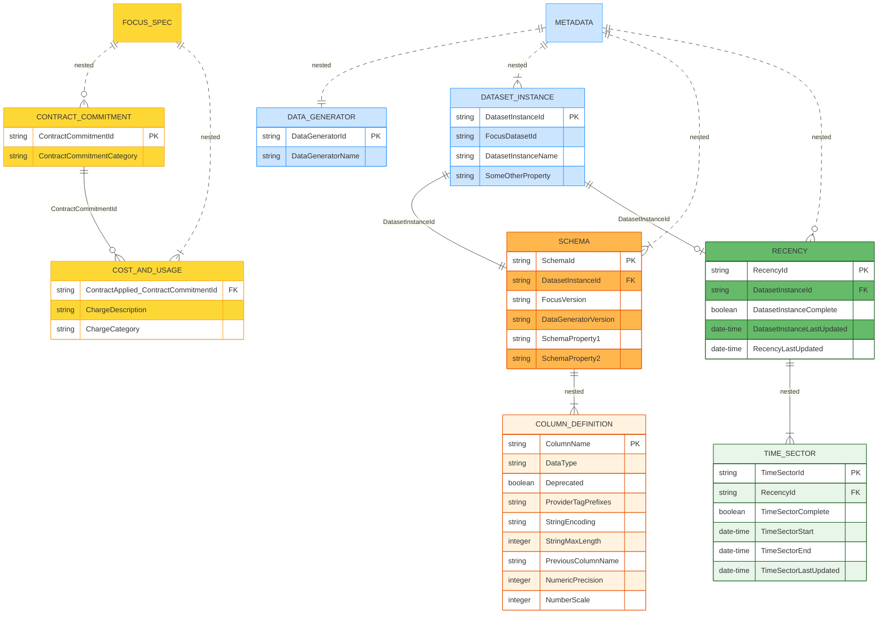
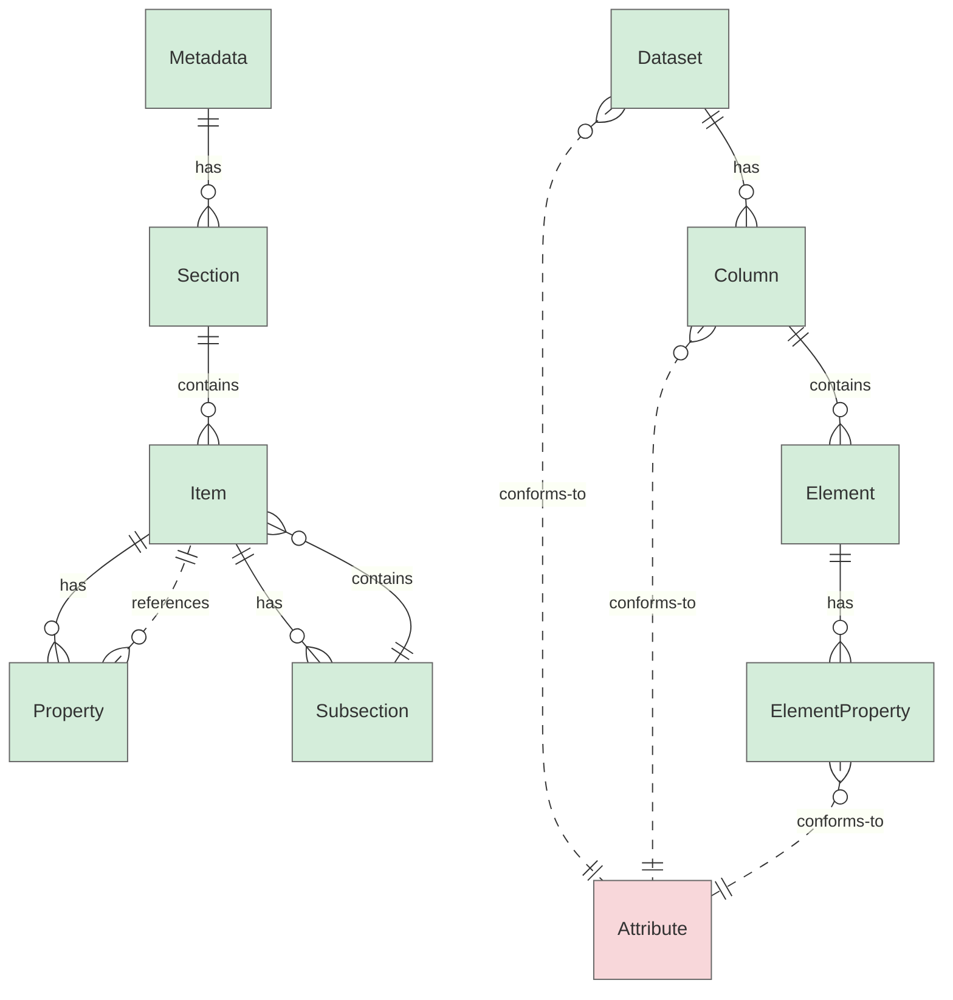

# Metadata Guidelines

## Metadata Structure

The FOCUS metadata structure is organized around a single root object — Metadata (capitalized), which encapsulates the overall structure and context of all FOCUS metadata elements.

The Metadata (root object), as well as any underlying metadata object, may contain both:

* Properties: key–value pairs that describe object characteristics.
  * Note: While most properties allow only a single value, some support multiple values (e.g., `Provider Tag Prefixes`).
* Nested (sub-)objects: metadata objects that represent structured components associated within parent object.
  * Note: The `Metadata` (root) and `Data Generator` objects are defined as single-entry structures, whereas most other metadata objects support multiple entries (e.g., `Schema`, `Dataset Instance`); in some cases, multiple entries are expected (e.g., `Time Sectors`).

### FOCUS Metadata – Specific Elements

This diagram illustrates the specific Sections, Items, and Properties within the FOCUS Metadata hierarchy, while also providing a preview of other schema-level entities from the FOCUS specification in parallel.

### FOCUS Metadata – Abstract Entities

This diagram presents the abstract structure of the FOCUS Metadata model, highlighting the relationships between high-level entities such as Sections, Subsections, Items (Objects) within Sections or Subsections, and their Properties, alongside a parallel view of schema-level constructs defined in the FOCUS specification.

### Direct vs. Referential Nesting of Metadata Objects

Some metadata objects are directly nested under a parent object (e.g., `Data Generator`, `Schema`, `Dataset Instance`, `Recency`).

In other cases, objects are related via reference properties rather than direct containment. For instance, the `Schema` object contains a `Dataset Instance ID` property that links it to a corresponding `Dataset Instance` object, creating a referential nesting relationship.

### Single vs Multiple Values in Objects and Properties

The `Metadata` root object is defined as a single-entry structure supplied by a Data Generator, containing exactly one corresponding `Data Generator` object. Other nested metadata objects generally support multiple entries, depending on their intended use. For example, `Dataset Instance` and `Schema` objects can have multiple entries, while `Time Sectors` explicitly expects multiple entries to represent a sequence of time periods.

Properties (key–value pairs) associated with metadata objects are typically single-value, conveying one piece of information per property. Some properties, however, are explicitly defined as multi-value, allowing multiple values where needed (e.g., `Provider Tag Prefixes`).

Notes:

* The documentation must clearly specify whether:
  * A metadata object is single-entry or multi-entry.
  * A property is single-value or multi-value.
* These information must also be considered when defining object and property names to ensure clarity and consistency. (See [Metadata Naming Convention](#metadatanamingconvention)).

> **Discussion Topics/Questions:**
>
> * Action Item: Objects shoud be explicitly defined as single-entry or multi-entry structures and properties should be explicitly defined as single-value or multi-value.
>   * Currently, only the `Time Sectors` object explicitly indicates that multiple values are allowed. However, other (sub-)objects (such as `Schema`, `Dataset Instance`, and `Column Definition`) also allow multiple entries, even though this is not explicitly stated.
>
> * Action Item: Address single-/multi-entry support in Naming Convention
>   * The `Time Sectors` object name is the only one in plural form, whereas all other object names are in singular form - even though some of them (e.g., `Schema`, `Dataset Instance`, `Column Definition`) can also have multiple entries. Moreover, when used as a property name base, even `Time Sectors` appears in singular form (i.e., as `Time Sector`). Should we align this naming convention for consistency?

### Metadata Property Categories

Note: The following metadata property categories are intended to **support understanding and naming conventions** of metadata properties within the FOCUS specification. These categories serve as **conceptual guidance** and are not meant to be explicitly declared or enforced within individual property definitions.

1. **Unique Identifier (Primary):** Uniquely identifies and distinguishes an object within its own domain or context (e.g., `Dataset Instance ID`).
2. **Unique Identifier (Foreign):** Uniquely references an external or related object, enabling linkage across domains or systems (e.g., `FOCUS Dataset ID`, `Dataset Instance ID`).
3. **Descriptive Identifier (Current):** Provides a human-readable identifier of the object (e.g., `Column Name`).
4. **Descriptive Identifier (Previous):** Provides a prior version of the human-readable identifier of the object, if applicable (e.g., `Previous Column Name`).
5. **Version Identifier:** Indicates the version of the object, supporting version control (e.g., `Data Generator`, `FOCUS Version`).
6. **State Indicator:** Indicates whether a specific condition is met or an event has occurred, using boolean values. Often used in combination with a timestamp to express both the occurrence and timing of an event (e.g., `Time Sector Completed`).
7. **Timestamp:** Captures the point in time when a specific condition is met or an event has occurred, using date/time values. Often complements a state indicator to provide temporal context (e.g., `Time Sector Last Updated At`).
8. **Period Boundary:** Defines the start or end of a time period during which the object is valid or relevant (e.g., `Time Sector Start`, `Time Sector End`).
9. **Technical Property:** Describes technical aspects of the object, such as format, encoding, etc.
10. **Other:** Covers properties that do not fit into the predefined categories (e.g., `Provider Tag Prefixes`).

## Metadata Naming Convention

* Ensure each object and property name is unique and contextually clear to avoid redundancy.
* Multi-value properties, indicated clearly in documentation (e.g., `Provider Tag Prefixes`).

### Metadata Properties Naming Convention

* Each Metadata Property Name should follow the pattern: **Base + Suffix**.
* Prefix attributes with their Base to maintain clarity and avoid ambiguity.
* Matadata Property Base reflects the parent entity (object) or logical grouping. (e.g., `Column`, `DatasetInstance`, `Schema`, `TimeSector`, `Recency`)
* Metadata Property Suffixes describe the nature of the property.
* Metadata Property Suffixes based on Property Categories:
  * **Unique Identifier**
    * For primary and foreign unique identifiers use `ID`.
  * **Descriptive Identifier**
    * For descriptive identifiers use suffix `Name`.
  * **Versioning Identifier**
    * For tracking versions use suffix `Version`.
  * **State Indicator**
    * Boolean values indicating state/status, i.e. whether an event occurred.
    * Examples: `Completed`, `Deprecated`
  * **Timestamp**
    * To indicate a specific point in time, i.e., when the event occurred and add suffix `At`.
    * Examples: `CreatedAt`, `LastUpdatedAt`
  * **Period Boundary**
    * For time period boundaries use suffixes `Start` and `End` to denote beginning and end of the period.
    * Note: These are not suffixed with `At`, as they represent boundaries rather than discrete points in time.
  * **Technical Property**
    * Examples: `DataType`, `StringEncoding`, `NumericPrecision`
  * **Other**
    * Examples: `Provider Tag Prefixes`

* Note: For lifecycle events or status changes, we should anticipate two complementary properties - State Indicator + Timestamp Pairing. Even if only one is currently used, always name with future extensibility in mind.

## Tabular Overviews

### Proposed Changes

| Metadata ID (Before)        | Metadata ID (After)          | Base            | Suffix            | Category            | Version |
|-----------------------------|------------------------------|-----------------|-------------------|---------------------|---------|
| DatasetInstance Complete    | DatasetInstanceCompleted     | DatasetInstance | **Completed**     | State Indicator     | 1.3     |
| TimeSectorComplete          | TimeSectorCompleted          | TimeSector      | **Completed**     | State Indicator     | 1.3     |
| Deprecated                  | ColumnDeprecated             | **Column**      | Deprecated        | State Indicator     | before  |
| DataType                    | ColumnDataType               | **Column**      | DataType          | Technical Property  | before  |
| NumberScale                 | ColumnNumberScale            | **Column**      | NumberScale       | Technical Property  | before  |
| NumericPrecision            | ColumnNumericPrecision       | **Column**      | NumericPrecision  | Technical Property  | before  |
| StringMaxLength             | ColumnStringMaxLength        | **Column**      | StringMaxLength   | Technical Property  | before  |
| StringEncoding              | ColumnStringEncoding         | **Column**      | StringEncoding    | Technical Property  | before  |
| DatasetInstanceLastUpdated  | DatasetInstanceLastUpdatedAt | DatasetInstance | **LastUpdatedAt** | Timestamp           | 1.3     |
| RecencyLastUpdateDate       | RecencyLastUpdatedAt         | Recency         | **LastUpdatedAt** | Timestamp           | 1.3     |
| TimeSectorLastUpdated       | TimeSectorLast UpdatedAt     | TimeSector      | **LastUpdatedAt** | Timestamp           | 1.3     |
| CreationDate                | SchemaCreatedAt              | **Schema**      | **CreatedAt**     | Timestamp           | before  |

### After

| Object / Attribute                | Location/Context + Base + Suffix                                    | Base+Suffix                      | Base                  | Suffix            | Renamed   | Version   |
|:----------------------------------|:--------------------------------------------------------------------|:---------------------------------|:----------------------|:------------------|:----------|:----------|
| Object                            | Metadata                                                            | Metadata                         | Metadata              |                   |           | Revisited |
| Object                            | Metadata -> Data Generator                                          | Data Generator                   | Data Generator        |                   |           | Revisited |
| String                            | Metadata -> Data Generator -> Data Generator Name                   | Data Generator Name              | Data Generator        | Name              |           | Revisited |
| Object                            | Metadata -> Dataset Instance                                        | Dataset Instance                 | Dataset Instance      |                   |           | Revisited |
| String                            | Metadata -> Dataset Instance -> Dataset Instance ID                 | Dataset Instance ID              | Dataset Instance      | ID                |           | Revisited |
| String                            | Metadata -> Dataset Instance -> Dataset Instance Name               | Dataset Instance Name            | Dataset Instance      | Name              |           | Revisited |
| String                            | Metadata -> Dataset Instance -> FOCUS Dataset ID                    | FOCUS Dataset ID                 | FOCUS Dataset         | ID                |           | Revisited |
| Object                            | Metadata -> Recency                                                 | Recency                          | Recency               |                   |           | Revisited |
| Boolean                           | Metadata -> Recency -> Dataset Instance Completed                   | Dataset Instance Completed       | Dataset Instance      | Completed         | Y         | Revisited |
| String                            | Metadata -> Recency -> Dataset Instance ID                          | Dataset Instance ID              | Dataset Instance      | ID                |           | Revisited |
| Date/Time                         | Metadata -> Recency -> Dataset Instance Last Updated At             | Dataset Instance Last Updated At | Dataset Instance      | Last Updated At   | Y         | Revisited |
| Date/Time                         | Metadata -> Recency -> Recency Last Updated At                      | Recency Last Updated At          | Recency               | Last Updated At   | Y         | Revisited |
| Object (multiple valuest allowed) | Metadata -> Recency -> Time Sectors                                 | Time Sectors                     | Time Sectors          |                   |           | Revisited |
| Boolean                           | Metadata -> Recency -> Time Sectors -> Time Sector Completed        | Time Sector Completed            | Time Sector           | Completed         | Y         | Revisited |
| Date/Time                         | Metadata -> Recency -> Time Sectors -> Time Sector End              | Time Sector End                  | Time Sector           | End               |           | Revisited |
| Date/Time                         | Metadata -> Recency -> Time Sectors -> Time Sector Last Updated At  | Time Sector Last Updated At      | Time Sector           | Last Updated At   | Y         | Revisited |
| Date/Time                         | Metadata -> Recency -> Time Sectors -> Time Sector Start            | Time Sector Start                | Time Sector           | Start             |           | Revisited |
| Object                            | Metadata -> Schema                                                  | Schema                           | Schema                |                   |           | Revisited |
| Object                            | Metadata -> Schema -> Column Definition                             | Column Definition                | Column Definition     |                   |           | Revisited |
| String                            | Metadata -> Schema -> Column Definition -> Column Data Type         | Column Data Type                 | Column                | Data Type         | Y         | Revisited |
| Boolean                           | Metadata -> Schema -> Column Definition -> Column Deprecated        | Column Deprecated                | Column                | Deprecated        | Y         | Revisited |
| String                            | Metadata -> Schema -> Column Definition -> Column Name              | Column Name                      | Column                | Name              |           | Revisited |
| Integer                           | Metadata -> Schema -> Column Definition -> Column Number Scale      | Column Number Scale              | Column                | Number Scale      | Y         | Revisited |
| Integer                           | Metadata -> Schema -> Column Definition -> Column Numeric Precision | Column Numeric Precision         | Column                | Numeric Precision | Y         | Revisited |
| String                            | Metadata -> Schema -> Column Definition -> Column String Encoding   | Column String Encoding           | Column                | String Encoding   | Y         | Revisited |
| Integer                           | Metadata -> Schema -> Column Definition -> Column String Max Length | Column String Max Length         | Column                | String Max Length | Y         | Revisited |
| String                            | Metadata -> Schema -> Column Definition -> Previous Column Name     | Previous Column Name             | Previous Column       | Name              |           | Revisited |
| String (multiple valuest allowed) | Metadata -> Schema -> Column Definition -> Provider Tag Prefixes    | Provider Tag Prefixes            | Provider Tag Prefixes |                   |           | Revisited |
| String                            | Metadata -> Schema -> Data Generator Version                        | Data Generator Version           | Data Generator        | Version           |           | Revisited |
| String                            | Metadata -> Schema -> Dataset Instance ID                           | Dataset Instance ID              | Dataset Instance      | ID                |           | Revisited |
| String                            | Metadata -> Schema -> FOCUS Version                                 | FOCUS Version                    | FOCUS                 | Version           |           | Revisited |
| Date/Time                         | Metadata -> Schema -> Schema Created At                             | Schema Created At                | Schema                | Created At        | Y         | Revisited |
| String                            | Metadata -> Schema -> Schema ID                                     | Schema ID                        | Schema                | ID                |           | Revisited |

### Before

| Object / Attribute                | Location/Context + Base + Suffix                                 | Base+Suffix                   | Base                  | Suffix            | Rename   | Version   |
|:----------------------------------|:-----------------------------------------------------------------|:------------------------------|:----------------------|:------------------|:---------|:----------|
| Object                            | -> Metadata                                                      | Metadata                      | Metadata              |                   |          | Original  |
| Object                            | Metadata -> Data Generator                                       | Data Generator                | Data Generator        |                   |          | Original  |
| String                            | Metadata -> Data Generator -> Data Generator                     | Data Generator                | Data Generator        |                   |          | Original  |
| Object                            | Metadata -> Dataset Instance                                     | Dataset Instance              | Dataset Instance      |                   |          | Original  |
| String                            | Metadata -> Dataset Instance -> FOCUS Dataset ID                 | FOCUS Dataset ID              | FOCUS Dataset         | ID                |          | Original  |
| String                            | Metadata -> Dataset Instance -> Dataset Instance ID              | Dataset Instance ID           | Dataset Instance      | ID                |          | Original  |
| String                            | Metadata -> Dataset Instance -> Dataset Instance Name            | Dataset Instance Name         | Dataset Instance      | Name              |          | Original  |
| Object                            | Metadata -> Schema                                               | Schema                        | Schema                |                   |          | Original  |
| String                            | Metadata -> Schema -> Schema ID                                  | Schema ID                     | Schema                | ID                |          | Original  |
| Date/Time                         | Metadata -> Schema ->  Creation Date                             | Creation Date                 |                       | Creation Date     | Y        | Original  |
| String                            | Metadata -> Schema -> FOCUS Version                              | FOCUS Version                 | FOCUS                 | Version           |          | Original  |
| String                            | Metadata -> Schema -> Data Generator Version                     | Data Generator Version        | Data Generator        | Version           |          | Original  |
| String                            | Metadata -> Schema -> Dataset Instance ID                        | Dataset Instance ID           | Dataset Instance      | ID                |          | Original  |
| Object                            | Metadata -> Schema -> Column Definition                          | Column Definition             | Column Definition     |                   |          | Original  |
| String                            | Metadata -> Schema -> Column Definition -> Column Name           | Column Name                   | Column                | Name              |          | Original  |
| String                            | Metadata -> Schema -> Column Definition ->  Data Type            | Data Type                     |                       | Data Type         | Y        | Original  |
| Boolean                           | Metadata -> Schema -> Column Definition ->  Deprecated           | Deprecated                    |                       | Deprecated        | Y        | Original  |
| Integer                           | Metadata -> Schema -> Column Definition ->  Numeric Precision    | Numeric Precision             |                       | Numeric Precision | Y        | Original  |
| Integer                           | Metadata -> Schema -> Column Definition ->  Number Scale         | Number Scale                  |                       | Number Scale      | Y        | Original  |
| String                            | Metadata -> Schema -> Column Definition -> Previous Column Name  | Previous Column Name          | Previous Column       | Name              |          | Original  |
| String (multiple valuest allowed) | Metadata -> Schema -> Column Definition -> Provider Tag Prefixes | Provider Tag Prefixes         | Provider Tag Prefixes |                   |          | Original  |
| String                            | Metadata -> Schema -> Column Definition ->  String Encoding      | String Encoding               |                       | String Encoding   | Y        | Original  |
| Integer                           | Metadata -> Schema -> Column Definition ->  String Max Length    | String Max Length             |                       | String Max Length | Y        | Original  |
| Object                            | Metadata -> Recency                                              | Recency                       | Recency               |                   |          | Original  |
| String                            | Metadata -> Recency -> Dataset Instance ID                       | Dataset Instance ID           | Dataset Instance      | ID                |          | Original  |
| Boolean                           | Metadata -> Recency -> Dataset Instance Complete                 | Dataset Instance Complete     | Dataset Instance      | Complete          | Y        | Original  |
| Date/Time                         | Metadata -> Recency -> Dataset Instance Last Updated             | Dataset Instance Last Updated | Dataset Instance      | Last Updated      | Y        | Original  |
| Date/Time                         | Metadata -> Recency -> Recency Last Update Date                  | Recency Last Update Date      | Recency               | Last Update Date  | Y        | Original  |
| Object (multiple valuest allowed) | Metadata -> Recency -> Time Sectors                              | Time Sectors                  | Time Sectors          |                   |          | Original  |
| Boolean                           | Metadata -> Recency -> Time Sectors -> Time Sector Complete      | Time Sector Complete          | Time Sector           | Complete          | Y        | Original  |
| Date/Time                         | Metadata -> Recency -> Time Sectors -> Time Sector Last Updated  | Time Sector Last Updated      | Time Sector           | Last Updated      | Y        | Original  |
| Date/Time                         | Metadata -> Recency -> Time Sectors -> Time Sector Start         | Time Sector Start             | Time Sector           | Start             |          | Original  |
| Date/Time                         | Metadata -> Recency -> Time Sectors -> Time Sector End           | Time Sector End               | Time Sector           | End               |          | Original  |
